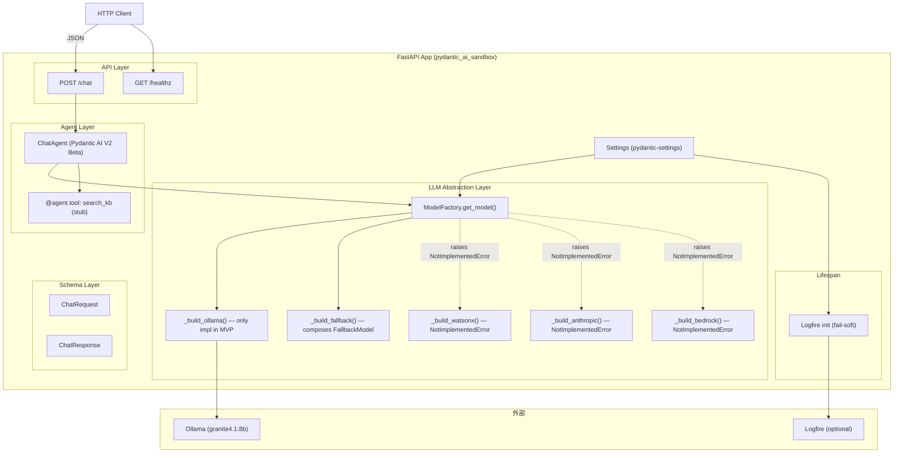
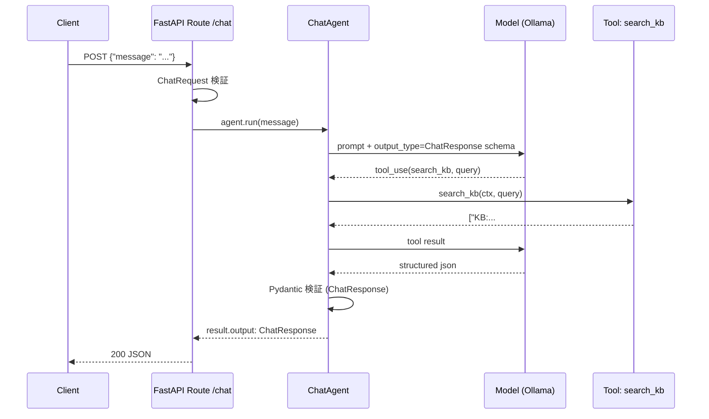

# 001-agentic-platform 技術設計書 (plan.md)

> **対象**: `specs/001-agentic-platform/spec.md` Requirements 1–10 + NFR-1..7
> **発行日**: 2026-05-24
> **アプローチ**: Library-First (Pydantic AI V2 Beta + FastAPI + Logfire) / Test-First (TDD) / 環境変数中心主義
> **ディスカバリログ**: [research.md](./research.md)
> **Constitution**: [.sdd/memory/constitution.md](../../.sdd/memory/constitution.md) v1.0.0

本書は **WHAT (spec.md) を HOW に翻訳する** ことを目的とする。実装コードは含まず、**コンポーネント境界・公開インターフェース・ファイル構成・トレーサビリティ** を確定する。

---

## 1. アーキテクチャ全体像

### 1.1 レイヤ構成



### 1.2 キーアーキテクチャ判断 (ADR 風サマリ)

| #    | 判断                                                                                                                                     | 採用理由 (Why)                                                                                           | トレード                                                       | トレース        |
| ---- | ---------------------------------------------------------------------------------------------------------------------------------------- | -------------------------------------------------------------------------------------------------------- | -------------------------------------------------------------- | --------------- |
| AD-1 | LLM プロバイダ抽象は MVP から `ModelFactory` を実装し、未実装 provider は `NotImplementedError` で stub する                             | 後続スプリントでの追加コストを下げる (Spec Q1)。stub で接点が型として固定され、契約テストを MVP で書ける | 未使用コードが残るが unit test が拘束する                      | 2.1, 2.3, 2.4   |
| AD-2 | Logfire は `send_to_logfire='if-token-present'` で fail-soft                                                                             | 公式 API。トークン未設定で起動継続を保証する標準パターン                                                 | ローカル開発でデータが UI に流れない (期待通り)                | 5.2, NFR-4      |
| AD-3 | FallbackModel の挙動テストは `FunctionModel` を直接構成する単体テストで証明する                                                          | MVP に他 provider 実装が無くても fallback ロジックを検証可能 (Spec Q1 の制約下で Req 4.4 を満たす)       | env-var 経由の組立は構成テストとは別に契約テストで担保         | 4.4             |
| AD-4 | Hardcoded model ID 検出は pre-commit `pygrep-hooks` のローカルフックで実装                                                               | ruff にカスタム rule 機構が無い。pre-commit は Req 8 で必須なので追加コストが小さい                      | ruff そのものでは検出できない (lint stage = pre-commit + ruff) | 1.5             |
| AD-5 | テスト基盤は `agent.override(model=TestModel())` / `FunctionModel(...)` を主、real Ollama 統合は `RUN_INTEGRATION_OLLAMA=1` ガードで分離 | Constitution I (Test-First) と NFR-2 (再現性) の両立                                                     | integration テストは default skip                              | 6.2, 10.2, 10.3 |
| AD-6 | `pyproject.toml` 依存に `pydantic-ai-slim[openai]` を追加                                                                                | `OpenAIChatModel` + `OllamaProvider` は openai extras を要求する (research.md R-1)                       | 依存数 +1                                                      | 2.2, 6.2        |
| AD-7 | `mise run check` を四ゲート (lint/format/typecheck/test) の集約タスクとして提供                                                          | Constitution V の単一エントリ点を確立、CI と local を一致させる                                          | mise.toml の保守                                               | 7.5, NFR-2      |

---

## 2. コンポーネント境界 (Component Contracts)

各コンポーネントは **公開インターフェース** と **NOT-OWNED (このコンポーネントが扱わない責務)** を明示する。`tasks.md` の `_Boundary:_` 注記はこの節を参照する。

### 2.1 `Settings` (config layer)

- **責務**: 全環境変数を `pydantic-settings.BaseSettings` でロードし、型付き属性として公開する。`LLM_PROVIDER` 値の正規化と未知値の拒絶を行う。
- **公開インターフェース**:
  ```text
  Settings (frozen=True)
    .app_env: str  # development | staging | production
    .log_level: str
    .llm_provider: Literal["ollama","watsonx","anthropic","bedrock","fallback"]
    .ollama_base_url: HttpUrl
    .ollama_model_name: str  # default-less; 必須
    .ollama_api_key: str | None
    .watsonx_*, .anthropic_*, .bedrock_* (オプション; provider 未選択時は読まない)
    .fallback_order: str  # "ollama,anthropic" 形式の生文字列
    .logfire_token: str | None
    .log_sensitive_payloads: bool = False
  get_settings() -> Settings  # functools.lru_cache 経由のシングルトン
  ```
- **NOT owned**: `Model` の構築、Logfire への副作用、エンドポイント定義。
- **トレース**: 1.1, 1.2, 1.4, NFR-3, NFR-6

### 2.2 `ModelFactory` (llm layer)

- **責務**: `Settings.llm_provider` を見て `pydantic_ai.models.Model` のインスタンスを返す唯一の窓口。provider 名と Model 構築ルールの 1:1 対応を保つ。
- **公開インターフェース**:
  ```text
  get_model(provider: str | None = None) -> pydantic_ai.models.Model
    - provider 引数なし -> Settings.llm_provider を使用
    - "ollama"      -> _build_ollama()
    - "watsonx" | "anthropic" | "bedrock"
                    -> NotImplementedError(f"Provider '<name>' is not implemented in MVP; tracked in 002-multi-provider")
    - "fallback"    -> _build_fallback()
    - その他          -> ValueError(f"Unknown LLM_PROVIDER: {provider!r}")
  ```
- **境界規則**:
  - `get_model()` 自身は **ネットワーク I/O を行わない** (Req 2.6)。Ollama への実 HTTP は agent.run 時。
  - `lru_cache` を agent ライフサイクル単位で適用してよい (副作用なし)。
- **NOT owned**: Agent 構築、ツール定義、HTTP ルーティング。
- **トレース**: 2.1, 2.2, 2.3, 2.4, 2.5, 2.6, 4.1, 4.2

### 2.3 `_build_ollama` (llm/providers/ollama.py)

- **責務**: `OpenAIChatModel(model_name=settings.ollama_model_name, provider=OllamaProvider(base_url=settings.ollama_base_url, api_key=settings.ollama_api_key))` を返すだけのアダプタ。
- **NOT owned**: モデル ID の文字列リテラル (env 由来のみ)。
- **トレース**: 2.2, 1.5

### 2.4 `_build_fallback` (llm/fallback.py)

- **責務**: `Settings.fallback_order` をパースし、各 member を `get_model(member)` で再帰解決して `FallbackModel(*members)` を返す。
- **境界規則**:
  - 順序の権威は env (Req 4.1)。
  - **MVP 既知 stub provider 集合 `{"watsonx","anthropic","bedrock"}` を `llm/factory.py` の定数 `_MVP_STUB_PROVIDERS` として公開**し、`_build_fallback` 実行時に member 全てがこの集合に含まれるなら `StartupError` (= `RuntimeError` サブクラス) を起動コンテキストで raise する (Req 4.5)。これにより `NotImplementedError` を `/chat` 呼び出し時まで遅延させない。
  - 空リスト・未知 provider のみのリストは `Settings` の field validator 段階で先に弾くため、ここに到達した時点で要素は構文 valid とみなしてよい。
- **NOT owned**: Fallback の retriable/non-retriable 判定 (Pydantic AI 側 `FallbackModel` の責務)。
- **トレース**: 4.1, 4.2, 4.5

### 2.5 `ChatAgent` factory (agents/chat_agent.py)

- **責務**: `Agent[None, ChatResponse]` を生成し、最低 1 つのツール (`search_kb` stub) を `@agent.tool` で登録する。
- **公開インターフェース**:
  ```text
  build_chat_agent(model: Model | None = None) -> Agent[None, ChatResponse]
    - model 省略時は ModelFactory.get_model() を呼ぶ
    - tools: [search_kb] (RunContext-aware, 戻り値 list[str])
    - instructions: 構造化出力スキーマ厳守を促す日本語プロンプト
  ```
- **境界規則**:
  - V2 Beta API 表面は research.md R-1 の確定セットのみ使用 (Req 6.4)。
  - `model` 引数を受けるのは `agent.override` 不要のテストパス用 (DI による差し替え)。
- **NOT owned**: HTTP リクエスト解釈、Logfire の追加 span 発行 (instrument_pydantic_ai に任せる)。
- **トレース**: 3.3, 6.2, 6.3, 6.4

### 2.6 Schemas (`schemas/chat.py`)

- **責務**: `ChatRequest` (`message: str`) と `ChatResponse` (`answer: str`, `sources: list[str]`) の Pydantic モデル定義。
- **境界規則**: `ChatResponse` は free-text の `answer` に加え 1 つ以上の構造化フィールド (`sources`) を持つ (Req 3.2)。
- **NOT owned**: バリデーション以外のロジック。
- **トレース**: 3.1, 3.2

### 2.7 API ルート (`api/routes/chat.py`, `api/routes/health.py`)

- **責務 (chat)**: `POST /chat` を提供。`ChatRequest` を受け、`build_chat_agent()` の `agent.run(req.message)` を呼び、`result.output` を `ChatResponse` として返す。
- **責務 (health)**: `GET /healthz` を提供し `{"status":"ok","provider":<settings.llm_provider>}` を返す。
- **境界規則**:
  - `ChatResponse` バリデーション失敗 (LLM 出力が schema 不適合) は HTTP 5xx で返却し partial なペイロードを返さない (Req 3.4)。Pydantic AI が `output_type` 検証で失敗 → Pydantic AI 側例外 → FastAPI default で 500。
  - リクエスト body validation 失敗は FastAPI 標準で 422 (Req 3.6)。
- **NOT owned**: Agent の構築 (Depends 経由で `build_chat_agent` を呼ぶ)、Logfire の手動 span 発行。
- **トレース**: 1.3, 3.1, 3.2, 3.4, 3.5, 3.6

### 2.8 Observability bootstrap (`logging_setup.py`)

- **責務**: FastAPI lifespan で `logfire.configure(send_to_logfire='if-token-present', ...)` → `instrument_pydantic_ai()` → `instrument_fastapi(app)` → `instrument_httpx()` を順に呼ぶ。
- **境界規則**:
  - configure 失敗時は `logger.warning(...)` で 1 行通知し起動継続 (Req 5.2)。
  - `ScrubbingOptions(extra_patterns=['prompt','tool_input','tool_output'])` でデフォルトスクラブ (Req 5.4)。
  - `LOG_SENSITIVE_PAYLOADS=true` で opt-in (実装時、span attribute 付与をフラグ分岐)。
- **NOT owned**: span の手動発行、ビジネス例外処理。
- **トレース**: 5.1, 5.2, 5.4, 5.5

### 2.9 App Factory (`main.py`)

- **責務**: `create_app() -> FastAPI` で lifespan + ルート登録 + (将来) 例外ハンドラ追加。`app = create_app()` をモジュールレベルで公開し `fastapi dev`/`fastapi run` のエントリにする。
- **境界規則**:
  - ロジックを直接書かない。すべて他コンポーネントの組み立てのみ。
  - lifespan 内で `Settings.llm_provider == "fallback"` のとき `_build_fallback()` を eager に呼び出して dry-run construct を実施 (Req 4.5)。失敗時は `StartupError` で起動を止める。
- **トレース**: 1.3, 3.1, 4.5, 5.1

### 2.10 Test Support (`tests/support/model_fakes.py`)

- **責務**: 単体テスト用の `FunctionModel` factory 集合。例えば `function_model_raising(...)` でプロバイダ失敗を模擬し、`function_model_returning_json(...)` で構造化出力を返す。
- **境界規則**: production code から import されない。
- **トレース**: 4.4, 10.2

---

## 3. データフロー詳細

### 3.1 `/chat` 正常系



### 3.2 `/chat` 出力検証失敗 (Req 3.4)

LLM が schema 不適合の出力を生成 → Pydantic AI が `output_type` 検証例外 → FastAPI が 500 を返す。partial データは漏らさない。テストは `FunctionModel` で不正 JSON を返してこの挙動を assert。

### 3.3 Fallback 失敗連鎖 (Req 4.3)

`FallbackModel(member1, member2)` で member1 が non-retriable エラー → `FallbackModel` 内部で次の member へ遷移 → `instrument_pydantic_ai()` が provider 名と error class を span 属性として記録 → 成功 or 全 member 失敗で例外。テストは `FunctionModel` で member1 を必ず失敗、member2 を成功にする。

### 3.4 起動シーケンス (Req 1.2 / 5.2 / 4.5)

```text
fastapi dev app/main.py
  |- create_app()
  |- app start lifespan
       |- get_settings() -> Settings (env validation; LLM_PROVIDER / 必須 var の不足は ValidationError -> 起動失敗)
       |- configure_observability(app, settings)
            |- logfire.configure(send_to_logfire='if-token-present', ...)
                 |- LOGFIRE_TOKEN なし -> 送信無効、warning ログ 1 行
            |- instrument_pydantic_ai(); instrument_fastapi(app); instrument_httpx()
       |- IF Settings.llm_provider == "fallback":
       |     |- _build_fallback() を **eager に呼び出して dry-run construct** (Req 4.5 起動時 fail-fast)
       |          |- 全 member が _MVP_STUB_PROVIDERS に含まれる -> StartupError raise -> 起動失敗
       |          |- 構築成功なら破棄 (キャッシュは get_model() 側の lru_cache に任せる)
       |- ELSE: ModelFactory.get_model() は最初の /chat で初めて呼ぶ (lazy I/O 回避、Req 2.6)
  |- yield (request 受付)
```

> **設計確定 (Req 4.5 二段検証)**:
>
> 1. **構文・名前集合検証**: `Settings` の field validator で `FALLBACK_ORDER` を起動時にパースし、空・未知 provider のみは `ValueError` で即座に fail-fast。
> 2. **構成可否検証**: lifespan 内で `LLM_PROVIDER=fallback` のときのみ `_build_fallback()` を eager に呼び出し、全 member が `_MVP_STUB_PROVIDERS` に含まれる構成 (例: `FALLBACK_ORDER=watsonx,anthropic`) を `StartupError` で起動失敗させる。
>
> 物理的な Ollama HTTP I/O は依然 lazy (Req 2.6 維持)。eager 構築は Model コンストラクタまでで、`agent.run` は呼ばない。

---

## 4. ファイル構成計画 (File Structure Plan)

> 各ファイルは 1 タスクの単位になる。`tasks.md` 生成時にこの表が分割の根拠となる。**このリストに無いファイルを task.md は生成してはならない**。

### 4.1 `src/pydantic_ai_sandbox/`

| Path                         | 1 文責務                                                                                         | 該当 Req                  |
| ---------------------------- | ------------------------------------------------------------------------------------------------ | ------------------------- |
| `__init__.py`                | パッケージマーカー (`__version__` のみ公開)                                                      | 1.4                       |
| `main.py`                    | `create_app()` と FastAPI lifespan、ルート登録のオーケストレーション                             | 1.3, 3.1, 5.1             |
| `config.py`                  | `Settings` (pydantic-settings) と `get_settings()`、env-driven の field validator                | 1.1, 1.2, 1.4, 4.5, NFR-3 |
| `logging_setup.py`           | `configure_observability(app, settings)` で Logfire 初期化と instrument\_\* 呼び出し (fail-soft) | 5.1, 5.2, 5.4, 5.5        |
| `llm/__init__.py`            | `get_model` を re-export                                                                         | —                         |
| `llm/factory.py`             | `ModelFactory.get_model()` のディスパッチと未知 provider 拒絶                                    | 2.1, 2.3, 2.5, 2.6        |
| `llm/providers/__init__.py`  | namespace のみ                                                                                   | —                         |
| `llm/providers/ollama.py`    | `_build_ollama()`: `OpenAIChatModel + OllamaProvider` の組立                                     | 2.2                       |
| `llm/providers/watsonx.py`   | `_build_watsonx()`: `NotImplementedError` stub (メッセージで後続スプリント名を示す)              | 2.4                       |
| `llm/providers/anthropic.py` | `_build_anthropic()`: `NotImplementedError` stub                                                 | 2.4                       |
| `llm/providers/bedrock.py`   | `_build_bedrock()`: `NotImplementedError` stub                                                   | 2.4                       |
| `llm/fallback.py`            | `_build_fallback()`: `FALLBACK_ORDER` から `FallbackModel` 構築                                  | 4.1, 4.2                  |
| `agents/__init__.py`         | namespace のみ                                                                                   | —                         |
| `agents/chat_agent.py`       | `build_chat_agent(model=None)` と `search_kb` ツール定義                                         | 3.3, 6.2, 6.3, 6.4        |
| `schemas/__init__.py`        | namespace のみ                                                                                   | —                         |
| `schemas/chat.py`            | `ChatRequest`, `ChatResponse` Pydantic モデル                                                    | 3.1, 3.2                  |
| `api/__init__.py`            | namespace のみ                                                                                   | —                         |
| `api/deps.py`                | `get_chat_agent()` 等の `Depends` ファクトリ                                                     | 3.1, 3.5                  |
| `api/routes/__init__.py`     | namespace のみ                                                                                   | —                         |
| `api/routes/chat.py`         | `POST /chat` ルート定義 (バリデーション + agent.run)                                             | 3.1, 3.2, 3.4, 3.5, 3.6   |
| `api/routes/health.py`       | `GET /healthz` ルート定義                                                                        | 1.3                       |

### 4.2 `tests/`

| Path                                           | 1 文責務                                                                                                             | 該当 Req           |
| ---------------------------------------------- | -------------------------------------------------------------------------------------------------------------------- | ------------------ |
| `conftest.py`                                  | 共有 fixture (`settings_factory`, `app_with_overrides`)                                                              | —                  |
| `support/__init__.py`                          | namespace                                                                                                            | —                  |
| `support/model_fakes.py`                       | `FunctionModel`-based 失敗/成功スタブの集約                                                                          | 4.4, 10.2          |
| `unit/test_config.py`                          | `Settings` の env load・必須 var 不足時 fail-fast・正規化                                                            | 1.1, 1.2, 4.5      |
| `unit/test_no_hardcoded_model_ids.py`          | `src/` 配下に禁則文字列が無いことを正規表現で検証 + `.gitignore` に `.env` が残存することを確認                      | 1.5, 9.6           |
| `unit/test_factory_dispatch.py`                | `get_model("ollama" \| "watsonx" \| ... \| unknown)` の戻り型/例外の契約テスト                                       | 2.1, 2.3, 2.4, 2.5 |
| `unit/test_factory_ollama_no_io.py`            | `get_model("ollama")` がネットワークに触れないこと (httpx を patch して assert no calls)                             | 2.6                |
| `unit/test_factory_fallback.py`                | `_build_fallback` の env パース、空/未知 member 拒絶、**全 member が stub の構成で StartupError**                    | 4.1, 4.2, 4.5      |
| `unit/test_app_lifespan_fallback_dryrun.py`    | `LLM_PROVIDER=fallback` で lifespan 起動時に `_build_fallback()` が eager 呼び出しされ全 stub 構成は起動失敗すること | 4.5                |
| `unit/test_fallback_failover.py`               | `FallbackModel(failing_fn, success_fn)` で member 切替が起きること、span 属性が provider 名 + error class を含むこと | 4.3, 4.4           |
| `unit/test_chat_agent_tool.py`                 | `build_chat_agent` がツールを 1 つ以上登録していること                                                               | 3.3, 6.3           |
| `unit/test_chat_agent_v2_surface.py`           | V2 Beta API 表面の利用 (Agent 構築、`@agent.tool`、`agent.override`、`result.output`) を assert                      | 6.4                |
| `unit/test_chat_endpoint_with_testmodel.py`    | TestClient + `agent.override(TestModel())` で 200 と ChatResponse 構造を確認                                         | 3.1, 3.2           |
| `unit/test_chat_endpoint_validation_errors.py` | 不正 body で 422、出力 schema 不適合 (FunctionModel で不正 json 返却) で 5xx                                         | 3.4, 3.6           |
| `unit/test_health.py`                          | `GET /healthz` が 200 と provider を返す                                                                             | 1.3                |
| `unit/test_logging_setup.py`                   | LOGFIRE_TOKEN 未設定でも起動継続、warning が 1 回出る、scrubbing 設定が attached                                     | 5.1, 5.2, 5.4      |
| `unit/test_logging_resilience.py`              | configure 例外をモンキーパッチで起こし `/healthz` 200 のままを確認                                                   | 5.5                |
| `unit/test_logging_span_attributes.py`         | `agent.run(...)` 1 回で provider 名と model ID を含む span が発火することを capture 経由で assert                    | 5.3                |
| `integration/__init__.py`                      | namespace                                                                                                            | —                  |
| `integration/test_ollama_chat_e2e.py`          | `RUN_INTEGRATION_OLLAMA=1` ガード付きで実 Ollama に対して `/chat` E2E                                                | 3.5, 6.2           |

### 4.3 リポジトリルート / 設定ファイル

| Path                                       | 1 文責務                                                                                                                                                                                                                                                                                                                                                                                                      | 該当 Req           |
| ------------------------------------------ | ------------------------------------------------------------------------------------------------------------------------------------------------------------------------------------------------------------------------------------------------------------------------------------------------------------------------------------------------------------------------------------------------------------- | ------------------ |
| `mise.toml` (修正)                         | `lint/format/typecheck/test/check/setup/pre-commit:*` タスクを追加 (research.md R-5)                                                                                                                                                                                                                                                                                                                          | 7.5, NFR-2         |
| `pyproject.toml` (修正)                    | `pydantic-ai-slim[openai]` 追加、dev に `pip-audit`, `bandit`, `pytest-cov` 追加。`[tool.coverage.report]` に `fail_under = 0` baseline を設定                                                                                                                                                                                                                                                                | 6.1, 7.7, 9.1, 9.2 |
| `.env.example`                             | 全 env 変数の canonical 仕様 (LLM*PROVIDER, OLLAMA*\_, WATSONX\_\_, ANTHROPIC*\*, BEDROCK*\*, LOGFIRE_TOKEN, FALLBACK_ORDER)                                                                                                                                                                                                                                                                                  | NFR-3, 9.6         |
| `.pre-commit-config.yaml`                  | `ruff check`, `ruff format --check`, `pyright`, `gitleaks`, `forbid-hardcoded-model-ids` を default stage / `pytest`, `pip-audit`, `bandit` を `manual` stage                                                                                                                                                                                                                                                 | 1.5, 8.1, 8.2, 8.3 |
| `.github/workflows/ci.yml`                 | push/PR で `mise run check` + `mise run pre-commit:manual` を実行                                                                                                                                                                                                                                                                                                                                             | 7.1-7.4, 8.4       |
| `.github/workflows/security.yml`           | push + 週次 cron で `pip-audit` / `bandit` / `gitleaks` を実行、HIGH/CRITICAL で fail                                                                                                                                                                                                                                                                                                                         | 9.1-9.4            |
| `.github/dependabot.yml`                   | 週次の依存監視 (pip / github-actions ecosystem)、`litellm` 等のサプライチェーン警戒対象には `supply-chain-watch` ラベルを付与しレビュー必須運用と紐付け                                                                                                                                                                                                                                                       | 9.5                |
| `.github/workflows/integration-ollama.yml` | `push: main` + 週次 cron + `pull_request:` (paths filter: `src/pydantic_ai_sandbox/{llm,agents,schemas}/**`, `tests/integration/**`, `pyproject.toml`) + `workflow_dispatch` で **Ollama service container (`ollama/ollama:latest`)** を起動し `granite4.1:8b` を `actions/cache` 併用で pull、`RUN_INTEGRATION_OLLAMA=1 mise run test:integration` を実行。`concurrency.cancel-in-progress: true` で重複抑制 | 6.2, 3.5, 10.3     |
| `README.md` (新規/修正)                    | `pre-commit install` と `mise run setup` をオンボーディング手順に明記                                                                                                                                                                                                                                                                                                                                         | 8.5, NFR-2         |
| `.gitleaks.toml` (任意)                    | gitleaks 例外設定 (テスト fixture 用)                                                                                                                                                                                                                                                                                                                                                                         | 9.3, 9.6           |

---

## 5. 横断要件 (Non-Functional) の実装方針

| NFR                       | 実装方針                                                                                                                                                                                                                                                                                  |
| ------------------------- | ----------------------------------------------------------------------------------------------------------------------------------------------------------------------------------------------------------------------------------------------------------------------------------------- |
| NFR-1 (Constitution 整合) | 本 plan は Principle I–V を全て満たす (§7 で再確認)                                                                                                                                                                                                                                       |
| NFR-2 (再現性)            | `mise run setup` → `mise run check` の 2 コマンドで全ゲート通過。CI で同じコマンドを回すことで "local だけ通る" を防ぐ                                                                                                                                                                    |
| NFR-3 (環境変数中心)      | Settings がすべての env を受け取り、コードに model ID / URL / token のリテラルを書かない。`unit/test_no_hardcoded_model_ids.py` と pre-commit grep フックで防御                                                                                                                           |
| NFR-4 (起動レジリエンス)  | Logfire fail-soft (Req 5.2) + Ollama lazy connection (`get_model` は I/O しない、Req 2.6) でアプリは LOGFIRE_TOKEN なし・Ollama 停止でも起動可。`/chat` 呼び出し時のみ Ollama 失敗で 5xx                                                                                                  |
| NFR-5 (V2 Beta 受容)      | `pydantic-ai>=2.0.0b3` のまま据え置き、依存更新 PR で test fail を検出 (Req 6.5)。**plan.md / research.md に "API 表面" を明示**することで GA 移行レビューを可能にする (Req 6.4)                                                                                                          |
| NFR-6 (秘密情報非ログ)    | `ScrubbingOptions(extra_patterns=...)` + `LOG_SENSITIVE_PAYLOADS=false` 既定、テストで scrubbing が attached されていることを検証                                                                                                                                                         |
| NFR-7 (CI 実行時間)       | `pre-commit:default` には pytest を含めない (Req 8.3)。重ステージは `manual` に分離。CI では `manual` を回しつつ、developer の commit 体感は <10s を目指す                                                                                                                                |
| Req 7.7 (coverage 非後退) | `pyproject.toml` の `[tool.coverage.report] fail_under = N` を baseline として保持し、各 Req 実装タスクで段階的に引き上げ。`ci.yml` は `pytest --cov-report=xml` を生成し PR に diff coverage コメントを posting。`integration-ollama.yml` 経由の coverage は別 artifact として参考値扱い |

---

## 6. 要件トレーサビリティ (Requirement → Component)

| Req                | 主担当コンポーネント                                                                                     | テストファイル                                                                                                              |
| ------------------ | -------------------------------------------------------------------------------------------------------- | --------------------------------------------------------------------------------------------------------------------------- |
| 1.1                | `config.py::Settings`                                                                                    | `unit/test_config.py`                                                                                                       |
| 1.2                | `config.py` (env validator)                                                                              | `unit/test_config.py`                                                                                                       |
| 1.3                | `api/routes/health.py`                                                                                   | `unit/test_health.py`                                                                                                       |
| 1.4                | `pyproject.toml` (`requires-python>=3.14`)                                                               | CI 構成 (matrix)                                                                                                            |
| 1.5                | `.pre-commit-config.yaml` (forbid-hardcoded-model-ids) + `unit/test_no_hardcoded_model_ids.py`           | 同左                                                                                                                        |
| 2.1                | `llm/factory.py::get_model`                                                                              | `unit/test_factory_dispatch.py`                                                                                             |
| 2.2                | `llm/providers/ollama.py::_build_ollama`                                                                 | `unit/test_factory_dispatch.py`, `unit/test_factory_ollama_no_io.py`                                                        |
| 2.3                | `llm/factory.py` の Literal 型契約                                                                       | `unit/test_factory_dispatch.py`                                                                                             |
| 2.4                | `llm/providers/{watsonx,anthropic,bedrock}.py`                                                           | `unit/test_factory_dispatch.py`                                                                                             |
| 2.5                | `llm/factory.py` (else 分岐)                                                                             | `unit/test_factory_dispatch.py`                                                                                             |
| 2.6                | `llm/factory.py` + `_build_ollama` (no I/O)                                                              | `unit/test_factory_ollama_no_io.py`                                                                                         |
| 3.1-3.6            | `api/routes/chat.py`, `schemas/chat.py`, `agents/chat_agent.py`                                          | `unit/test_chat_endpoint_with_testmodel.py`, `unit/test_chat_endpoint_validation_errors.py`, `unit/test_chat_agent_tool.py` |
| 3.5                | (E2E) `integration/test_ollama_chat_e2e.py` + `.github/workflows/integration-ollama.yml`                 | 同左 (CI lane で実行)                                                                                                       |
| 4.1-4.4            | `llm/fallback.py` + `config.py` (FALLBACK_ORDER validator)                                               | `unit/test_factory_fallback.py`, `unit/test_fallback_failover.py`                                                           |
| 4.5                | `config.py` field validator + `main.py` lifespan eager dry-run + `llm/fallback.py`                       | `unit/test_factory_fallback.py`, `unit/test_app_lifespan_fallback_dryrun.py`                                                |
| 5.1, 5.2, 5.4, 5.5 | `logging_setup.py`, `main.py` (lifespan)                                                                 | `unit/test_logging_setup.py`, `unit/test_logging_resilience.py`                                                             |
| 5.3                | `logging_setup.py` (instrument_pydantic_ai), `agents/chat_agent.py`                                      | `unit/test_logging_span_attributes.py`                                                                                      |
| 6.1                | `pyproject.toml`                                                                                         | CI lock check                                                                                                               |
| 6.2                | `agents/chat_agent.py`, `integration/test_ollama_chat_e2e.py` + integration CI lane                      | 同左 (`.github/workflows/integration-ollama.yml` で `RUN_INTEGRATION_OLLAMA=1` 実行を保証)                                  |
| 6.3                | `agents/chat_agent.py` の `@agent.tool`                                                                  | `unit/test_chat_agent_tool.py`                                                                                              |
| 6.4                | 本 plan.md §2.5 / research.md R-1 (永続列挙)                                                             | `unit/test_chat_agent_v2_surface.py`                                                                                        |
| 6.5                | CI (`ci.yml`) が依存更新 PR で test 走行                                                                 | CI                                                                                                                          |
| 7.1-7.5            | `mise.toml` タスク + `pyproject.toml` 設定                                                               | CI (`ci.yml`)                                                                                                               |
| 7.6                | `.pre-commit-config.yaml` + コードレビュー文化                                                           | manual                                                                                                                      |
| 7.7                | `pyproject.toml` `[tool.coverage.report] fail_under` (段階引き上げ) + `ci.yml` の diff coverage コメント | CI (`ci.yml`)                                                                                                               |
| 8.1-8.5            | `.pre-commit-config.yaml`, `mise.toml`, `README.md`                                                      | CI (`ci.yml` で manual stage 走行)                                                                                          |
| 9.1-9.4, 9.6       | `.github/workflows/security.yml`, `.gitignore`, `.env.example`                                           | CI, `unit/test_no_hardcoded_model_ids.py` (`.gitignore` 検査)                                                               |
| 9.5                | `.github/dependabot.yml` (週次依存監視 + supply-chain ラベル)                                            | CI (Dependabot)                                                                                                             |
| 10.1               | `pyproject.toml` (既設定)                                                                                | —                                                                                                                           |
| 10.2               | `tests/support/model_fakes.py`, 各 unit テスト                                                           | 同左                                                                                                                        |
| 10.3               | `integration/test_ollama_chat_e2e.py` の skip ガード                                                     | 同左                                                                                                                        |
| 10.4               | `pyproject.toml` `pytest-cov` + CI 表示                                                                  | CI                                                                                                                          |
| 10.5               | TDD 実施 (`/sdd-impl` の tdd-enforcement)                                                                | PDCA log                                                                                                                    |

---

## 7. Constitution Compliance Check (v1.0.0)

| 原則                           | 適合根拠                                                                                                                                | 判定 |
| ------------------------------ | --------------------------------------------------------------------------------------------------------------------------------------- | ---- |
| I. Test-First (NON-NEGOTIABLE) | 全 src/ ファイルが `tasks.md` で先行する failing test と対応。`/sdd-impl` の tdd-enforcement skill を必須運用                           | ✅   |
| II. Strict Type Safety         | pyright strict (既設定)。`Settings` で env を Pydantic に narrowing し境界以後 `Any` を排除。`# type: ignore` は使わない設計            | ✅   |
| III. Library-First             | `pydantic-ai`, `fastapi`, `pydantic-settings`, `logfire`, `pydantic-ai-slim[openai]` を採用。**カスタム実装ゼロ** (Stub すら型契約のみ) | ✅   |
| IV. SDD Pipeline               | 本ドキュメントが `/sdd-plan` 成果物。次は `/sdd-tasks`。Constitution compliance も §7 に明記                                            | ✅   |
| V. Quality Gates               | `mise run check` で四ゲート集約。`.pre-commit-config.yaml` で default + manual ステージ分離。CI で manual stage を回す                  | ✅   |

**CRITICAL/HIGH violations**: 検出なし。

**注意点 (HIGH 相当ではないが記録)**:

- `pyproject.toml` 上の `pre-commit / pip-audit / bandit / pytest-cov` 追加は `tasks.md` の早期タスクに含める必要がある。
- `mise.toml` のタスク追加は Req 7.5 を満たすために必須。

---

## 8. リスクと留意点 (Implementation Risks)

| #   | リスク                                                                             | 対策                                                                                                                                                                                                                                                                                                                                                                                                                                                                                                                                                                                                                                                                                                                                                                                                                       |
| --- | ---------------------------------------------------------------------------------- | -------------------------------------------------------------------------------------------------------------------------------------------------------------------------------------------------------------------------------------------------------------------------------------------------------------------------------------------------------------------------------------------------------------------------------------------------------------------------------------------------------------------------------------------------------------------------------------------------------------------------------------------------------------------------------------------------------------------------------------------------------------------------------------------------------------------------- |
| R-1 | Pydantic AI V2 Beta が `2.0.0b4+` で Agent ctor 名前を変更                         | `unit/test_chat_agent_v2_surface.py` が import パス + 引数名を直接 assert。CI が dependency 更新 PR を走らせて即検出 (Req 6.5)                                                                                                                                                                                                                                                                                                                                                                                                                                                                                                                                                                                                                                                                                             |
| R-2 | OllamaProvider が `pydantic-ai-slim[openai]` extras を要求                         | 依存追加を tasks.md の前段タスク (T-001 系) に置く                                                                                                                                                                                                                                                                                                                                                                                                                                                                                                                                                                                                                                                                                                                                                                         |
| R-3 | Logfire `if-token-present` の API 仕様変更                                         | `logging_setup.py` を 1 ファイルに局所化、test で fail-soft 挙動を直接 assert                                                                                                                                                                                                                                                                                                                                                                                                                                                                                                                                                                                                                                                                                                                                              |
| R-4 | FallbackModel 内部の retriable 判定が Provider SDK のリトライと衝突 (idea0.md §13) | MVP は Ollama 単独なので影響範囲は限定。watsonx/anthropic/bedrock 実装スプリントで再評価                                                                                                                                                                                                                                                                                                                                                                                                                                                                                                                                                                                                                                                                                                                                   |
| R-5 | `pre-commit grep hook` が偽陽性で `config.py` の default 値も拾う                  | `exclude: ^src/.*/config\.py$` で例外。default 値の文字列リテラルは将来 `OLLAMA_MODEL_NAME` 必須化で消す方向                                                                                                                                                                                                                                                                                                                                                                                                                                                                                                                                                                                                                                                                                                               |
| R-6 | Constitution V "coverage shall not regress" の運用基準が未定義                     | **MVP 運用方針 (Req 7.7 充足)**: (a) `pyproject.toml` の `[tool.coverage.report]` に `fail_under = 0` を初期設定し、各 Req 実装完了タスクで段階的に 5pt ずつ引き上げる。(b) CI (`ci.yml`) で `pytest --cov-report=xml` を生成し、`py-cov-action/python-coverage-comment-action@v3` で PR diff coverage を提示。(c) main マージ時の coverage 値を `.coverage-baseline` ファイルに記録 (CI で artifact として保存)。後続スプリントで `--cov-fail-under` の自動更新ワークフロー化を検討。                                                                                                                                                                                                                                                                                                                                     |
| R-7 | Ollama integration CI lane (Req 6.2) のジョブ時間が長くなり PR 待ち時間を圧迫      | **採用方針 (M1 改善反映)**: ① `pull_request:` トリガに `paths:` フィルタを設定し、`src/pydantic_ai_sandbox/llm/**` / `agents/**` / `schemas/**` / `tests/integration/**` / `pyproject.toml` の改修 PR でのみ起動 (provider/agent に触れない PR では走らない)。② `workflow_dispatch:` を併設し、レビュアが必要に応じて手動トリガ可能。③ `granite4.1:8b` (約 5GB) は `actions/cache` でモデル blob をキャッシュ (cache key = `ollama-model-${{ hashFiles('.github/workflows/integration-ollama.yml') }}-granite4.1-8b`)。④ `concurrency: { group: integration-ollama-${{ github.ref }}, cancel-in-progress: true }` で PR 連投時の重複ジョブを抑制。⑤ 既存の `push: main` + 週次 cron は安全網として維持。Req 6.2 は PR 時点で provider 系の変更を確実にカバーしつつ、無関係 PR の体感は `ci.yml` (unit + lint) のみに保つ。 |

---

## 9. 後続フェーズへの引き継ぎ

- `/sdd-tasks 001-agentic-platform` で本書 §4 (File Structure Plan) と §6 (Traceability) を読み、各ファイルを 1 タスクに分解。各タスクは `_Boundary:_ §2.x を参照_` 注記を付与。
- `/sdd-impl` は tdd-enforcement skill を必ずロードし、Red→Green→Refactor を遵守。各テストは §6 のマッピング通りに作成。
- `/sdd-validate-impl` は §6 のトレーサビリティ表を逆引きし、Req 1–10 + NFR-1..7 が全て test に到達していることを確認。
- 後続スプリント `002-multi-provider`: watsonx (LiteLLM/SDK)・Anthropic・Bedrock の実装。本 plan の `_build_*` stub を実装で置き換え、`unit/test_factory_dispatch.py` の "NotImplementedError 期待" を成功 assert に書き換える。
