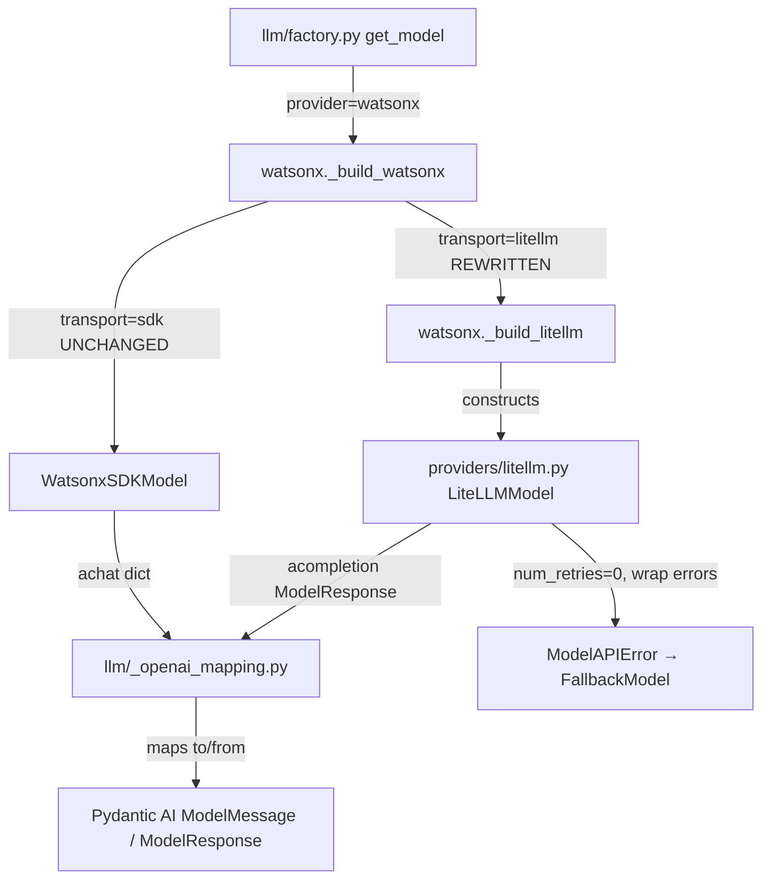
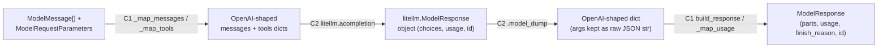

# 003-litellm-integration — Technical Plan

Translates approved requirements (WHAT) into architecture (HOW). No
implementation code. Follows `rules/plan-principles.md`.

**Branch**: `003-litellm-integration` | **Date**: 2026-06-09 | **Spec**: [spec.md](./spec.md) | **Research**: [research.md](./research.md)

> **Review note (2026-06-09)**: This plan was re-authored from Bob's
> `bobkit.plan` draft to (1) conform to this project's SDD plan template,
> (2) correct the Pydantic AI **V2 (Beta)** `Model` ABC signatures against the
> live reference [`watsonx.py`](../../src/pydantic_ai_sandbox/llm/providers/watsonx.py),
> and (3) remove a fabricated constitution check (no `.sdd/memory/constitution.md`
> exists in this repo). See [research.md](./research.md) §"Review corrections".

## Summary

Deliver a provider-agnostic `LiteLLMModel(pydantic_ai.models.Model)` that routes
chat requests through `litellm.acompletion()`, plus rewrite the watsonx
`_build_litellm()` builder to construct it with the `watsonx/<model_id>` route.
The OpenAI-shaped message/tool/response mapping that already lives inside
[`watsonx.py`](../../src/pydantic_ai_sandbox/llm/providers/watsonx.py) is
extracted into a shared `llm/_openai_mapping.py` so both `WatsonxSDKModel` and
`LiteLLMModel` consume one implementation. This fixes the `002` live-verified
404 (the current `_build_litellm` builds an `OpenAIChatModel` over
`LiteLLMProvider`, which POSTs to `/chat/completions` — an endpoint watsonx.ai
does not expose) while keeping the working `sdk` transport untouched.

## Architecture Overview



`get_model` already dispatches `watsonx → _build_watsonx`, and `_build_watsonx`
already switches on `Settings.watsonx_transport`. **No change to `factory.py` or
to the dispatch table is required** — only the `litellm` branch's *construction
recipe* (`_build_litellm`) is rewritten, and the shared mapper is extracted. Both
model classes call `litellm.acompletion()` / `ModelInference.achat()` respectively
and funnel their OpenAI-shaped payloads through one mapping module.

## Components

### C1 — Shared OpenAI-shaped mapping (`llm/_openai_mapping.py`) — NEW

- **Responsibility**: Convert Pydantic AI message history, tool definitions,
  usage, and completion responses to/from OpenAI/LiteLLM-shaped dicts — the one
  implementation both transports import.
- **Public interface** (extracted verbatim from `watsonx.py`, signatures preserved):
  - `_map_messages(messages: list[ModelMessage]) -> list[dict[str, Any]]`
  - `_map_request_part(part: ModelRequestPart) -> dict[str, Any]`
  - `_map_user_prompt(part: UserPromptPart) -> dict[str, Any]`
  - `_map_assistant_message(response: ModelResponse) -> dict[str, Any]`
  - `_map_tools(model_request_parameters: ModelRequestParameters) -> list[dict[str, Any]] | None`
  - `_map_usage(raw_usage: dict[str, Any] | None) -> RequestUsage`
  - `_FINISH_REASON_MAP: dict[str, FinishReason]`
  - `build_response(raw: dict[str, Any], *, model_name: str, provider_name: str) -> ModelResponse`
    — generalised from `WatsonxSDKModel._build_response` (which hard-codes
    `self.model_name` / `provider_name="watsonx"`); the identity fields become
    parameters so both transports can stamp their own.
- **Owns**: The bidirectional OpenAI-shape mapping logic and the finish-reason map.
- **Does NOT own**: Any transport/SDK call, error wrapping, timeout wiring, or
  credential handling. It is pure data transformation and performs no I/O.
- **Requirements**: 2.1, 2.2, 2.3, 2.4, 3.1, 3.2, 3.3, 3.4, 11.1, 11.2, 11.3, 11.4

### C2 — `LiteLLMModel` (`llm/providers/litellm.py`) — NEW

- **Responsibility**: A provider-agnostic `pydantic_ai.models.Model` subclass that
  executes one non-streaming chat via `litellm.acompletion()` and adapts it to the
  V2 (Beta) `Model` ABC.
- **Placement rationale** (resolves gap-analysis Challenge #6): although
  `LiteLLMModel` is provider-agnostic — structurally closer to the cross-cutting
  `llm/fallback.py` than to the provider-specific files in `llm/providers/` — it is
  deliberately placed at `llm/providers/litellm.py`. `litellm` *is* the multiplexing
  backend here (the LiteLLM SDK is what selects the concrete provider via the route
  prefix), so it reads naturally as one more entry alongside `anthropic.py` /
  `bedrock.py` / `ollama.py` / `watsonx.py`, and keeps every `Model`-subclass adapter
  discoverable in one directory. Critically, this is **not** a new `LLMProvider`
  Literal or factory dispatch entry — watsonx still dispatches to `_build_watsonx`,
  which internally picks the litellm transport (factory unchanged, see the
  `factory.py`-absent note below). The alternative `llm/litellm_model.py` was
  considered and rejected: it would split `Model` adapters across two locations for
  a marginal taxonomy gain.
- **Public interface** (must match the live V2 ABC — see [Interfaces](#interfaces--contracts)):
  - `__init__(self, *, model_name, api_key=None, api_base=None, custom_llm_provider=None, timeout_connect, timeout_read) -> None` — I/O-free.
  - `system: str` (property) and `model_name: str` (property) → instrumentation span attrs.
    `system` is derived once from the route provider segment
    (`model_name.split("/", 1)[0]`, falling back to `"litellm"` when the route has
    no prefix); the **same** value is passed to C1's `build_response(provider_name=...)`
    so `gen_ai.system` and the response provider agree and match the SDK path for
    the watsonx route (Req 1.4 / NFR Observability).
  - `profile` (property): returns a `ModelProfile` that keeps `supports_json_schema_output`
    falsy for the watsonx route so `build_chat_agent` does not wrap `NativeOutput`/force
    `response_format` — matching the SDK transport's tool-mode (Req 1.5).
  - `async request(self, messages, model_settings, model_request_parameters) -> ModelResponse`
  - `@asynccontextmanager async request_stream(self, messages, model_settings, model_request_parameters, run_context=None) -> AsyncGenerator[StreamedResponse]` — raises `NotImplementedError` before any yield.
- **Owns**: The `litellm.acompletion()` call (with `num_retries=0`), timeout
  passthrough, broad-except `→ ModelAPIError` wrapping **scoped to the
  `acompletion()` call only** (the subsequent `.model_dump()` and C1
  `build_response` — which raises `UnexpectedModelBehavior` per Req 3.3 — sit
  outside the `try` so they fail loud unwrapped, Req 4.3), the function-local
  `litellm` import guard, the streaming-deferral guard, **and the normalization
  of the `litellm.ModelResponse` object into the OpenAI-shaped `dict` that C1's
  `build_response` consumes** (see below).
- **Response normalization (load-bearing)**: `litellm.acompletion()` returns a
  `litellm.ModelResponse` **object**, not a plain `dict` — whereas C1's
  `build_response(raw: dict[str, Any], ...)` was generalised from watsonx
  `achat`, which returns a bare `dict` ([watsonx.py:490](../../src/pydantic_ai_sandbox/llm/providers/watsonx.py#L490)).
  C2 SHALL convert the response via `.model_dump()` **before** handing it to C1.
  `.model_dump()` (not attribute access) is required because it preserves
  `tool_calls[].function.arguments` as the **raw JSON string** the backend sent,
  satisfying Req 2.4 (Granite double-encoded args surfaced faithfully, never
  re-encoded). Attribute/`to_dict()` variants that re-parse arguments are
  rejected.
- **Does NOT own**: Message/tool/response mapping (delegates to C1); environment
  parsing/validation (`Settings`); fallback composition (`llm/fallback.py`);
  watsonx-specific configuration (delegates to C3).
- **Requirements**: 1.1, 1.2, 1.3, 1.4, 1.5, 2.x (via C1), 3.x (via C1), 4.1, 4.2,
  4.3, 5.1, 6.2, 8.1, 8.2, 8.3, 9.1, 9.2, 9.3, 9.4

### C3 — watsonx builder rewrite (`_build_litellm` in `llm/providers/watsonx.py`) — MODIFY

- **Responsibility**: Configure a `LiteLLMModel` for watsonx — the `watsonx/<model_id>`
  route, the unwrapped API key, the watsonx URL, project-ID env reconciliation, and
  timeouts — replacing the broken `OpenAIChatModel`/`LiteLLMProvider` construction.
- **Public interface**: `_build_litellm(settings: Settings) -> Model` (signature
  unchanged; body fully replaced).
- **Owns**: The optional-`litellm` import guard (`ValueError`, never bare
  `ImportError`); unwrapping `SecretStr` only at this boundary; ensuring
  `WATSONX_PROJECT_ID` is present in the process environment for LiteLLM
  (sourced from the already-validated `settings.watsonx_project_id`; a `None`
  value is a defensive `TypeError` + `# pragma: no cover`, since the boot
  credential gate makes it unreachable — see research.md ADR-3); sourcing
  timeouts from `watsonx_timeout_connect`/`watsonx_timeout_read`.
- **Side-effect note (`os.environ`)**: Setting `WATSONX_PROJECT_ID` in
  `os.environ` is a process-global mutation inside an otherwise pure, I/O-free
  builder (against the I/O-free/no-side-effect construction convention,
  [tech.md](../../.sdd/steering/tech.md)). It is accepted only because LiteLLM's
  watsonx path reads `os.environ` **directly** (ADR-3). The hermetic test for
  this branch SHALL use `monkeypatch.setenv`/`delenv` (or save-and-restore) so
  the write does not leak across tests; if the live lane (Req 10.3) confirms an
  `acompletion(project_id=...)` kwarg works, prefer that and drop the env write.
- **Does NOT own**: The request/response cycle (delegates to C2); the `sdk`
  transport (`WatsonxSDKModel`, unchanged); transport dispatch (already in
  `_build_watsonx`, unchanged).
- **Requirements**: 6.1, 6.2, 7.1, 7.2, 7.3, 7.5, 5.2; preserves 7.4 (sdk untouched)

### C4 — Test coverage (`tests/unit/`, `tests/integration/`) — NEW + MODIFY

- **Responsibility**: Prove construction, mapping, response, error
  classification, timeout, and streaming-deferral behavior hermetically; extend
  the opt-in live lane; keep existing suites green.
- **Owns**: New `test_litellm_*` hermetic cases (with `litellm.acompletion`
  mocked), shared-mapping tests, and the rewrite of the now-obsolete
  `test_watsonx_litellm_construction.py` (it currently asserts the
  `OpenAIChatModel` path being removed).
- **Does NOT own**: Production source behavior; it observes it.
- **Requirements**: 10.1, 10.2, 10.3, 10.4, 10.5

> **`factory.py` is intentionally absent from the component list** — its dispatch
> already routes watsonx through `_build_watsonx`, and the transport switch is
> internal to that builder. Bob's draft listed `factory.py [MODIFY]`; that is
> incorrect and would invite a spurious edit.

## Data Model

This feature introduces **no persistent entities**. The "model" is the runtime
transformation pipeline below.



| Entity | Field | Type | Notes |
|--------|-------|------|-------|
| `LiteLLMModel` | `model_name` | `str` | LiteLLM route `<provider>/<model_id>` (e.g. `watsonx/ibm/granite-...`). |
| `LiteLLMModel` | `api_key` | `str \| None` | Already-unwrapped key passed to `acompletion`; never logged. |
| `LiteLLMModel` | `api_base` | `str \| None` | Backend base URL (watsonx URL). |
| `LiteLLMModel` | `custom_llm_provider` | `str \| None` | Optional LiteLLM provider override. |
| `LiteLLMModel` | `timeout_connect` | `float` | Connect timeout → `acompletion`. |
| `LiteLLMModel` | `timeout_read` | `float` | Read timeout → `acompletion`. |

## Interfaces / Contracts

The only "contract" is the Pydantic AI **V2 (Beta)** `Model` ABC. Signatures are
taken from the live reference `WatsonxSDKModel`
([watsonx.py:403](../../src/pydantic_ai_sandbox/llm/providers/watsonx.py#L403),
[:548](../../src/pydantic_ai_sandbox/llm/providers/watsonx.py#L548)) — **three
positional params on `request`, and `request_stream` is an
`@asynccontextmanager` yielding `StreamedResponse`**, not the two-arg /
`AsyncIterator[ModelResponse]` shapes in Bob's draft.

```python
from __future__ import annotations
from contextlib import asynccontextmanager
from typing import TYPE_CHECKING, Any

from pydantic_ai.models import Model

if TYPE_CHECKING:
    from collections.abc import AsyncGenerator
    from pydantic_ai import RunContext
    from pydantic_ai.messages import ModelMessage, ModelResponse
    from pydantic_ai.models import ModelRequestParameters, StreamedResponse
    from pydantic_ai.settings import ModelSettings


class LiteLLMModel(Model):
    @property
    def system(self) -> str: ...        # → gen_ai.system
    @property
    def model_name(self) -> str: ...    # → gen_ai.request.model

    async def request(
        self,
        messages: list[ModelMessage],
        model_settings: ModelSettings | None,
        model_request_parameters: ModelRequestParameters,
    ) -> ModelResponse:
        """Non-streaming inference via litellm.acompletion(..., num_retries=0).

        Raises:
            ModelAPIError: any exception from acompletion(), chained via `from`.
            NotImplementedError / UnexpectedModelBehavior: mapping/response
                errors (from C1) surface unwrapped — fail loud (Req 4.3).
        """

    @asynccontextmanager
    async def request_stream(
        self,
        messages: list[ModelMessage],
        model_settings: ModelSettings | None,
        model_request_parameters: ModelRequestParameters,
        run_context: RunContext[Any] | None = None,
    ) -> AsyncGenerator[StreamedResponse]:
        """Streaming deferred (Req 8). Raises NotImplementedError naming the
        model before any yield; the unreachable `yield` keeps it a generator."""
```

`acompletion` call shape (internal): `model=self.model_name`,
`messages=_map_messages(...)`, `tools=_map_tools(model_request_parameters)`,
`api_key=...`, `api_base=...`, `custom_llm_provider=...`, `num_retries=0` (Req
4.2 / ADR-2), `timeout=httpx.Timeout(read, connect=connect)`. LiteLLM's
`acompletion` accepts `timeout: float | str | httpx.Timeout`, so the SDK path's
`httpx.Timeout(read, connect=connect)` shaping is passed through directly —
**both** connect and read reach the backend (Req 5.1), with no single-float
fallback that would silently drop the connect phase. The response is then
normalised via `.model_dump()` → C1 `build_response` (see C2 above). Watsonx
builder contract is unchanged: `_build_litellm(settings: Settings) -> Model`.

> **`num_retries=0` is honored, not just passed (Req 4.2 / ADR-2).** `num_retries`,
> `api_base`, and `custom_llm_provider` ride `acompletion`'s `**kwargs` rather than
> its explicit signature, so a hermetic test can only assert they are *passed*. That
> `num_retries=0` is actually *respected* (LiteLLM runs no internal retry loop, leaving
> the fallback chain as the sole resilience layer) cannot be proven hermetically and
> is therefore verified in the opt-in live lane (Req 10.3 — see tasks §6). If LiteLLM's
> default were non-zero and silently dropped, ADR-2's no-double-resilience guarantee
> would break, so this verification is load-bearing, not cosmetic.

## File Structure Plan

| File | Create/Modify | Responsibility |
|------|---------------|----------------|
| `src/pydantic_ai_sandbox/llm/_openai_mapping.py` | Create | Shared OpenAI-shaped message/tool/usage/response mapping + `_FINISH_REASON_MAP`, extracted from `watsonx.py` (C1). |
| `src/pydantic_ai_sandbox/llm/providers/litellm.py` | Create | `LiteLLMModel(Model)` wrapping `litellm.acompletion()`, with upstream `pydantic-ai-litellm` MIT attribution header (C2 / Req 9.3). |
| `src/pydantic_ai_sandbox/llm/providers/watsonx.py` | Modify | Remove the in-module mapping helpers (now import from C1); rewrite `_build_litellm` to construct `LiteLLMModel`; `WatsonxSDKModel` behavior unchanged (C3 / Req 11.4). |
| `tests/unit/test_litellm_construction.py` | Create | Hermetic I/O-free construction; `system` resolves to the route provider segment (`watsonx/<id>` → `"watsonx"`, bare route → `"litellm"`); `model_name` returns the route; `profile` keeps `supports_json_schema_output` falsy for the watsonx route (Req 1.4, 1.5, 10.1, 10.6). |
| `tests/unit/test_litellm_message_mapping.py` | Create | Message/tool mapping incl. unsupported-part raise and double-encoded args (Req 2.x, 10.1). |
| `tests/unit/test_litellm_response_mapping.py` | Create | Response build, finish-reason map, empty-choices, absent-usage, **and the `litellm.ModelResponse` object → `.model_dump()` dict → `build_response` shape path (asserting tool-call `arguments` stay a raw JSON string, Req 2.4)** (Req 3.x, 10.1). |
| `tests/unit/test_litellm_error_classification.py` | Create | Broad-except `→ ModelAPIError` and `FallbackModel` recovery (Req 4.1, 10.2). |
| `tests/unit/test_litellm_timeout_config.py` | Create | Timeout values reach `acompletion` (Req 5.1, 10.1). |
| `tests/unit/test_litellm_streaming_deferred.py` | Create | `request_stream` raises `NotImplementedError` with greppable, model-named message (Req 8, 10.5). |
| `tests/unit/test_openai_mapping_shared.py` | Create | C1 utilities tested directly, transport-agnostic (Req 11). |
| `tests/unit/test_watsonx_litellm_construction.py` | Modify | Rewrite: currently asserts the removed `OpenAIChatModel`/`LiteLLMProvider` path; retarget to the new `LiteLLMModel` construction (Req 7.1, 7.3). |
| `tests/integration/test_watsonx_chat_e2e.py` | Modify | Add a `WATSONX_TRANSPORT=litellm` lane behind `RUN_INTEGRATION_WATSONX=1` (Req 10.3). |

> Vendoring (Req 9.3) is realised as an **MIT attribution header** inside
> `litellm.py` (citing the upstream library, version, repo URL) — not a separate
> vendored package directory. Existing watsonx SDK tests (`test_watsonx_sdk_construction.py`,
> `test_watsonx_no_retry.py`, `test_watsonx_observability.py`, `test_watsonx_timeout_config.py`)
> must pass **unmodified** (Req 7.4 / 11.4); they are not in this table.

## Error Handling & Edge Cases

| Condition | Behavior | Requirement |
|-----------|----------|-------------|
| `litellm` not installed when `transport=litellm` | `_build_litellm` raises `ValueError` naming the package + install cmd; never bare `ImportError`. | 6.1 |
| Any exception from `acompletion()` | Caught by broad `except`, wrapped as `ModelAPIError(model_name=..., ...) from exc`. | 4.1 |
| Mapping error (unsupported part / multimodal) | `NotImplementedError` naming the type — **not** wrapped. | 2.3, 4.3 |
| Completion response with no `choices` | `UnexpectedModelBehavior` — **not** wrapped. | 3.3, 4.3 |
| Absent `usage` block | Zeroed `RequestUsage`, no failure. | 3.4 |
| Double-encoded tool-call args (Granite) | Surfaced faithfully via `args=...` raw; no re-encode. | 2.4 |
| `request_stream` invoked | `NotImplementedError` (greppable, names model) before any yield; never silent non-stream downgrade. | 8.1, 8.2, 8.3 |
| `WATSONX_PROJECT_ID` missing for litellm transport | The boot-time credential gate ([config.py:236-244](../../src/pydantic_ai_sandbox/config.py#L236)) already requires it when watsonx is selected, so the builder cannot legitimately see `None`. Treated as a **defensive invariant**: raise `TypeError` (mirroring the existing `_build_litellm` apikey/model-id guard) with `# pragma: no cover`, NOT a duplicate user-facing fail-fast with a divergent message. | 7.2 |
| LiteLLM internal retries | Disabled via `num_retries=0`; fallback chain is sole resilience layer. | 4.2 |

## Constitution Compliance

> **No `.sdd/memory/constitution.md` exists in this repository.** Bob's draft
> contained a "Principle I–V" check imported from the `bobkit`/`.specify`
> toolkit; it has no backing file here and was removed. Compliance is therefore
> assessed against the project's **steering conventions** (`tech.md`,
> `product.md`, `structure.md`).

| Steering convention | Status | Notes |
|---------------------|--------|-------|
| Config over code; model IDs never in `src/` | ✅ | Route built from `Settings.watsonx_model_id`; guarded by `test_no_hardcoded_model_ids.py`. |
| Fail fast / fail loud | ✅ | `ValueError` on missing `litellm`; fail-fast on missing `WATSONX_PROJECT_ID`; mapping errors unwrapped. |
| Fallback is sole resilience layer (ADR-2) | ✅ | `num_retries=0`; all `acompletion` failures → `ModelAPIError`. |
| Hermetic default test run | ✅ | `acompletion` mocked; live lane behind `RUN_INTEGRATION_WATSONX=1`. |
| I/O-free construction | ✅ | First network call is the first `request()`. |
| Secrets unwrapped only at boundary | ✅ | `.get_secret_value()` only inside `_build_litellm`; never logged (Req 7.5). |
| Strict typing + `msg`-then-`raise` idiom | ✅ | `from __future__ import annotations`, pyright strict, `EM`/`TRY` idioms (Req 9.4). |
| Optional dep function-local import | ✅ | `litellm` imported inside the builder/model (Req 6.2). |
| Observability parity | ✅ | `system` is derived from the route provider segment (watsonx route → `"watsonx"`), so `gen_ai.system` / `gen_ai.request.model` match the SDK path; the same value stamps `provider_name`. Verified hermetically (Req 10.6). |
| Output-mode parity (tool-mode) | ✅ | `profile` keeps `supports_json_schema_output` falsy for the watsonx route, so `build_chat_agent` does not force `NativeOutput`/`response_format` — matching the SDK transport (Req 1.5). |

## Requirements Traceability

| Requirement ID | Component(s) |
|----------------|--------------|
| 1.1, 1.2, 1.3, 1.4, 1.5 | C2 |
| 2.1, 2.2, 2.3 | C1 (called by C2) |
| 2.4 | C1 (faithful raw args in `build_response`) + C2 (`.model_dump()` preserves the raw JSON arg string) |
| 3.1, 3.2, 3.3, 3.4 | C1 (called by C2) |
| 4.1, 4.2, 4.3 | C2 |
| 5.1 | C2 |
| 5.2 | C3 |
| 6.1 | C3 |
| 6.2 | C2, C3 |
| 7.1, 7.2, 7.3, 7.5 | C3 |
| 7.4 | C3 (sdk untouched), verified by C4 |
| 8.1, 8.2, 8.3 | C2 |
| 9.1, 9.2, 9.3, 9.4 | C2 |
| 10.1, 10.2, 10.3, 10.4, 10.5, 10.6 | C4 |
| 11.1, 11.2, 11.3, 11.4 | C1, C3 |
