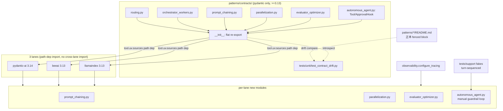
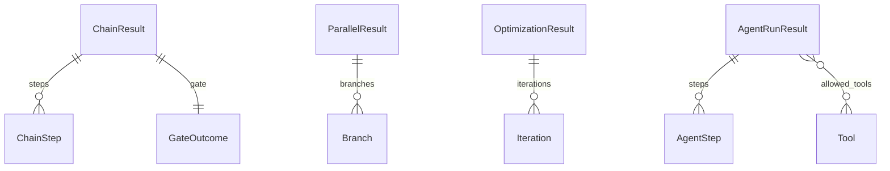

# 006-2a-cross-platform — Technical Plan

承認済み要件（spec.md R1–R13）を HOW に翻訳する。実装コードは書かない。
`rules/plan-principles.md` に従う。一次情報は 005 実装・steering・gap-analysis。

## Summary

005 のレーン足場を拡張し、(1) 依存ゼロの契約専用パッケージ
`patterns/contracts/`（パターン別サブモジュール + フラット再エクスポート、
`requires-python >=3.13`）を昇格して6パターンの契約を集約、各レーンは
`tool.uv.sources` のパス依存で import、(2) prompt-chaining /
parallelization / evaluator-optimizer / autonomous-agent を3フレームワークで
実装する。契約ドリフト検知は「README 正本 == パッケージ」の単一点に縮約し、
autonomous-agent は4ガードレールを契約レベルで全レーン共通化する。新規 runtime
依存は無く（pydantic のみ）、fan-out・フェイク・可観測性は 005 の実証済み機構を流用する。

## Architecture Overview



契約は `patterns/contracts/` が唯一の実体、各 `patterns/<pattern>/README.md` の
```python ブロックが正本。レーンは契約を import し、4パターンを各 fw の最小
プリミティブで実装する。autonomous-agent のみレーンコードが手動ループで
4ガードレールと `stop_reason` を確定する。

## Components

### contracts package (`patterns_contracts`)

- **Responsibility**: 6パターンの入出力 Pydantic モデル・`Literal` 語彙・
  autonomous-agent のツール抽象（Protocol / 型エイリアス）を唯一の実体として保持する。
- **Public interface**: `from patterns_contracts import` で全公開シンボル
  （`RouteDecision`, `RoutedAnswer`, `Route`, `SubTask`, `TaskPlan`,
  `WorkerResult`, `OrchestratedResult`, `ChainStep`, `GateOutcome`,
  `ChainResult`, `Branch`, `ParallelResult`, `Iteration`,
  `OptimizationResult`, `AgentStep`, `AgentRunResult`, `Tool`, `ApprovalHook`）。
- **Owns**: 契約モデル定義、`Literal` 語彙（Route / verdict / stop_reason / variant）、
  `Tool` Protocol、`ApprovalHook` 型エイリアス。
- **Does NOT own**: パターンの実行ロジック（レーンが所有）、フレームワーク依存、
  エントリポイント関数の本体（signature の正本は各 README）。
- **Requirements**: 1.1, 1.2, 1.3, 1.5

### contract drift guard (`test_contract_drift.py`)

- **Responsibility**: 各 README の正本 fenced block と `patterns_contracts`
  パッケージ実体のクラス集合・フィールド集合・Literal 語彙の一致を1点で検証する。
- **Public interface**: pytest テスト関数（contracts venv で実行）。
- **比較範囲（明示）**: Pydantic モデルの **クラス集合 / フィールド集合 / `Literal`
  語彙**（`stop_reason` / `verdict` / `variant` 等）に限定する（R2.3 が要求するのは
  この3集合）。`Tool`（Protocol、`model_fields` 非保持）・`ApprovalHook`（Callable
  エイリアス）・エントリ signature は **型システムの責務**として比較対象外とし、
  README の当該ブロックはドリフトテストの parser がスキップする（混入時に誤検知
  しないよう明示除外）。Protocol/alias の正本一致は pyright strict が担保する。
- **Owns**: README パース（`ast`、Pydantic クラスブロックのみ抽出）・パッケージ
  introspect（`model_fields` / `get_args`）・差分アサート。
- **Does NOT own**: レーン間 AST 相互比較（廃止）、Protocol/alias/signature の比較
  （型システムの責務）、実行時の契約強制。
- **Requirements**: 2.1, 2.2, 2.3

### lane contract wiring (`pyproject.toml` × 3 + uv.lock × 3)

- **Responsibility**: 各レーンが `patterns_contracts` をパス依存で import 可能にし、
  レーン内の契約複製（旧 `contracts.py`）を排除する。
- **Public interface**: `[tool.uv.sources] patterns-contracts = { path = "../../contracts", editable = true }` + `dependencies += ["patterns-contracts"]`。
- **Owns**: パス依存宣言、lockfile 再生成。
- **Does NOT own**: 契約定義（contracts パッケージが所有）、レーン→レーン import（禁止）。
- **Requirements**: 1.4, 1.5, NFR-1, NFR-3

### prompt-chaining 実装（lane × 3）

- **Responsibility**: 逐次ステップ + ステップ間プログラム検証ゲートのワークフローを
  各 fw の最小プリミティブで実装し、ゲート不合格時に早期終了する。
- **Public interface**: `async def run_prompt_chain(input_text: str, *, model/llm) -> ChainResult`。
- **Owns**: ステップ逐次連結（PydanticAI=複数 `agent.run` 直列 / LlamaIndex=`@step`
  直列 / BeeAI=Workflow 逐次ステップ）、ゲート判定、`final_output=None` 早期終了。
- **Does NOT own**: 契約モデル定義、並列実行。
- **Requirements**: 3.1, 3.2, 3.3

### parallelization 実装（lane × 3）

- **Responsibility**: 並列 fan-out を sectioning / voting の2変種で実装し、ブランチ
  順序を決定論復元する。
- **Public interface**: `async def run_parallelization(task: str, *, variant: Literal["sectioning","voting"], model/llm, n: int = 3) -> ParallelResult`。
- **Owns**: variant 分岐、fan-out（`asyncio.gather` / `collect_events`+index sort）、
  集約（sectioning=結合 / voting=多数決、**同数時は index 昇順の決定論タイブレーク**）、
  `branches` の index 順序復元。
- **オフライン検証シーム**: voting は同一 prompt の n ブランチが全会一致になり多数決
  ロジックを素通りするため、fakes の「ブランチ index → 出力マップ」モードで割れた票
  （例 2:1）を供給し、`test_parallelization.py` に多数決・タイブレーク両ケースを含める。
- **Does NOT own**: 契約モデル定義、プランナー LLM（不使用）。
- **Requirements**: 4.1, 4.2, 4.3, 4.4

### evaluator-optimizer 実装（lane × 3）

- **Responsibility**: 生成器→評価器のループを、`pass` 到達か `max_iterations` まで
  反復し、各反復を記録する。
- **Public interface**: `async def run_evaluator_optimizer(task: str, *, model/llm, max_iterations: int = 3) -> OptimizationResult`。
- **Owns**: 生成→評価ループ、`revise` フィードバックの次反復入力反映、
  `stop_reason` 確定（`passed` / `max_iterations` のみ）。
- **オフライン検証シーム**: 固定 payload フェイクでは「全 revise → max_iterations」
  しか再現できないため、turn-sequenced fakes の cursor モードを評価器 verdict 列にも
  適用し、`revise → … → pass` 遷移を決定論供給する。これにより `stop_reason="passed"`
  （R5.4）と feedback 反映（R5.3）を hermetic に検証できる。
- **Does NOT own**: 契約モデル定義、ツール実行。
- **Requirements**: 5.1, 5.2, 5.3, 5.4

### autonomous-agent 実装（lane × 3）

- **Responsibility**: chat プリミティブ上の手動ツールループで自律実行し、4ガードレールと
  `stop_reason` を全レーン同一に確定する。
- **Public interface**: `async def run_autonomous_agent(goal: str, *, model/llm, max_iterations: int, allowed_tools: Sequence[Tool], approval_hook: ApprovalHook, budget: int) -> AgentRunResult`。
- **Owns**: 手動ループ駆動、許可リスト検査（R6.4）、危険操作の `approval_hook`
  呼出（R6.5）、各反復の `budget_spent`（モデル usage トークン）記録と累積超過判定
  （R6.6）、`max_iterations` 停止（R6.3）、`stop_reason` 語彙確定（R6.2）。
- **Budget 会計シーム（決定論性の核心）**: ループは usage を直接 fw API から読まず、
  レーン毎の小関数 `_budget_spent(response) -> int` を1点に閉じ込めて読む
  （pydantic-ai=`ModelResponse.usage` のトークン和 / beeai=`ChatModelOutput.usage` /
  llamaindex=`CompletionResponse.raw` の usage、いずれも欠落時は `0` ではなく
  フェイクが台本供給する明示値を採る）。これによりオフラインでは「turn-sequenced
  fakes」がターン毎に確定トークン数を供給し、`budget` 超過反復を決定論的に発火できる
  （R7.3 の予算超過ケースを hermetic に再現）。
- **Does NOT own**: 契約モデル/Protocol 定義（contracts が所有）、ツールの危険分類
  （`Tool.dangerous` が保持）、コスト換算（将来イテレーション）。
- **Requirements**: 6.1, 6.2, 6.3, 6.4, 6.5, 6.6, 10.3

### turn-sequenced fakes（lane support × 3）

- **Responsibility**: ツールループを「ツール呼出→環境FB→最終回答」のターン列で
  決定論再現するフェイクへ拡張する（既存 schema 分岐モードは温存）。
- **Public interface**: PydanticAI=`scripted_model(..., turns=...)`、BeeAI=
  `ScriptedChatModel(..., turns=...)`、LlamaIndex=`ScriptedLLM(..., turns=...)`（命名は impl 時確定）。
- **Owns**: ターン進行（PydanticAI=履歴 tool-return 数 / 他=呼出カーソル）、
  決定論的インメモリツールスタブ、**ターン毎の確定トークン数供給**（`_budget_spent`
  シームが読む usage を fakes が台本化し、予算超過を決定論再現）、**ブランチ index →
  出力マップ**（parallelization voting の割れた票を再現するため、同一 prompt でも
  index で出力を分岐できる台本モード）、**評価器 verdict 列の cursor 供給**
  （evaluator-optimizer の `revise → … → pass` 遷移を反復ごとに確定）。
- **Does NOT own**: 実 LLM I/O、本番ループ制御。
- **Requirements**: 7.1, 7.2, 4.3, 5.2, 5.3

### offline unit tests（lane × 3 × 4パターン）

- **Responsibility**: 新4パターンを hermetic に検証する（正常系 + 契約違反系）。
- **Public interface**: `uv run pytest`（レーン内）。
- **Owns**: 正常系 + 契約違反系（ゲート不合格 / 許可リスト違反 / 予算超過 /
  承認拒否 / max_iterations 打切）、span≥1 検証、coverage 維持。
- **Does NOT own**: ネットワーク I/O（ゼロ）、結合アサート。
- **Requirements**: 7.1, 7.3, 7.4, 7.5, 9.2, 9.3

### integration tests（lane × 3）

- **Responsibility**: 新4パターンの Ollama 結合を契約レベルでゲート検証する。
- **Public interface**: `RUN_INTEGRATION_PATTERNS=1 uv run pytest tests/integration`。
- **Owns**: 契約レベルアサート（steps≥1 / branches==n / stop_reason 語彙内）、
  `OLLAMA_BASE_URL` / `OLLAMA_MODEL_NAME` 読取。
- **Does NOT own**: 正確テキスト一致（禁止）、unit の hermetic 領域。
- **Requirements**: 8.1, 8.2, 8.3

### observability 適用（lane × 3）

- **Responsibility**: 既存 `configure_tracing()` を新4パターンにも適用し span≥1 を保証。
- **Public interface**: 既存 `observability.configure_tracing()`（無変更想定）。
- **Owns**: 計装手段（PydanticAI=`instrument_model` / llamaindex=OpenInference /
  beeai=手動スパン）の新パターンへの適用。
- **Does NOT own**: トークン集計（末端 LLM スパン存在確認に留める、R9.3）。
- **Requirements**: 9.1, 9.2, 9.3

### docs / security / taxonomy

- **Responsibility**: 新4パターン README（必須4セクション + 差異比較）、
  patterns/README.md タクソノミー更新、SECURITY-NOTES の OWASP マッピング、
  routing/orchestrator README の契約所在記述更新。
- **Public interface**: Markdown（README / SECURITY-NOTES）。
- **Owns**: 正本 fenced block（ドリフトテスト入力）、4セクション、OWASP 対応表。
- **Does NOT own**: 実行コード。
- **Requirements**: 10.1, 11.1, 11.2, 11.3

### dev experience（mise / CI / pre-commit）

- **Responsibility**: contracts パッケージを含めた全域の setup/lint/typecheck/
  test/audit/integration と CI を整合させる。
- **Public interface**: `mise run patterns:*` / `.github/workflows/patterns-*.yml`。
- **Owns**: contracts ステップ追加、CI paths に `patterns/contracts/**`、
  pip-audit、root `mise run check` の無変更グリーン維持。
- **Does NOT own**: root ci.yml / integration-ollama.yml / security.yml（無変更、R12.3）。
- **Requirements**: 10.2, 10.4, 12.1, 12.2, 12.3, 13.1, 13.2, 13.3

## Data Model



| Entity | Field | Type | Notes |
|--------|-------|------|-------|
| ChainStep | name | `str` | ステップ名 |
| ChainStep | output | `str` | ステップ出力（次入力） |
| GateOutcome | passed | `bool` | ゲート合否 |
| GateOutcome | detail | `str` | 判定理由 |
| ChainResult | steps | `list[ChainStep]` | 実行済みステップ列 |
| ChainResult | gate | `GateOutcome` | ゲート判定 |
| ChainResult | final_output | `str \| None` | ゲート不合格時 `None`（R3.3） |
| Branch | index | `int` | 決定論順序キー |
| Branch | output | `str` | ブランチ出力 |
| ParallelResult | variant | `Literal["sectioning","voting"]` | 変種（R4.1） |
| ParallelResult | branches | `list[Branch]` | index 昇順復元（R4.4） |
| ParallelResult | aggregate | `str` | 集約結果 |
| Iteration | index | `int` | 反復番号 |
| Iteration | candidate | `str` | 生成候補 |
| Iteration | verdict | `Literal["pass","revise"]` | 評価判定 |
| Iteration | feedback | `str` | 改善フィードバック |
| OptimizationResult | iterations | `list[Iteration]` | 反復記録 |
| OptimizationResult | final_output | `str` | 最終出力 |
| OptimizationResult | stop_reason | `Literal["passed","max_iterations"]` | 打切理由（R5.4） |
| AgentStep | index | `int` | 反復番号 |
| AgentStep | tool | `str` | 呼出ツール名 |
| AgentStep | observation | `str` | 環境フィードバック |
| AgentStep | budget_spent | `int` | 当該反復のトークン消費（非負）。本番は `_budget_spent(response)` シームが fw usage から取得、オフラインは fakes が台本供給 |
| AgentRunResult | steps | `list[AgentStep]` | ループ記録 |
| AgentRunResult | final_output | `str \| None` | 未完了時 `None` |
| AgentRunResult | stop_reason | `Literal["completed","max_iterations","budget_exceeded","denied"]` | 語彙固定（R6.2） |
| AgentRunResult | total_budget_spent | `int` | 累積トークン（非負） |
| Tool (Protocol) | name / dangerous / run | `str` / `bool` / `(str)->str` | ツール抽象（ADR-7） |
| ApprovalHook (alias) | — | `Callable[[str, str], bool]` | (tool, args)→承認可否 |

既存契約（`Route`, `RouteDecision`, `RoutedAnswer`, `SubTask`, `TaskPlan`,
`WorkerResult`, `OrchestratedResult`）は無変更で `patterns_contracts` へ移行（R1.5）。

## Interfaces / Contracts

各パターンのエントリポイント（正本は `patterns/<pattern>/README.md` の
```python ブロック、実体型は `patterns_contracts`）:

```python
# patterns_contracts （フラット再エクスポート）
async def run_prompt_chain(input_text: str, *, model/llm) -> ChainResult: ...
async def run_parallelization(
    task: str, *, variant: Literal["sectioning", "voting"], model/llm, n: int = 3
) -> ParallelResult: ...
async def run_evaluator_optimizer(
    task: str, *, model/llm, max_iterations: int = 3
) -> OptimizationResult: ...
async def run_autonomous_agent(
    goal: str, *, model/llm, max_iterations: int,
    allowed_tools: Sequence[Tool], approval_hook: ApprovalHook, budget: int,
) -> AgentRunResult: ...
```

- 各レーンは `model`（PydanticAI）/ `llm`（LlamaIndex）/ `llm`（BeeAI ChatModel）の
  DI seam で同一契約を満たす（005 と同パターン）。
- パス依存配線: `[tool.uv.sources] patterns-contracts = { path = "../../contracts", editable = true }`。
- ドリフトテスト入力フォーマット: README の ```python fenced block に
  Pydantic クラス定義（フィールドのみ）と `Literal` エイリアスを記載する。これらが
  ドリフト parser の比較対象。エントリ signature・`Tool` Protocol・`ApprovalHook`
  エイリアスも README に記すが、これらは**ドキュメント目的のみ**で parser はスキップ
  し（比較対象外）、正本一致は pyright strict が担保する。

## File Structure Plan

凡例: `<fw>` ∈ {pydantic-ai, beeai, llamaindex}、`patterns_<fw>` ∈
{patterns_pydantic_ai, patterns_beeai, patterns_llamaindex}。

| File | Create/Modify | Responsibility |
|------|---------------|----------------|
| `patterns/contracts/pyproject.toml` | Create | 契約パッケージ定義（pydantic のみ・`requires-python >=3.13`・hatchling・ruff/pyright ミラー） |
| `patterns/contracts/.python-version` | Create | 3.13 ピン（クロスバージョン install 担保） |
| `patterns/contracts/uv.lock` | Create | 契約パッケージの lockfile |
| `patterns/contracts/README.md` | Create | パッケージ概要・import 面・正本との関係説明 |
| `patterns/contracts/src/patterns_contracts/__init__.py` | Create | 全モデル・型のフラット再エクスポート |
| `patterns/contracts/src/patterns_contracts/routing.py` | Create | routing 契約（005 から移行） |
| `patterns/contracts/src/patterns_contracts/orchestrator_workers.py` | Create | orchestrator-workers 契約（005 から移行） |
| `patterns/contracts/src/patterns_contracts/prompt_chaining.py` | Create | `ChainStep/GateOutcome/ChainResult` 定義 |
| `patterns/contracts/src/patterns_contracts/parallelization.py` | Create | `Branch/ParallelResult` 定義 |
| `patterns/contracts/src/patterns_contracts/evaluator_optimizer.py` | Create | `Iteration/OptimizationResult` 定義 |
| `patterns/contracts/src/patterns_contracts/autonomous_agent.py` | Create | `AgentStep/AgentRunResult/Tool/ApprovalHook` 定義 |
| `patterns/contracts/tests/unit/test_contract_drift.py` | Create | 単一点ドリフトテスト（README 正本 == パッケージ） |
| `patterns/frameworks/<fw>/pyproject.toml` | Modify | パス依存追加（`[tool.uv.sources]` + dependencies） |
| `patterns/frameworks/<fw>/uv.lock` | Modify | パス依存込みで再生成 |
| `patterns/frameworks/<fw>/src/patterns_<fw>/contracts.py` | Delete | 契約をパッケージへ移行、複製排除（R1.4） |
| `patterns/frameworks/<fw>/src/patterns_<fw>/routing.py` | Modify | import を `patterns_contracts` へ差替 |
| `patterns/frameworks/<fw>/src/patterns_<fw>/orchestrator_workers.py` | Modify | import を `patterns_contracts` へ差替 |
| `patterns/frameworks/<fw>/src/patterns_<fw>/prompt_chaining.py` | Create | prompt-chaining 実装 |
| `patterns/frameworks/<fw>/src/patterns_<fw>/parallelization.py` | Create | parallelization 実装（variant + 順序復元） |
| `patterns/frameworks/<fw>/src/patterns_<fw>/evaluator_optimizer.py` | Create | evaluator-optimizer 実装 |
| `patterns/frameworks/<fw>/src/patterns_<fw>/autonomous_agent.py` | Create | autonomous-agent 手動ガードレールループ |
| `patterns/frameworks/<fw>/tests/support/<fake>.py` | Modify | ターン列モード追加（既存 schema 分岐は温存） |
| `patterns/frameworks/<fw>/tests/unit/test_prompt_chaining.py` | Create | 正常系 + ゲート不合格 |
| `patterns/frameworks/<fw>/tests/unit/test_parallelization.py` | Create | sectioning/voting（割れた票→多数決＋同数タイブレーク）+ 順序復元 |
| `patterns/frameworks/<fw>/tests/unit/test_evaluator_optimizer.py` | Create | pass 到達（revise→pass 遷移）/ max_iterations 打切（全 revise） |
| `patterns/frameworks/<fw>/tests/unit/test_autonomous_agent.py` | Create | 正常完了 + 許可リスト違反 / 予算超過 / 承認拒否 / max_iterations |
| `patterns/frameworks/<fw>/tests/unit/test_observability.py` | Modify | 新4パターンの span≥1 検証を追加 |
| `patterns/frameworks/<fw>/tests/integration/test_ollama_e2e.py` | Modify | 新4パターンの契約レベル結合ケース追加 |
| `patterns/frameworks/<fw>/README.md` | Modify | 新4パターンの実行方法・バージョン注意を追記 |
| `patterns/prompt-chaining/README.md` | Create | 正本 + 必須4セクション + 差異比較 |
| `patterns/parallelization/README.md` | Create | 同上 |
| `patterns/evaluator-optimizer/README.md` | Create | 同上 |
| `patterns/autonomous-agent/README.md` | Create | 同上（4ガードレール・OWASP 言及） |
| `patterns/routing/README.md` | Modify | 契約所在記述を「パッケージ実体 + README 正本」へ更新 |
| `patterns/orchestrator-workers/README.md` | Modify | 同上 |
| `patterns/README.md` | Modify | タクソノミー4行を「✅実装済み」＋リンク、contracts パッケージ注記 |
| `patterns/SECURITY-NOTES.md` | Modify | autonomous-agent 4ガードレール → OWASP Agentic AI マッピング追記 |
| `mise.toml` | Modify | `patterns:*` に contracts ステップ追加（setup/lint/format/typecheck/test/audit） |
| `.github/workflows/patterns-ci.yml` | Modify | paths に `patterns/contracts/**`、contracts 検証ジョブ追加 |
| `.github/workflows/patterns-integration-ollama.yml` | Modify | 新4パターン結合を mise 経由で実行 |
| `tests/unit/test_patterns_contract_sync.py` | Delete | 単一点ドリフトテストへ置換（R2.2） |

## Error Handling & Edge Cases

- prompt-chaining ゲート不合格 → チェーン早期終了・`final_output=None`・
  `gate.passed=False` を `ChainResult` から判別可能（silent 継続禁止）（R3.3）。
- parallelization で `collect_events` の到着順が乱れる → index でソートし
  `branches` を決定論復元（R4.4）。
- evaluator-optimizer が `max_iterations` 到達 → ループ停止・
  `stop_reason="max_iterations"`（R5.4）。
- autonomous-agent が `allowed_tools` 外を呼出 → ツール非実行で拒否（R6.4）。
- autonomous-agent の危険操作で承認得られず → ループ停止・`stop_reason="denied"`（R6.5）。
- autonomous-agent の累積トークンが `budget` 超過 → ループ停止・
  `stop_reason="budget_exceeded"`（R6.6）。
- autonomous-agent が `max_iterations` 到達 → 停止・`stop_reason="max_iterations"`（R6.3）。
- 契約 README とパッケージ実体が乖離 → ドリフトテスト失敗（R2.3）。
- contracts パッケージで 3.14 専用構文使用 → pyright（`pythonVersion="3.13"`）で拒否。

## Constitution Compliance

| Principle | Status | Notes |
|-----------|--------|-------|
| I. Test-First (NON-NEGOTIABLE) | ✅ | 全新パターンは Red-Green-Refactor。契約違反系テストを先行して赤確認（R7.3） |
| II. Strict Type Safety | ✅ | 全レーン pyright strict。contracts は 3.13 ターゲットで strict。`Tool` は Protocol、`Any` 不使用 |
| III. 依存追加の正当化 | ✅ | 新規 runtime 依存なし（contracts=pydantic のみ）。パス依存は SDK ではなく自パッケージ |
| IV. 観測性 | ✅ | `configure_tracing()` を新4パターンに適用、span≥1 検証（R9） |
| V. 品質ゲート4種 | ✅ | レーン毎 lint/format/typecheck/test 緑が前提。contracts もゲート対象に追加（ADR-8） |
| Model-ID hygiene | ✅ | 新パターンも env 経由モデル ID。pre-commit guard は `patterns/contracts/` を除外しない（R10.4） |
| patterns/ 独立性（tech.md §8） | ✅ | レーン→レーン import なし。契約共有はパス依存のみ（NFR-3） |

CRITICAL 違反なし。⚠️ steering（structure.md §8 原則1 / tech.md §8）は「契約は
レーン複製 + クロス AST ドリフト」と記述しており本フィーチャで前提が変わるが、
steering 更新は `/sdd-reflect` の責務（plan では変更しない）。

## Requirements Traceability

| Requirement ID | Component(s) |
|----------------|--------------|
| 1.1, 1.2, 1.3 | contracts package |
| 1.4 | lane contract wiring |
| 1.5 | contracts package, lane contract wiring |
| 2.1, 2.2, 2.3 | contract drift guard |
| 3.1, 3.2, 3.3 | prompt-chaining 実装, contracts package |
| 4.1, 4.2, 4.3, 4.4 | parallelization 実装, contracts package |
| 5.1, 5.2, 5.3, 5.4 | evaluator-optimizer 実装, contracts package |
| 6.1, 6.2, 6.3, 6.4, 6.5, 6.6 | autonomous-agent 実装, contracts package |
| 7.1, 7.2 | turn-sequenced fakes, offline unit tests |
| 7.3, 7.4, 7.5 | offline unit tests |
| 8.1, 8.2, 8.3 | integration tests |
| 9.1, 9.2, 9.3 | observability 適用, offline unit tests |
| 10.1 | docs / security / taxonomy |
| 10.2 | dev experience |
| 10.3 | autonomous-agent 実装 |
| 10.4 | dev experience |
| 11.1, 11.2, 11.3 | docs / security / taxonomy |
| 12.1, 12.2, 12.3 | dev experience |
| 13.1, 13.2, 13.3 | dev experience |
| NFR-1, NFR-3 | lane contract wiring |
| NFR-2 | prompt-chaining/parallelization/evaluator-optimizer/autonomous-agent 実装（pydantic-ai レーン） |
| NFR-4 | offline unit tests |
| NFR-5 | contracts package, contract drift guard |
