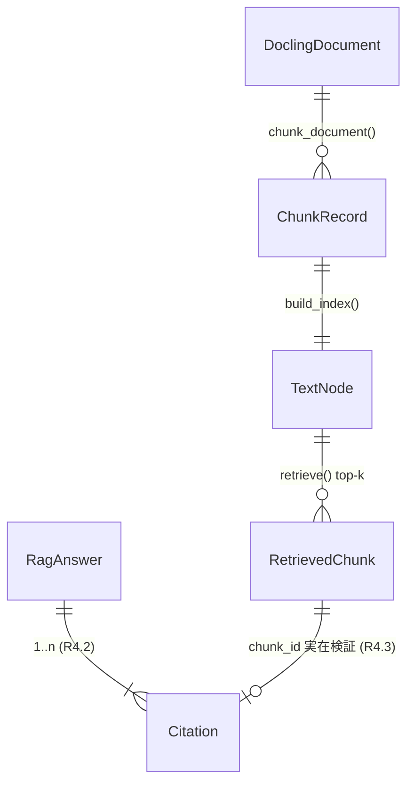

# 007-2b-cross-platform — Technical Plan

承認済み要件（WHAT）を `patterns/` 規律に沿うアーキテクチャ（HOW）へ翻訳する。
実装コードは含まない。判断根拠は `research.md`（ADR-1〜5 / Risk R-1〜4）、整合点は
`gap-analysis.md` を参照。

## Summary

初の**応用レイヤ（RAG）**を独立 uv レーン `patterns/rag/`（`frameworks/` 外、
`patterns_rag`）として新設し、Docling `HybridChunker`（実物）→ in-memory
`VectorStoreIndex` → top-k 検索 → **引用付き回答**のパイプラインを LlamaIndex で構築する。
RAG 契約（`RetrievedChunk` / `Citation` / `RagAnswer`）を `patterns/contracts/` に単一
実体として追加し 006-2a の単一点ドリフトに乗せ、dangling citation を契約レベルで
loud-fail させる。重量依存（変換器）は**事前変換 DoclingDocument 固定資産**で CI 経路外に
追い出し、mise/CI は `patterns/contracts/` の明示配線前例を踏襲してルート無変更を保つ。

## Architecture Overview

```mermaid
flowchart TD
  subgraph offline["オフライン経路（unit, ネット I/O ゼロ）"]
    FIX[("sample.docling.json<br/>固定資産 (ADR-3)")] --> CH[chunking.chunk_document<br/>HybridChunker 実物]
    CH -->|"list[ChunkRecord]<br/>source/locator/chunk_id"| IDX[indexing.build_index]
    FE[["HashEmbedding<br/>(BaseEmbedding fake)"]] -.DI seam.-> IDX
    IDX --> VS[("VectorStoreIndex<br/>SimpleVectorStore in-memory")]
    GOLD[("golden_chunks.json")] -. 比較 .- CH
  end
  Q[query] --> RAG[rag.run_rag]
  VS --> RET[retrieval.retrieve<br/>top-k + (-score, chunk_id) 安定ソート]
  RAG --> RET
  RET -->|"list[RetrievedChunk]"| RAG
  FL[["ScriptedLLM / Ollama<br/>(DI seam)"]] -.-> RAG
  RAG --> CIT[citation.validate_citations<br/>dangling/empty → loud-fail]
  CIT -->|OK| ANS[RagAnswer]
  CIT -->|NG| ERR[[DanglingCitationError /<br/>EmptyCitationError]]
  OBS[observability.configure_tracing<br/>OpenInference + InMemorySpanExporter] -. span≥1 .- RAG
```

**データ/制御フロー**: 固定資産（事前変換 `DoclingDocument`）→ `chunk_document` が実物
`HybridChunker` で決定論チャンク化し `ChunkRecord` 列を生成（ゴールデン比較で回帰検知）→
`build_index` が DI seam の埋め込み（オフライン=ハッシュ / 結合=Ollama）で in-memory
`VectorStoreIndex` を構築 → `run_rag(query, *, llm, retriever)` が top-k 検索（安定ソート）
→ LLM が引用付き回答を生成 → `validate_citations` が各引用の実在性を検証し dangling/empty を
例外で loud-fail → `RagAnswer` を返す。全経路を OpenInference 計装が観測し、テストは
`InMemorySpanExporter` で span≥1 を検証する。

## Components

### contracts.rag（共有契約モジュール）

- **Responsibility**: RAG の入出力 Pydantic モデルを契約パッケージの単一実体として定義する。
- **Public interface**:
  ```python
  class RetrievedChunk(BaseModel): chunk_id: str; source: str; locator: str; text: str; score: float
  class Citation(BaseModel): source: str; locator: str; chunk_id: str; score: float
  class RagAnswer(BaseModel): answer: str; citations: list[Citation]
  ```
  `patterns_contracts.__init__` から3型を再エクスポート（`__all__` 追記）。
- **Owns**: RAG 契約の型定義（フィールド名・型）。`Field(description=...)` は実体側のみ。
- **Does NOT own**: エントリ関数の実装、`Literal` 語彙（RAG は持たない）、README 正本本文。
- **Requirements**: 4.1, 5.1

### rag.entrypoint（`run_rag`）

- **Responsibility**: query と注入された llm・retriever を受け、引用付き `RagAnswer` を
  オーケストレーションして返す唯一の公開エントリ。
- **Public interface**: `async def run_rag(query: str, *, llm: LLM, retriever: BaseRetriever, top_k: int = 4) -> RagAnswer`
- **Owns**: 検索→プロンプト構築（各チャンクに `chunk_id` ラベル付与）→LLM 呼出→
  `RagAnswer` パース→引用検証の制御フロー。
- **Does NOT own**: チャンク化（`chunking`）、インデックス構築・埋め込み seam（`indexing`）、
  検索順序ロジック（`retrieval`）、引用検証規則（`citation`）、計装配線（`observability`）。
- **Requirements**: 4.1, 4.2, 4.3

### rag.chunking（`chunk_document`）

- **Responsibility**: `DoclingDocument` を実物 `HybridChunker` で決定論チャンク化し、
  `source`/`locator`/`chunk_id` を付与した `ChunkRecord` 列を返す。
- **Public interface**: `def chunk_document(doc: DoclingDocument, *, source: str, tokenizer: BaseTokenizer, max_tokens: int) -> list[ChunkRecord]`（`ChunkRecord` はレーン内 dataclass: `chunk_id/source/locator/text`）
- **Owns**: locator 文字列化規約（page → section → char、ADR-4）、`chunk_id` 序数導出
  （`f"{source}::{ordinal:04d}"`）、決定論順序。
- **Does NOT own**: PDF→Document 変換（固定資産化, 経路外）、埋め込み、契約型（`RetrievedChunk`
  は検索時に score 付与して構築）。
- **Requirements**: 2.1, 2.2, 2.3, 4.4

### rag.indexing（`build_index`）

- **Responsibility**: `ChunkRecord` 列を LlamaIndex `TextNode`（`id_=chunk_id`,
  metadata=`{source, locator}`）化し、注入された埋め込みモデルで in-memory
  `VectorStoreIndex` を構築する。
- **Public interface**: `def build_index(chunks: Sequence[ChunkRecord], *, embed_model: BaseEmbedding) -> VectorStoreIndex`
- **Owns**: 埋め込み DI seam の受け口、in-memory `SimpleVectorStore` 既定（CVE-2025-1793
  回避）、`ChunkRecord` → `TextNode` 変換。
- **Does NOT own**: 埋め込みの具体実装（オフライン fake / 結合 Ollama は呼び出し側が注入）、
  検索順序、回答生成。
- **Requirements**: 3.1, 3.2

### rag.retrieval（`retrieve`）

- **Responsibility**: top-k 検索結果を `(-score, chunk_id)` 安定ソートで決定論順に整列し、
  `RetrievedChunk`（契約型）列を返す。
- **Public interface**: `def retrieve(retriever: BaseRetriever, query: str, *, top_k: int = 4) -> list[RetrievedChunk]`
- **Owns**: スコア同点時 `chunk_id` 昇順タイブレーク（ADR-5）、node metadata → `RetrievedChunk`
  への復元。
- **Does NOT own**: インデックス構築、埋め込み、引用検証。
- **Requirements**: 3.1, 3.3

### rag.citation（`validate_citations`）

- **Responsibility**: `RagAnswer` の各 `Citation` が検索済みチャンク集合の実在 `chunk_id` を
  指すこと、引用が1件以上あることを検証し、違反を例外で loud-fail させる。
- **Public interface**: `def validate_citations(answer: RagAnswer, retrieved: Sequence[RetrievedChunk]) -> None`（`raise DanglingCitationError | EmptyCitationError`）
- **Owns**: 引用なりすまし（dangling）の契約レベル防御（R9.3）、引用ゼロ禁止、例外型定義。
- **Does NOT own**: 回答生成、locator の意味的妥当性以上の検証（locator は範囲対応のみ）。
- **Requirements**: 4.2, 4.3, 9.3

### rag.observability（`configure_tracing` ほか）

- **Responsibility**: llamaindex レーンと揃えた OpenInference 計装を配線する（複製）。
- **Public interface**: `configure_tracing(exporter=None) -> TracerProvider` / `instrument_llamaindex(provider)` / `uninstrument_llamaindex(instrumentor)`
- **Owns**: exporter 優先チェーン（注入 > `OTEL_EXPORTER_OTLP_ENDPOINT` > no-op）、
  プロセスグローバル instrumentor の着脱。
- **Does NOT own**: スパン属性の集計（バックエンド責務、R8.3）、span 内容のアサート。
- **Requirements**: 8.1, 8.2, 8.3

### tests.support.fakes（`HashEmbedding` / `ScriptedLLM`）

- **Responsibility**: オフライン決定論の埋め込み・LLM フェイクを供給する。
- **Public interface**: `HashEmbedding(BaseEmbedding)`（内容→ハッシュ→固定次元ベクトル）/
  引用入り台本を返す `ScriptedLLM(CustomLLM)`。
- **Owns**: 決定論ベクトル生成、引用付き回答の台本化。
- **Does NOT own**: 本番埋め込み/LLM（結合は env 駆動で実物）。
- **Requirements**: 6.3, 3.2

### infra.wiring（mise / CI / contracts drift / docs）

- **Responsibility**: 新レーンを mise タスク・CI・単一点ドリフト・README/SECURITY-NOTES に
  contracts 前例で明示配線し、ルート無変更を保つ。
- **Public interface**: mise `patterns:*` への `(cd patterns/rag && …)` 行、`patterns-ci.yml`
  の `rag` 専用ジョブ + paths、`test_contract_drift.py` の `_README_PATHS["rag"]`、
  `patterns/README.md` 応用レイヤー節、`patterns/SECURITY-NOTES.md` の RAG 行。
- **Owns**: 配線の単一性（グロブ外レーンの明示登録）。
- **Does NOT own**: ルートワークフロー（`ci.yml`/`integration-ollama.yml`/`security.yml`、無変更）。
- **Requirements**: 1.4, 5.2, 9.1, 9.2, 9.4, 10.1, 10.2, 10.3, 11.1, 11.2, 11.3, 12.1, 12.2

## Data Model



| Entity | Field | Type | Notes |
|--------|-------|------|-------|
| `ChunkRecord`（lane internal） | chunk_id | str | `f"{source}::{ordinal:04d}"`（決定論序数, R2.3） |
| | source | str | ドキュメント識別子（固定資産で明示注入） |
| | locator | str | `page=` / `section=` / `char=`（種別非依存, R4.4） |
| | text | str | `chunker.contextualize(chunk)` のシリアライズ |
| `RetrievedChunk`（contract） | chunk_id/source/locator/text | str | `ChunkRecord` 由来 |
| | score | float | 検索スコア（同点は chunk_id 昇順, R3.3） |
| `Citation`（contract） | source/locator/chunk_id | str | 実在チャンクを指す（R4.3） |
| | score | float | 裏付けチャンクのスコア |
| `RagAnswer`（contract） | answer | str | 回答本文 |
| | citations | list[Citation] | 1件以上必須（R4.2） |

## Interfaces / Contracts

- **契約正本**: `patterns/rag/README.md` の `## パターン契約` ```` ```python ```` ブロック
  （注釈のみ、`Field`/description なし）。実体は `patterns/contracts/src/patterns_contracts/rag.py`。
  一致は `test_contract_drift.py`（README 正本 == パッケージ）が単一点検証（R5.2）。
- **エントリ signature（README 記載・parser スキップ対象）**:
  `async def run_rag(query: str, *, llm, retriever/index) -> RagAnswer: ...`
- **環境変数（結合）**: `OLLAMA_BASE_URL` / `OLLAMA_MODEL_NAME`（既存）+ 新規
  `OLLAMA_EMBED_MODEL_NAME`（埋め込みモデル, Q-2）。`RUN_INTEGRATION_PATTERNS=1` でゲート。
  CI（`patterns-integration-ollama.yml`）は `OLLAMA_EMBED_MODEL_NAME` を env で供給し、
  生成 LLM と同様に埋め込みモデルを pull する（未供給だと結合が実質スキップ/失敗するため必須）。
- **例外契約**: `DanglingCitationError` / `EmptyCitationError`（`rag.citation` 定義、loud-fail）。
- **固定資産**: `tests/fixtures/sample.docling.json`（事前変換 DoclingDocument）+
  `tests/fixtures/golden_chunks.json`（チャンク境界・id・locator のスナップショット）。

## File Structure Plan

| File | Create/Modify | Responsibility |
|------|---------------|----------------|
| `patterns/rag/.python-version` | Create | レーンの Python を `3.13` に固定（contracts/llamaindex フロア）。 |
| `patterns/rag/pyproject.toml` | Create | 独立 uv プロジェクト定義（deps/contracts パス依存/ruff/pyright strict/pytest/fail_under）。 |
| `patterns/rag/uv.lock` | Create | レーンの解決済みロック（`--locked` で CI 解決, NFR-1）。 |
| `patterns/rag/README.md` | Create | パターン契約正本 + 必須4セクション + Docling/ライブラリ版・ベータ注記（R10.1/10.3）。 |
| `patterns/rag/src/patterns_rag/__init__.py` | Create | `run_rag`・契約型・tracing シンボルのフラット再エクスポート。 |
| `patterns/rag/src/patterns_rag/chunking.py` | Create | `chunk_document`：HybridChunker 実物 + locator/chunk_id 決定論導出。 |
| `patterns/rag/src/patterns_rag/indexing.py` | Create | `build_index`：埋め込み DI seam で in-memory `VectorStoreIndex` 構築。 |
| `patterns/rag/src/patterns_rag/retrieval.py` | Create | `retrieve`：top-k + `(-score, chunk_id)` 安定ソート。 |
| `patterns/rag/src/patterns_rag/citation.py` | Create | `validate_citations` + `DanglingCitationError`/`EmptyCitationError`。 |
| `patterns/rag/src/patterns_rag/rag.py` | Create | `run_rag` エントリ：検索→生成→引用検証のオーケストレーション。 |
| `patterns/rag/src/patterns_rag/observability.py` | Create | `configure_tracing`/`instrument_llamaindex`（llamaindex レーンから複製）。 |
| `patterns/rag/tests/support/fake_embedding.py` | Create | `HashEmbedding`（決定論ハッシュベクトル, BaseEmbedding 派生）。 |
| `patterns/rag/tests/support/fake_llm.py` | Create | `ScriptedLLM`（引用入り台本回答, CustomLLM 派生）。 |
| `patterns/rag/tests/fixtures/sample.docling.json` | Create | 事前変換 DoclingDocument 固定資産（ADR-3、変換器を CI 経路外に）。 |
| `patterns/rag/tests/fixtures/golden_chunks.json` | Create | チャンク境界/id/locator のゴールデンスナップショット（R6.2）。 |
| `patterns/rag/tests/unit/test_chunking_golden.py` | Create | 実物 HybridChunker 出力 == ゴールデン（R2.2/6.2）。 |
| `patterns/rag/tests/unit/test_retrieval_determinism.py` | Create | top-k 順序と同点 chunk_id 昇順タイブレーク（R3.3）。 |
| `patterns/rag/tests/unit/test_citation_soundness.py` | Create | 各 Citation が実在チャンクを指し locator が範囲対応（R6.4/4.4）。 |
| `patterns/rag/tests/unit/test_dangling_citation.py` | Create | dangling/empty citation の loud-fail（R4.2/4.3/9.3）。 |
| `patterns/rag/tests/unit/test_rag_answer_contract.py` | Create | `RagAnswer` ≥1 citation・契約形状（R4.1/4.2）。 |
| `patterns/rag/tests/unit/test_observability.py` | Create | `InMemorySpanExporter` で span≥1・末端スパン存在（R8.2/8.3）。 |
| `patterns/rag/tests/unit/test_smoke.py` | Create | import + fake 一巡の健全性。 |
| `patterns/rag/tests/integration/test_ollama_e2e.py` | Create | `RUN_INTEGRATION_PATTERNS=1` ゲート・契約レベルアサート・`OLLAMA_*`/embed env（R7.x）。 |
| `patterns/contracts/src/patterns_contracts/rag.py` | Create | `RetrievedChunk`/`Citation`/`RagAnswer` の単一実体（R5.1）。 |
| `patterns/contracts/src/patterns_contracts/__init__.py` | Modify | 3型を import + `__all__` 追記（R5.1）。 |
| `patterns/contracts/tests/unit/test_contract_drift.py` | Modify | `_README_PATHS` に `"rag"` 1行追加（R5.2）。 |
| `mise.toml` | Modify | `patterns:{setup,lint,format,typecheck,test,audit}` に `(cd patterns/rag && …)` 明示行 + `patterns:test:integration` に rag 行（R12.1）。 |
| `.github/workflows/patterns-ci.yml` | Modify | `rag` 専用ジョブ（contracts ジョブ複製: `uv sync --locked` → `pytest`、ネット事前取得ステップ無し）+ paths に `patterns/rag/**`（R11.1）。**前提**: 当該ジョブはオフライン解決可能なトークナイザ（`tiktoken` or `uv sync --locked` で同梱される資産）に確定し、HF 事前取得を不要にする（ADR-3 / R6.1 / R-1）。 |
| `.github/workflows/patterns-integration-ollama.yml` | Modify | PR paths に `patterns/rag/**` 追加 + **`env` に `OLLAMA_EMBED_MODEL_NAME` を追加** + **埋め込みモデルの pull ステップを追加**（生成 LLM と同様に skip-if-cached）（R7.3 / R11.2 / Q-2）。Docling/埋め込みの CI 重量が非実用と実測された場合は R11.4 に従い RAG 結合を別ジョブ/別ゲートへ隔離する。 |
| `patterns/README.md` | Modify | 「応用レイヤー」節を新設し RAG を索引（ワークフロー6表とは分離, R10.2）。 |
| `patterns/SECURITY-NOTES.md` | Modify | CVE-2025-1793 行更新（in-memory 既定のみ）+ RAG リスク→OWASP マッピング行（R9.1）。 |

## Error Handling & Edge Cases

- 引用ゼロの回答 → `EmptyCitationError` で loud-fail（R4.2）。
- `Citation.chunk_id` が検索済み集合に不在 → `DanglingCitationError` で loud-fail（R4.3/9.3）。
- チャンク境界がゴールデンと不一致 → `test_chunking_golden` 失敗で回帰検知（R6.2）。
- unit 実行中のネットワーク到達（HF/Ollama）→ `HF_HUB_OFFLINE=1` で loud-fail、結合のみ実 I/O（R6.1/R-1）。
- `top_k < 1` → `ValueError`（境界防御）。
- 検索結果ゼロ（空インデックス）→ 引用不能のため `EmptyCitationError`（R4.2 と整合）。
- スコア同点 → `chunk_id` 昇順タイブレークで決定論化（R3.3）。
- 外部ベクトル DB の混入 → 設計上 in-memory `SimpleVectorStore` 既定固定で CVE-2025-1793 回避（R9.1）。

## Constitution Compliance

| Principle | Status | Notes |
|-----------|--------|-------|
| I. Test-First（NON-NEGOTIABLE） | ✅ | 全 src モジュールに先行 unit。`/sdd-impl` の tdd-enforcement で Red→Green を PDCA/コミットに痕跡化。 |
| II. Strict Type Safety | ✅ | pyright strict（py3.13）。LlamaIndex/Docling の未型部は I/O 境界で `Citation`/`RetrievedChunk` 等 Pydantic に narrow。`# type: ignore` は upstream 原因を inline 明記。 |
| III. Library-First | ✅ | Docling/LlamaIndex を素直に利用。新規ビルドは upstream 不在の3点（fake 埋め込み・dangling loud-fail・ゴールデン基盤）のみで `research.md` に gap/exit を記録。observability は「複製」だが既存レーン規律（NFR-3 レーン自前コピー）に準拠。 |
| IV. SDD | ✅ | spec→plan→tasks→impl パイプライン遵守。各 task は requirement ID へトレース（下表）。 |
| V. Quality Gates | ✅ | レーン毎 `mise run patterns:{lint,format,typecheck,test,audit}`。`fail_under` は兄弟 parity(98) 目標、被覆困難なら 85→ratchet（R-4）。bare tool 起動なし。 |
| Tooling（mise→uv） | ✅ | 全ゲートを `patterns:*` 経由。`(cd patterns/rag && uv run …)` で配線。 |
| Security（S/secrets） | ✅ | pip-audit dev 依存 + CI、in-memory で CVE 回避、gitleaks/forbid-hardcoded-model-ids はリポジトリ全域被覆（R9.4）。モデル ID は env 経由（`OLLAMA_*`）。 |

CRITICAL 違反なし。observability 複製は Constitution III の「vendoring 禁止」と緊張しうるが、
これは patterns/ の確立規律（レーン独立性 NFR-3: 共有は契約パス依存のみ、運用ユーティリティは
レーン自前コピー）であり 005/006 で承認済みのため HIGH 説明として記録（新規逸脱ではない）。

## Requirements Traceability

| Requirement ID | Component(s) |
|----------------|--------------|
| 1.1 | infra.wiring（`patterns/rag/` 新設）, pyproject/.python-version/uv.lock |
| 1.2 | pyproject.toml（`tool.uv.sources` `../contracts`） |
| 1.3 | 全 `patterns_rag` モジュール（レーン間 import なし） |
| 1.4 | infra.wiring（ルート無変更） |
| 2.1, 2.2, 2.3 | rag.chunking |
| 3.1 | rag.indexing, rag.retrieval |
| 3.2 | rag.indexing, tests.support.fakes（HashEmbedding） |
| 3.3 | rag.retrieval |
| 4.1 | contracts.rag, rag.entrypoint |
| 4.2, 4.3 | rag.citation, rag.entrypoint |
| 4.4 | rag.chunking（locator）, rag.citation |
| 5.1 | contracts.rag, contracts `__init__` |
| 5.2 | patterns/rag/README.md, test_contract_drift.py |
| 5.3 | infra.wiring（既存6パターン非破壊） |
| 6.1 | tests（HF_HUB_OFFLINE, 固定資産） |
| 6.2 | tests/fixtures, test_chunking_golden |
| 6.3 | tests.support.fakes |
| 6.4 | test_citation_soundness, test_dangling_citation |
| 6.5 | pyproject.toml（fail_under） |
| 7.1, 7.2, 7.3 | tests/integration/test_ollama_e2e |
| 8.1, 8.2, 8.3 | rag.observability, test_observability |
| 9.1 | patterns/SECURITY-NOTES.md |
| 9.2 | pyproject.toml（pip-audit dev）, mise/CI |
| 9.3 | rag.citation |
| 9.4 | infra.wiring（pre-commit 全域不変条件） |
| 10.1, 10.3 | patterns/rag/README.md |
| 10.2 | patterns/README.md |
| 11.1 | patterns-ci.yml（rag ジョブ） |
| 11.2 | patterns-integration-ollama.yml |
| 11.3 | （ルートワークフロー無変更で担保） |
| 11.4 | pyproject.toml（結合 extra 隔離オプション）, research.md R-2 |
| 12.1 | mise.toml（patterns:* 明示行） |
| 12.2 | infra.wiring（ルート mise run check 無変更） |
