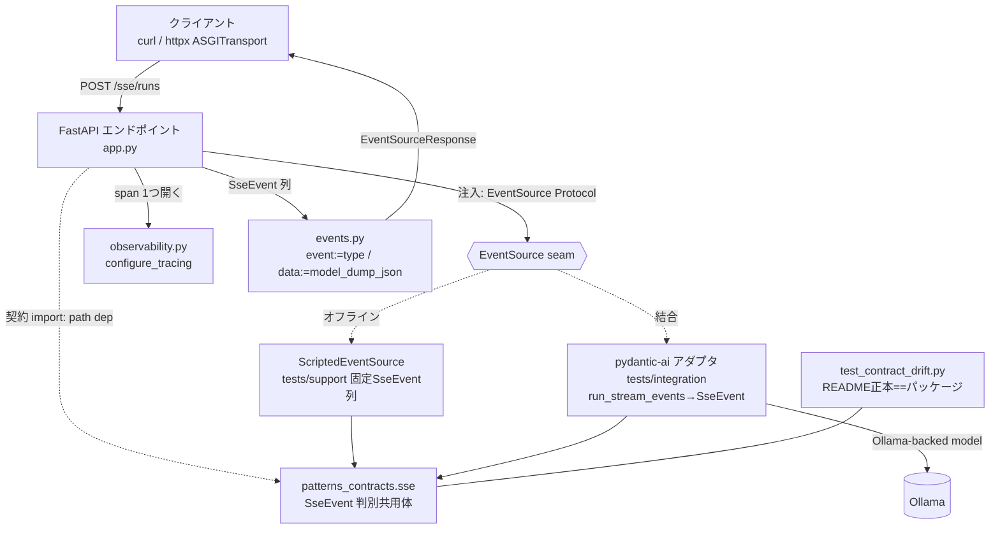
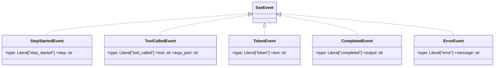

# 008-2c-cross-platform — Technical Plan

承認済み要件（WHAT）を `patterns/sse/` の応用レイヤアーキテクチャ（HOW）へ翻訳する。
実装コードは含まない。`research.md` の ADR-1〜5 を前提とする。

## Summary

RAG（007-2b）が確立した「共有契約を再利用しつつ `patterns/` 直下に新しい兄弟レーンを
足す」型紙を踏襲し、**配信インフラの 2 つ目の応用レイヤ**として独立 uv レーン
`patterns/sse/`（Python 3.14）を新設する。SSE レーン src は **framework-agnostic** に保ち、
エージェント実行イベントを `patterns_contracts` の **Pydantic 判別共用体 `SseEvent`** として
契約化、`EventSource` Protocol を **DI seam** で注入する（オフライン=台本フェイク／結合=
pydantic-ai `run_stream_events` アダプタ、ADR-2）。FastAPI + sse-starlette
`EventSourceResponse` で配信し、httpx `ASGITransport`（有限ストリームの全文バッファ）で
ハッピーパスを、ASGI scope への `http.disconnect` 直接注入（ADR-4）で切断・キャンセル経路を
ネットワークゼロで hermetic に検証する。

## Architecture Overview



制御/データフロー: クライアントが `POST /sse/runs` でクエリを送ると、エンドポイントは
注入された `EventSource` を駆動し、`configure_tracing` の `TracerProvider` から 1 span を
開いた内側で `SseEvent` を逐次受け取る。各 `SseEvent` は `events.py` で
`{"event": type, "data": model_dump_json()}` に直列化され `EventSourceResponse` が
`text/event-stream` として配信する。`step_started → tool_called* → token* → completed`
（またはエラー時 `error`）で終端する（R4）。切断時は sse-starlette の task-group が本体
ジェネレータを cancel し、`finally`/`except CancelledError` でリソースを解放する（R6）。

## Components

### `patterns_contracts.sse`（契約 — 既存 contracts パッケージに追加）

- **Responsibility**: エージェント実行イベントを `type: Literal[...]` 判別子付き Pydantic
  モデル群 + 判別共用体 `SseEvent` として単一実体で定義する。
- **Public interface**:
  - `StepStartedEvent` / `ToolCalledEvent` / `TokenEvent` / `CompletedEvent` /
    `ErrorEvent`（各 `type: Literal[...]` 判別子 + 最小フィールド）
  - `SseEvent = Annotated[Union[...], Field(discriminator="type")]`
  - `patterns_contracts` ルートからの再エクスポート（flat import 面）
- **Owns**: イベントの形状・`type` 判別子語彙（`event:` 名の正本）・フィールド集合。
- **Does NOT own**: 直列化（`events.py`）／配信（`app.py`）／イベント生成（`EventSource`
  実装）／不変条件の強制（順序・終端は `app.py`/`EventSource` 責務）。機微情報の混入禁止は
  契約の**設計方針**として保持するがフィールド制約では強制しない。
- **Requirements**: 2.1, 2.2（README 正本）, 2.4

### `patterns_sse.events`（SSE 直列化 + EventSource seam）

- **Responsibility**: `SseEvent` を SSE ワイヤ表現に写すヘルパと、注入される
  `EventSource` Protocol を定義する。
- **Public interface**:
  - `class EventSource(Protocol): def stream(self, query: str) -> AsyncIterator[SseEvent]: ...`
  - `def to_sse(event: SseEvent) -> dict[str, str]`（`{"event": event.type, "data":
    event.model_dump_json()}`、ADR-3）
  - 受信側ユーティリティ `parse_sse_events(body: str) -> list[SseEvent]`（`data:` JSON を
    `TypeAdapter(SseEvent).validate_json` で逆写像、テスト/クライアント用、R4.2）
- **Owns**: `event:`/`data:` 導出規約・`SseEvent` 逆写像・`EventSource` Protocol 形状。
- **Does NOT own**: イベントの中身の生成（`EventSource` 実装）／HTTP・配信ライフサイクル
  （`app.py`）／契約定義（`patterns_contracts.sse`）。
- **Requirements**: 2.3, 4.2

### `patterns_sse.app`（FastAPI アプリ + SSE 配信 + 切断/可観測性）

- **Responsibility**: FastAPI アプリを構築し、`EventSource` を注入で受けて
  `EventSourceResponse` で配信、切断時のクリーンアップと span を司る。
- **Public interface**:
  - `def create_app(*, event_source: EventSource, tracer_provider: TracerProvider | None
    = None) -> FastAPI`（DI seam — テストはフェイク/台本、結合は pydantic-ai アダプタを注入、
    R3.3/NFR-3）
  - エンドポイント `POST /sse/runs`（body `{query: str}`）→ `EventSourceResponse`
  - 内部 async ジェネレータ: `await request.is_disconnected()` ポーリング + `try/except
    asyncio.CancelledError: <cleanup>; raise` + `finally: <release>`（R6）。`error` イベントで
    終端し例外を silent に打ち切らない（R4.3）。`completed`/`error` で必ず終端（R4.4）。
    リクエストごとに `tracer_provider` から 1 span を開く（R7、ADR-5）。
- **Owns**: HTTP ルーティング・配信ライフサイクル・切断検知とリソース解放・span ラップ・
  イベント列の順序保証と終端マーカー。
- **Does NOT own**: イベント生成ロジック（`EventSource` 実装に委譲）／契約定義／直列化規約
  （`events.py`）／トレーサ構成（`observability.py`）／pydantic-ai・Ollama への直接結合
  （src は framework-agnostic、結合は注入されたアダプタ経由）。
- **Requirements**: 3.1, 3.2, 3.3, 4.1, 4.3, 4.4, 6.1, 6.3, 7.1

### `patterns_sse.observability`（OTel ブートストラップ — 複製）

- **Responsibility**: `configure_tracing(exporter=None) -> TracerProvider`(注入 >
  `OTEL_EXPORTER_OTLP_ENDPOINT` > no-op) を提供する。
- **Public interface**: `def configure_tracing(exporter: SpanExporter | None = None) ->
  TracerProvider`
- **Owns**: TracerProvider のプロセス構成と exporter 優先チェーン。
- **Does NOT own**: span の生成箇所（`app.py`）／属性アサート（しない、R7.3）。
- **Requirements**: 7.1

### `ScriptedEventSource`（オフライン台本フェイク — tests/support）

- **Responsibility**: 固定 `SseEvent` 列（`token` は固定チャンク列）を決定論的に yield し、
  切断を任意点で再現可能にする `EventSource` 実装。
- **Public interface**: `EventSource` Protocol 準拠 + 切断/エラーを誘発する seam
  （`fail_at` / `block_after` 等）
- **Owns**: 決定論トークン台本・テスト用エラー/遅延の注入点。
- **Does NOT own**: 実モデル駆動（結合アダプタ）／配信。
- **Requirements**: 5.2, 5.3, 6.2（誘発側）

### pydantic-ai 結合アダプタ（tests/integration）

- **Responsibility**: `pydantic_ai`（フレームワーク）+ Ollama-backed モデルで routing 型
  Agent を構築し、`run_stream_events` の `AgentStreamEvent` を `SseEvent` に写す `EventSource`
  実装（research.md I-1 の写像表）。
- **Public interface**: `EventSource` Protocol 準拠（`tests/integration/` 内）
- **Owns**: `AgentStreamEvent → SseEvent` 写像・モデル seam（env 駆動 Ollama）・
  `InstrumentationSettings` 併用。
- **Does NOT own**: `patterns_pydantic_ai` レーンの import（禁止、NFR-3）／オフライン経路。
- **Requirements**: 3.3, 7.1（結合）

## Data Model



| Entity | Field | Type | Notes |
|--------|-------|------|-------|
| StepStartedEvent | type / step | `Literal["step_started"]` / `str` | ステップ名（例 classify/answer） |
| ToolCalledEvent | type / tool / args_json | `Literal["tool_called"]` / `str` / `str` | 機微情報非掲載のサニタイズ済 JSON 文字列（R8.3, Q-1） |
| TokenEvent | type / text | `Literal["token"]` / `str` | 増分トークン（固定チャンクで決定論化, R5.3） |
| CompletedEvent | type / output | `Literal["completed"]` / `str` | 最終出力。終端マーカー（R4.4） |
| ErrorEvent | type / message | `Literal["error"]` / `str` | 例外サマリ（全文 traceback / 認証情報は載せない, R8.3）。終端マーカー（R4.4） |
| SseEvent | — | `Annotated[Union[...], Field(discriminator="type")]` | 判別共用体。ドリフトパーサは別名をスキップ（research.md I-5） |

> `args_json` / `message` の正確な命名・サニタイズ規約は impl 契約タスクで確定（Q-1）。

## Interfaces / Contracts

- **エンドポイント**: `POST /sse/runs`、リクエスト body `{"query": str}`、レスポンス
  `text/event-stream`（`EventSourceResponse`）。各イベントは `event: <type>` 行 +
  `data: <SseEvent の model_dump_json()>` 行（ADR-3）。
- **イベント列（R4.1）**: `step_started → (tool_called)* → (token)* → completed`、
  異常時は任意点から `error` で終端。`tool_called`/`token` は 0 回以上。
- **契約正本**: `patterns/sse/README.md` の `## パターン契約` ```` ```python ```` ブロックが
  正本、実体は `patterns/contracts/src/patterns_contracts/sse.py`。一致は
  `test_contract_drift.py` が 1 点で検証（`_README_PATHS` に `"sse"` 登録、research.md I-5）。
- **DI seam**: `create_app(*, event_source, tracer_provider)`。`EventSource` Protocol
  （`stream(query) -> AsyncIterator[SseEvent]`）を介し、src はレーン/フレームワークに非結合
  （NFR-3 / R1.3 / R3.3）。
- **環境変数（結合のみ）**: `OLLAMA_BASE_URL` / `OLLAMA_MODEL_NAME`（既設）、
  `OTEL_EXPORTER_OTLP_ENDPOINT`（任意）。モデル ID はハードコード禁止（env 経由）。

## File Structure Plan

| File | Create/Modify | Responsibility |
|------|---------------|----------------|
| `patterns/contracts/src/patterns_contracts/sse.py` | Create | 5 イベントモデル + `SseEvent` 判別共用体の単一実体定義。 |
| `patterns/contracts/src/patterns_contracts/__init__.py` | Modify | 5 イベントモデル + `SseEvent` を flat 再エクスポート（`__all__` 追記）。 |
| `patterns/contracts/tests/unit/test_contract_drift.py` | Modify | `_README_PATHS` に `"sse"` を 1 行追加（パーサは無改修、I-5）。 |
| `patterns/contracts/tests/unit/test_sse_contracts.py` | Create | 各イベントの生成・`model_dump_json`・判別共用体ラウンドトリップ・判別子検証。 |
| `patterns/sse/pyproject.toml` | Create | 独立 uv プロジェクト定義（runtime: fastapi/sse-starlette/pydantic/otel/contracts、dev: httpx/pydantic-ai/pytest 群、Python 3.14、ruff/pyright/coverage 設定）。 |
| `patterns/sse/.python-version` | Create | `3.14`（ADR-1 / I-7）。 |
| `patterns/sse/uv.lock` | Create | `--locked` 解決のロックファイル（NFR-1）。 |
| `patterns/sse/README.md` | Create | 契約正本 fenced block + 必須 4 セクション + FastAPI/sse-starlette 版・ベータ注意・curl/httpx 接続例（R9.1/9.3）。 |
| `patterns/sse/src/patterns_sse/__init__.py` | Create | パッケージ初期化・公開面。 |
| `patterns/sse/src/patterns_sse/events.py` | Create | `EventSource` Protocol・`to_sse`・`parse_sse_events`（直列化/逆写像、R2.3/4.2）。 |
| `patterns/sse/src/patterns_sse/app.py` | Create | `create_app` DI seam・`POST /sse/runs`・切断対応ジェネレータ・span ラップ（R3/4/6/7）。 |
| `patterns/sse/src/patterns_sse/observability.py` | Create | `configure_tracing`（exporter 優先チェーン、R7.1）。 |
| `patterns/sse/tests/support/scripted_source.py` | Create | 決定論台本 `ScriptedEventSource`（固定トークン・エラー/切断誘発 seam）。 |
| `patterns/sse/tests/support/asgi_driver.py` | Create | ASGI scope 直接駆動 + `http.disconnect` 注入ヘルパ（R6.2、ADR-4）。 |
| `patterns/sse/tests/unit/test_stream_order.py` | Create | ASGITransport でハッピーパスのイベント列順序・型・`model_validate`（R4.1/4.2/5.1/5.2）。 |
| `patterns/sse/tests/unit/test_token_determinism.py` | Create | 固定チャンク列で `token` の決定論検証（R5.3/NFR-2）。 |
| `patterns/sse/tests/unit/test_event_serialization.py` | Create | `event:`=`type` / `data:`=`model_dump_json` の導出検証（R2.3）。 |
| `patterns/sse/tests/unit/test_error_termination.py` | Create | 実行中エラー → `error` 終端、silent 打ち切り禁止（R4.3/4.4）。 |
| `patterns/sse/tests/unit/test_disconnect_cleanup.py` | Create | scope 注入切断 + `agen.aclose()` でジェネレータ停止・リソース解放（R6.1/6.2/6.3）。 |
| `patterns/sse/tests/unit/test_observability.py` | Create | `InMemorySpanExporter` 注入で span≥1・末端 span 存在（R7.2/7.3）。 |
| `patterns/sse/tests/unit/test_smoke.py` | Create | import/アプリ構築のスモーク。 |
| `patterns/sse/tests/integration/test_ollama_e2e.py` | Create | pydantic-ai `run_stream_events` アダプタ → 実 Ollama、`RUN_INTEGRATION_PATTERNS=1` ゲート・契約レベルアサート（R3.3 結合）。 |
| `mise.toml` | Modify | `patterns:{setup,lint,format,typecheck,test,audit}` と `patterns:test:integration` に `(cd patterns/sse && …)` を 1 行ずつ追記（rag 行の後）。 |
| `.github/workflows/patterns-ci.yml` | Modify | `rag` と同型の専用 `sse` ジョブ追加 + `paths` に `patterns/sse/**` 追記。 |
| `.github/workflows/patterns-integration-ollama.yml` | Modify | `pull_request.paths` に `patterns/sse/**` 追記。 |
| `patterns/SECURITY-NOTES.md` | Modify | SSE 固有リスク → OWASP（無制限消費 / データ漏洩）マッピング節を追加（R8.1）。 |
| `patterns/README.md` | Modify | 応用レイヤー索引に SSE 行を追加（ワークフロー 6 表とは別軸、配信インフラ応用と明記、R9.2）。 |

> ルート `ci.yml` / `integration-ollama.yml` / `security.yml` / ルート `pyproject.toml` は
> **無変更**（patterns/ は既に除外済、R10.3/R11.2 が構造的に成立）。gitleaks /
> forbid-hardcoded-model-ids は `exclude: ^patterns/` を持たずリポジトリ全域を走査するため、
> `patterns/sse/` も自動被覆（R8.4、新規ファイル不要の不変条件）。

## Error Handling & Edge Cases

- 実行中の例外 → `error` イベントを配信しストリームを終端（例外を silent に握り潰さない）→ R4.3
- 正常完了 → 最終 `completed` で明確に終端 → R4.4
- クライアント早期切断 → sse-starlette task-group が本体を cancel → `except CancelledError`
  でクリーンアップ後 re-raise、`finally` でリソース解放 → R6.1/6.3
- 無限/超長ストリーム（ASGITransport ハング回避）→ 終端マーカー強制 + 最大イベント数ガード +
  `send_timeout` 設定 → research.md R-2
- 空クエリ等の不正入力 → FastAPI バリデーションで 4xx（ストリーム開始前）→ R3.1
- `ToolCalledEvent.args_json` / `ErrorEvent.message` に機微情報を載せない（サニタイズ）→ R8.3
- ドリフト: `event:` 名（判別子）と README 正本の不一致 → `test_contract_drift.py` が loud-fail
  → R2.2

## Constitution Compliance

| Principle | Status | Notes |
|-----------|--------|-------|
| I. Test-First (NON-NEGOTIABLE) | ✅ | 全 src ファイルに先行する失敗テストを tasks.md で Red-Green-Refactor 順に配置。tdd-enforcement で強制。 |
| II. Strict Type Safety | ✅ | pyright strict（Python 3.14）。`SseEvent` 判別共用体で型安全と JSON 直列化を両立。ASGI/HTTP 境界の `Any` は Pydantic で narrow。`# type: ignore` は upstream 理由付きのみ。 |
| III. Library-First | ✅ | fastapi/sse-starlette/pydantic-ai/httpx を idiomatic に使用。自作は `EventSource` Protocol と直列化ヘルパ（upstream に無い fw 非依存 seam、ADR-2）に限定し pyproject に 1 行 rationale。 |
| IV. SDD | ✅ | `.sdd`/`specs` パイプライン準拠。各 tasks は要件 ID にトレース。本フェーズで constitution-compliance を実施。 |
| V. Quality Gates | ✅ | `patterns:check`（lint/format/typecheck/test）+ pip-audit + coverage `fail_under`。CI 専用 `sse` ジョブで `--locked` 同期。ルートゲート無変更。 |
| 型のみ import（TCH） | ✅ | `TracerProvider`/`SpanExporter`/`SseEvent` 等の型は `TYPE_CHECKING` ブロックへ（RAG 前例どおり）。 |
| Python バージョン（>=3.13） | ✅ | SSE レーンは 3.14（>=3.13 を満たす）。docling 由来の 3.13 ピン理由は本レーンに非該当（I-7）。 |
| print 禁止（T20）/ Google docstring（D） | ✅ | ロガー/span を使用、`print` なし。Google スタイル docstring。 |
| セキュリティ（S / gitleaks / model-id） | ✅ | モデル ID は env 専属。SSE リスク→OWASP マッピング（R8.1）。pip-audit を dev+CI（R8.2）。フックは patterns/ 全域被覆（R8.4）。 |

CRITICAL 違反なし。HIGH 違反なし。

## Requirements Traceability

| Requirement ID | Component(s) |
|----------------|--------------|
| 1.1 | `patterns/sse/pyproject.toml`, `.python-version`, `uv.lock`（独立 uv レーン） |
| 1.2 | `pyproject.toml`（`[tool.uv.sources]` contracts パス依存） |
| 1.3 | `patterns_sse.events`（`EventSource` Protocol）, `app.create_app`（DI seam）— src は fw/レーン非結合 |
| 1.4 | `mise.toml`/`patterns-ci.yml`/ルート無変更（patterns/ 除外） |
| 2.1 | `patterns_contracts.sse`（5 モデル + `SseEvent`） |
| 2.2 | `patterns/sse/README.md`（正本）, `__init__.py`（再エクスポート）, `test_contract_drift.py`（`_README_PATHS`） |
| 2.3 | `patterns_sse.events.to_sse`（`event:`=type / `data:`=json） |
| 2.4 | `test_contract_drift.py`（無改修パーサ、I-5）, `test_sse_contracts.py` |
| 3.1 | `patterns_sse.app`（`POST /sse/runs` + `EventSourceResponse`） |
| 3.2 | `patterns_sse.app`（注入 `EventSource` を駆動しイベント yield） |
| 3.3 | `create_app` DI seam, 結合アダプタ（Ollama-backed model seam） |
| 4.1 | `patterns_sse.app`（順序保証）, `ScriptedEventSource`, 結合アダプタ写像 |
| 4.2 | `patterns_sse.events.parse_sse_events`（`model_validate`）, `test_stream_order.py` |
| 4.3 | `patterns_sse.app`（`error` 終端・例外非握り潰し）, `test_error_termination.py` |
| 4.4 | `patterns_sse.app`（終端マーカー）, `test_error_termination.py` |
| 5.1 | `test_stream_order.py`（ASGITransport インプロセス） |
| 5.2 | `test_stream_order.py`（順序・型・`model_validate`） |
| 5.3 | `ScriptedEventSource`, `test_token_determinism.py`（固定チャンク） |
| 5.4 | `pyproject.toml`（coverage `fail_under` ratchet） |
| 6.1 | `patterns_sse.app`（切断対応ジェネレータ）, `test_disconnect_cleanup.py` |
| 6.2 | `tests/support/asgi_driver.py`（`http.disconnect` 注入）, `test_disconnect_cleanup.py` |
| 6.3 | `patterns_sse.app`（`except CancelledError`/`finally`）, `test_disconnect_cleanup.py` |
| 7.1 | `patterns_sse.observability.configure_tracing`, `app`（span ラップ） |
| 7.2 | `test_observability.py`（`InMemorySpanExporter` 注入で span≥1） |
| 7.3 | `test_observability.py`（末端 span 存在のみ） |
| 8.1 | `patterns/SECURITY-NOTES.md`（SSE→OWASP 節） |
| 8.2 | `pyproject.toml`（dev `pip-audit`）, `patterns-ci.yml`（`sse` ジョブ） |
| 8.3 | `patterns_contracts.sse`（最小フィールド設計）, `patterns/sse/README.md`（方針明記） |
| 8.4 | 既存 gitleaks/forbid-hardcoded-model-ids（patterns/ 全域、新規不要の不変条件確認） |
| 9.1 | `patterns/sse/README.md`（正本 + 必須 4 セクション） |
| 9.2 | `patterns/README.md`（応用レイヤー索引に SSE） |
| 9.3 | `patterns/sse/README.md`（版・ベータ注意・curl/httpx 例） |
| 10.1 | `.github/workflows/patterns-ci.yml`（`sse` ジョブ + paths） |
| 10.2 | `.github/workflows/patterns-integration-ollama.yml`（paths）, `mise.toml`（`patterns:test:integration`） |
| 10.3 | ルートワークフロー無変更（構造的成立） |
| 11.1 | `mise.toml`（全 `patterns:*` に sse 行） |
| 11.2 | ルート `mise run check`（patterns/ 除外で無変更グリーン） |
| NFR-1 | `uv.lock` コミット + CI `--locked` |
| NFR-2 | `ScriptedEventSource`（固定チャンク） |
| NFR-3 | `EventSource` Protocol DI seam（src 非結合）, contracts パス依存のみ |
| NFR-4 | coverage `fail_under` ratchet |
| NFR-5 | 契約正本=README / 実体=`patterns_contracts` / ドリフトテスト |
| NFR-6 | `app` の切断時リソース解放 + `test_disconnect_cleanup.py` |

---

_Plan generated (/sdd-plan): 2026-06-14_
