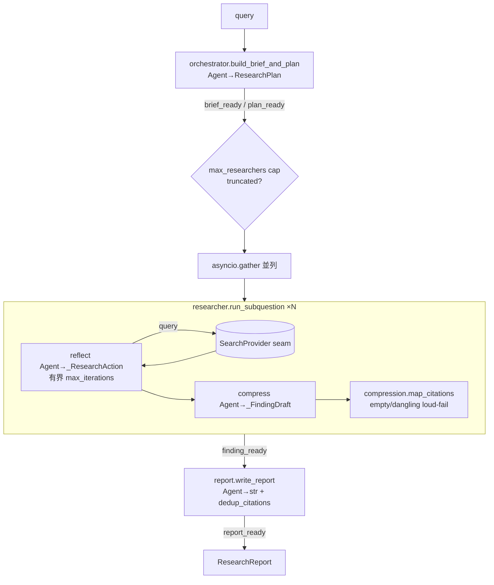

# 009-deep-research — Technical Plan

## Summary

Deep Research を `patterns/deep-research/` 独立 uv レーン（Python 3.13）として実装。lead→並列
researcher→引用 grounding→report の各段を Pydantic AI `Agent` で構成し、検索は `SearchProvider`
DI seam で抽象化する。契約は contracts パッケージに集約し（`Citation` は RAG 再利用）、単一ドリフト
テストで正本一致を検証。既存の orchestrator-workers / parallelization / autonomous-agent / RAG /
SSE の最小プリミティブを合成する。

## Architecture Overview



## Components

### `patterns_contracts.deep_research`（契約 — contracts パッケージに追加）
- 責務: brief/plan/finding/report モデル＋`ProgressEvent` 判別共用体の単一実体。`Citation` を RAG から再利用。
- Owns: 上記モデル。Does NOT own: grounding/cap の不変条件（パイプライン責務）。
- Req: 2.1 / 2.2。

### `patterns_deep_research.search`（SearchProvider seam）
- 責務: `@runtime_checkable` Protocol＋`load_search_provider()`（env で遅延 import、未設定/未配線は `ValueError`）。
- Req: 4.2 / 13.1。

### `patterns_deep_research.orchestrator`（lead）
- 責務: `build_brief_and_plan` — planner `Agent[None, ResearchPlan]`＋任意 clarify 前段。Req: 3。

### `patterns_deep_research.researcher`（sub-researcher）
- 責務: `run_subquestion` — 有界 search→read→reflect（`_ResearchAction`）→compress（`_FindingDraft`）→`map_citations`。
  cap 検証は `ValueError`。Req: 4.3 / 5 / 7.2。

### `patterns_deep_research.compression`（引用 grounding）
- 責務: `map_citations`（empty/dangling loud-fail、`chunk_id=f"{source}::{locator}"`）/ `dedup_citations`。Req: 5 / 6。

### `patterns_deep_research.report`（synthesizer）
- 責務: `write_report` — synthesizer `Agent[None, str]`＋dedup 引用＋truncated 伝播。Req: 6。

### `patterns_deep_research.research`（上位 entry）
- 責務: `run_deep_research` — cap 検証→plan→fan-out cap（truncated）→`asyncio.gather`→report、`on_event` 発行、
  instrumentation を一度だけ適用し各段へ共有。Req: 4.1 / 7.1 / 9 / 10。

### `patterns_deep_research.observability`（OTel ブートストラップ — 複製）
- 責務: `configure_tracing(exporter=None)`（注入 > OTLP env > no-op）。Req: 9。

### テスト support（tests/support, tests/fixtures）
- `fake_search.FakeSearchProvider`（決定論 corpus、force_empty/fail_at seam）、`model_fakes.scripted_model`
  （出力スキーマ分岐）、`hermetic.NetworkReachError`、`fixtures/corpus.json`。Req: 8。

## Data Model

`ResearchBrief{query,objective,out_of_scope}` / `SubQuestion{description}` /
`ResearchPlan{brief,subquestions}` / `SearchQuery{text}` /
`SearchResult{source,locator,snippet,score}` /
`Finding{subquestion,summary,citations,iterations,truncated}` /
`ResearchReport{brief,findings,report,citations,truncated}` /
`ProgressEvent = BriefReady|PlanReady|ResearcherStarted|FindingReady|ReportReady`。
`Citation` は RAG 再利用（`{source,locator,chunk_id,score}`）。

## Interfaces / Contracts

```python
async def run_deep_research(query, *, model, search, max_researchers=3, max_iterations=3,
    top_k=5, clarify=False, instrumentation=None, on_event=None) -> ResearchReport
async def build_brief_and_plan(query, *, model, clarify=False, instrumentation=None) -> ResearchPlan
async def run_subquestion(subquestion, *, model, search, max_iterations=3, top_k=5, instrumentation=None) -> Finding
async def write_report(brief, findings, *, model, truncated=False, instrumentation=None) -> ResearchReport
```

## File Structure Plan

| 操作 | パス |
|---|---|
| 新規 | `patterns/contracts/src/patterns_contracts/deep_research.py` |
| 変更 | `patterns/contracts/src/patterns_contracts/__init__.py`（再export）|
| 変更 | `patterns/contracts/tests/unit/test_contract_drift.py`（`_README_PATHS`）|
| 新規 | `patterns/contracts/tests/unit/test_deep_research_contracts.py` |
| 新規 | `patterns/deep-research/{pyproject.toml,.python-version,uv.lock,README.md,COMPARISON.md}` |
| 新規 | `patterns/deep-research/src/patterns_deep_research/{__init__,research,orchestrator,researcher,compression,report,search,observability}.py` |
| 新規 | `patterns/deep-research/tests/{support,fixtures,unit,integration}/...` |
| 変更 | `patterns/README.md` / `patterns/SECURITY-NOTES.md` |
| 変更 | `mise.toml` / `.github/workflows/patterns-ci.yml` / `patterns-integration-ollama.yml` / `.env.example` |

## Error Handling & Edge Cases

- 非正の cap（researchers/iterations/top_k）→ `ValueError`。
- 引用ゼロ → `EmptyCitationError`；未取得出典 → `DanglingCitationError`。
- 空クエリ反復は検索を呼ばずスキップ；fake `fail_at` で検索失敗を伝播。
- ライブ検索未設定/未配線 → `load_search_provider` が `ValueError`。

## Constitution Compliance

- 品質ゲートは mise/uv 経由（bare 実行なし）。pyright strict / ruff strict / coverage 98（実測 100%）。
- モデル ID・鍵ハードコード禁止（env 専属）。import 時 I/O ゼロ。契約は単一実体＋ドリフトテスト。

## Requirements Traceability

| Req | 実装 / テスト |
|---|---|
| 1 | レーン pyproject / `tool.uv.sources` / smoke の no-sibling-import |
| 2 | `deep_research.py` / `__init__` / drift test / `test_deep_research_contracts.py` |
| 3 | `orchestrator.py` / `test_brief_and_plan.py` |
| 4 | `research.py`・`researcher.py` / `test_fanout_cap.py`・`test_bounded_iterations.py` |
| 5 | `compression.py` / `test_citation_mapping.py` |
| 6 | `report.py` / `test_report_synthesis.py` |
| 7 | cap 検証＋truncated / `test_fanout_cap.py`・`test_bounded_iterations.py` |
| 8 | `tests/unit/*`（autouse block_network）/ `tests/integration/*`（gated）|
| 9 | `observability.py` / `test_observability.py` |
| 10 | `research.py` on_event / `test_report_synthesis.py` |
| 11 | README / COMPARISON.md / patterns/README.md |
| 12 | mise.toml / patterns-ci.yml / patterns-integration-ollama.yml |
| 13 | SECURITY-NOTES.md / .env.example / search.py |
