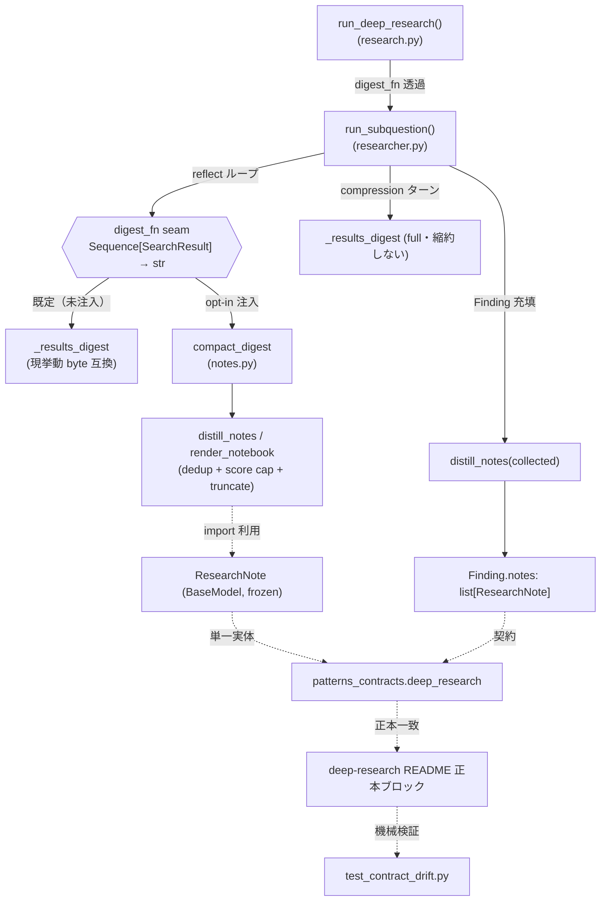
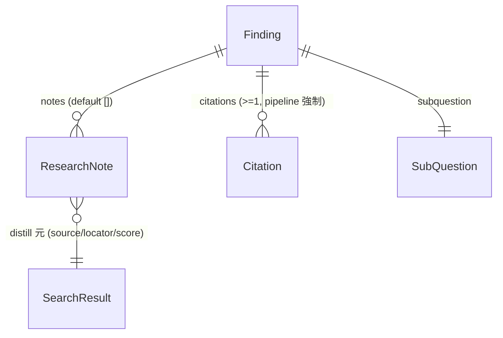

# 010-context-engineering — Technical Plan

承認済み要件（WHAT）をアーキテクチャ（HOW）へ翻訳する。実装コードは含めない。
`rules/plan-principles.md` 準拠。前提は spec.md ADR-1〜3（Clarifications 確定済）と
`research.md` の ADR-A/B/C。

## Summary

deep-research の compaction / structured note-taking デモ（`notes.py`、実装・100% テスト済）を
本線へ昇格する。具体的には (1) reflect ループの digest 生成を `digest_fn` DI シーム化し（既定で
現挙動 byte 互換、`compact_digest` を opt-in 注入）、(2) `ResearchNote` を `patterns_contracts` の
Pydantic 契約へ昇格して `Finding.notes` に載せ、ハンドオフを「凝縮サマリ + ノート」へ固定する。
既存の DI シーム規律・契約所有則・単一ドリフトテストにそのまま乗るため最小チャーンで Req 1〜5 を充足する。

## Architecture Overview

データ/制御フロー:

1. `run_deep_research` は `digest_fn` を受け取り `run_subquestion` へ透過（end-to-end opt-in）。
2. `run_subquestion` の **reflect ループ**のみが `digest_fn` シーム経由で results ブロックを生成する。
   既定は `_results_digest`（byte 互換）、opt-in で `compact_digest`（ノートベース縮約）。
3. **compression ターン**は `_results_digest` full 出力を維持し citation grounding を保全する（ADR-A）。
4. ループ終了後、`distill_notes(collected)` で `Finding.notes` を充填しハンドオフを凝縮する。
5. `ResearchNote` は `patterns_contracts` の単一実体。deep-research README 正本＝package の一致を
   既存ドリフトテストが自動検証（Req 2.3）。

## Components

### ResearchNote 契約（patterns_contracts.deep_research）

- **Responsibility**: distill した高信号ノートを表す依存ゼロの Pydantic 契約を単一実体として提供する。
- **Public interface**: `class ResearchNote(BaseModel)` — `frozen=True`、フィールド
  `source: str` / `locator: str` / `key_point: str` / `score: float`。package root から再エクスポート。
- **Owns**: ノートの形状（4 フィールド）と不変性（frozen）。
- **Does NOT own**: ノートの生成ロジック（`notes.py` の distill）、ハッシュ以外の振る舞い、
  `decision` 系の将来拡張（v1 は 4 フィールド固定。docstring に拡張余地のみ明記）。
- **Requirements**: 2.1

### Finding 契約拡張（patterns_contracts.deep_research）

- **Responsibility**: sub-researcher → lead ハンドオフに distill ノートを載せる carrier を提供する。
- **Public interface**: 既存 `Finding` に `notes: list[ResearchNote] = Field(default_factory=list, ...)`
  を追加。既定 `[]` で後方互換。
- **Owns**: ハンドオフ payload の形状（summary + citations + notes、生トランスクリプト非伝播）。
- **Does NOT own**: notes の充填（researcher の責務）、citation grounding（compression の責務）。
- **Requirements**: 2.2

### notes モジュール（patterns_deep_research.notes）

- **Responsibility**: compaction（dedup + score cap + truncate）と note 描画を決定論的に提供する。
- **Public interface**: `distill_notes(results, *, max_notes, key_point_chars) -> list[ResearchNote]`、
  `compact_digest(results, ...) -> str`、`render_notebook(notes) -> str`。シグネチャ不変。
- **Owns**: 縮約アルゴリズム（最高 score 優先 dedup、score 降順 + `(source, locator)` tiebreak、
  `max_notes` cap、可視マーカー truncate）、`max_notes`/`key_point_chars` 非正の `ValueError` loud-fail。
- **Does NOT own**: `ResearchNote` の **定義**（契約から import、再定義しない）、reflect ループへの配線
  （researcher の責務）。
- **Requirements**: 1.2, 3.1, 3.2, 3.3
- **変更点**: local frozen dataclass `ResearchNote` を削除し `patterns_contracts` から import。
  アルゴリズム本体（`distill_notes`/`compact_digest`/`render_notebook`/`_key_point`）は不変。

### researcher（patterns_deep_research.researcher）

- **Responsibility**: reflect ループの digest 生成を注入可能シーム化し、ループ後に Finding.notes を充填する。
- **Public interface**: `run_subquestion(subquestion, *, model, search, max_iterations, top_k,
  instrumentation, digest_fn: Callable[[Sequence[SearchResult]], str] = _results_digest)`。
- **Owns**: `digest_fn` シームの **reflect ループへの適用**（L132 相当）、`_results_digest` の引数型
  拡幅（`list` → `Sequence`）、`Finding.notes = distill_notes(collected)` の充填。
- **Does NOT own**: compression ターンの digest（`_results_digest` full を維持＝縮約しない、ADR-A）、
  縮約アルゴリズム（notes.py の責務）、citation grounding（compression の責務）。
- **Requirements**: 1.1, 1.2, 1.3, 1.4, 2.2
- **byte 互換ロックの検証手法（Req 1.3 受入条件）**: 既定 `digest_fn=_results_digest` は同一関数
  オブジェクトのため「同一オブジェクト等価」では回帰を捕捉できない。テストは **FunctionModel で
  reflect プロンプト文字列を捕捉**し、`_results_digest(collected)` から **独立に組み立てた期待文字列**
  との **完全一致（`==`）** をアサートする（関数同一性ではなく生成文字列の一致で固定）。これにより
  `_results_digest` 改変・seam 配線変更後の reflect プロンプト退行を検知する。

### research（patterns_deep_research.research）

- **Responsibility**: 最上位エントリから `digest_fn` を `run_subquestion` へ透過し end-to-end opt-in を可能にする。
- **Public interface**: `run_deep_research(..., digest_fn: Callable[[Sequence[SearchResult]], str] =
  _results_digest)` を追加し `_research` 内の `run_subquestion` 呼び出しへ委譲。
- **Owns**: seam スルーパス（既定は現挙動互換）。
- **Does NOT own**: 縮約ロジック・reflect 適用点（researcher の責務）。
- **Requirements**: 1.1, 1.2

### deep-research README 正本ブロック

- **Responsibility**: `ResearchNote` の正本所有と `Finding.notes` の正本記載で Req 2.3 をドリフト機械検証へ接続する。
- **Public interface**: `## パターン契約` 配下 `python` fence へ col-0 `class ResearchNote(BaseModel):`
  を `SearchResult` 直後に挿入。`Finding` 定義へ `notes: list[ResearchNote]` 行を追記。
- **Owns**: `ResearchNote` の正本（1クラス=1README）、本線昇格の準拠状況追記（Req 5.1）。
- **Does NOT own**: `Citation`（RAG 所有）など他レーン契約。
- **Requirements**: 2.3, 5.1

### ドキュメント（docs/context-engineering.md・verification.md）

- **Responsibility**: 本線配線手順への更新とベストプラクティス検証への反映。
- **Public interface**: `docs/context-engineering.md` を「diff 提示のみ」から「本線配線済 + 拡張点
  （token-budget seam）」へ書換。`specs/best-practices-review/verification.md` の **観点別テーブル第 5 行
  「コンテキストエンジニアリング」（現状「✅/△ 部分的」「compaction / note-taking は未実装」）** を
  実装済へ更新し、**「主な検証ポイント」節の bullet「context engineering の spec→実装ギャップ … → 改善提案 P2」** を
  実装済（本 spec）へ反映する。
- **Owns**: 配線手順の記述、v1 非対象（上限トリガ文脈再初期化）の明記。
- **Does NOT own**: 契約定義・アルゴリズム。
- **Requirements**: 1.4, 3.4, 5.1, 5.2

## Data Model

| Entity | Field | Type | Notes |
|--------|-------|------|-------|
| `ResearchNote` (新規) | `source` | `str` | distill 元 `SearchResult.source`。dedup アンカー |
| `ResearchNote` | `locator` | `str` | distill 元 `SearchResult.locator`。dedup アンカー |
| `ResearchNote` | `key_point` | `str` | 先頭文を `key_point_chars` で truncate（可視マーカー付き） |
| `ResearchNote` | `score` | `float` | distill 元 score。降順ランキングのキー |
| `Finding` (拡張) | `notes` | `list[ResearchNote]` | 既定 `[]`（後方互換）。`distill_notes(collected)` で充填 |

`ResearchNote` は `frozen=True`（不変・ハッシュ可能）。`Finding` の既存フィールド
（subquestion/summary/citations/iterations/truncated）は不変。

## Interfaces / Contracts

- **digest seam 型**: `Callable[[Sequence[SearchResult]], str]`。既定 `_results_digest`（引数型を
  `Sequence` へ拡幅）。opt-in 値 `compact_digest`（`notes.py`、同シグネチャ）。
- **契約再エクスポート**: `patterns_contracts.__init__` の `deep_research` import と `__all__` に
  `ResearchNote` を追加。
- **README 正本**: `## パターン契約` fence の `ResearchNote` を col-0 class として記載（ドリフト parser が
  field-set を拾える形）。`Finding` へ `notes: list[ResearchNote]` 行追記。
- **ドリフト不変条件**: `test_contract_drift.py` の class set / field set / 1クラス=1README が
  README＝package 一致を自動検証（追加コード不要）。

## File Structure Plan

| File | Create/Modify | Responsibility |
|------|---------------|----------------|
| `patterns/contracts/src/patterns_contracts/deep_research.py` | Modify | `ResearchNote(BaseModel, frozen=True)` を定義し、`Finding` に `notes: list[ResearchNote]`（既定 `[]`）を追加、`__all__` 更新 |
| `patterns/contracts/src/patterns_contracts/__init__.py` | Modify | `ResearchNote` を `deep_research` から import し package root `__all__` へ再エクスポート |
| `patterns/contracts/tests/unit/test_deep_research_contracts.py` | Modify | `Finding.model_fields` 期待集合へ `notes` 追加、`ResearchNote` の reexport / field-set / 既定値 ケースを新設 |
| `patterns/deep-research/README.md` | Modify | 正本ブロックへ `ResearchNote` を挿入・`Finding.notes` を追記、本線昇格の準拠状況と token-budget 拡張点を追記 |
| `patterns/deep-research/src/patterns_deep_research/notes.py` | Modify | local `ResearchNote` dataclass を削除し契約から import。アルゴリズムは不変 |
| `patterns/deep-research/src/patterns_deep_research/researcher.py` | Modify | `digest_fn` シーム追加（reflect 限定）、`_results_digest` 引数型を `Sequence` へ拡幅、`Finding.notes` を `distill_notes` で充填 |
| `patterns/deep-research/src/patterns_deep_research/research.py` | Modify | `run_deep_research` に `digest_fn` を追加し `run_subquestion` へ透過 |
| `patterns/deep-research/tests/unit/test_researcher.py` | Modify | reflect digest の byte 互換ロック（FunctionModel でプロンプト捕捉 → 独立構築した期待文字列と `==` 完全一致。関数同一性に依拠しない）、`compact_digest` 注入、`Finding.notes` 充填、compression は full digest 維持を検証 |
| `patterns/deep-research/tests/unit/test_research.py` | Modify | `run_deep_research` の `digest_fn` 透過（end-to-end opt-in）を検証 |
| `patterns/deep-research/tests/unit/test_notes.py` | Modify | `ResearchNote` の BaseModel 化（等値・frozen・kwargs 構築）に追従。空入力ケース確認 |
| `docs/context-engineering.md` | Modify | 「diff 提示のみ」から本線配線済へ書換、v1 非対象（上限トリガ再初期化）と token-budget 拡張点を明記 |
| `specs/best-practices-review/verification.md` | Modify | 観点別テーブル第 5 行「コンテキストエンジニアリング」（L33）＋ L42 の bullet（→ 改善提案 P2）を実装済へ反映 |

> 変更は deep-research レーン・`patterns_contracts.deep_research`/`__init__`・関連 docs に限定。
> 凍結 6 パターン契約・他レーン README・他レーン src には触れない（NFR）。

> **既知のスコープ脱線（要追跡）**: 本ブランチには改善提案 P1 の tool-design demo
> （`patterns/frameworks/pydantic-ai/src/patterns_pydantic_ai/tool_design.py` ＋ `tests/unit/test_tool_design.py`、
> commit `ee0e40c`）が同梱されているが、これは上記ファイルスコープ外であり、本 spec のどの要件 ID にも
> トレースしない（constitution「Every task traces to a requirement ID」に対する gap）。コード品質は良好だが、
> SDD 上は **未起票の P1 demo**。今後 P1 tool-design 用の専用 spec を起票してトレースを付与すること
> （本 spec 010 の受け入れ判定には含めない）。

## Error Handling & Edge Cases

- `max_notes` または `key_point_chars` が非正 → `ValueError` で loud-fail（既存実装維持、Req 3.3）。
- compression ターンの digest を縮約しない → citation 選択元 source を保全し `EmptyCitationError` /
  `DanglingCitationError` を誘発しない（ADR-A、Req 1.1）。
- `digest_fn` 未注入（既定）→ reflect digest が `_results_digest` と byte 一致（Req 1.3）。検証は
  関数同一性ではなく、捕捉した reflect プロンプト文字列 ＝ `_results_digest(collected)` から独立構築
  した期待文字列の完全一致で固定（researcher コンポーネントの受入条件参照）。
- `collected` が空 → `distill_notes([])` は `[]` を返し `Finding.notes=[]`（後方互換、安全）。
- トークン上限近傍の文脈再初期化要求 → v1 非対象。token-budget seam 接続を拡張点として文書化
  （Req 1.4 / 3.4、ADR-C）。

## Constitution Compliance

| Principle | Status | Notes |
|-----------|--------|-------|
| I. Test-First (NON-NEGOTIABLE) | ✅ | 全変更を Red-Green-Refactor で実装。byte 互換ロック・seam 注入・notes 充填・契約 field-set を先に赤テスト化 |
| II. Strict Type Safety | ✅ | `digest_fn` 型は `Callable[[Sequence[SearchResult]], str]`。`_results_digest` 引数を `Sequence` へ拡幅し pyright strict 反変を解消。`Any` 不使用 |
| III. Library-First | ✅ | 新規 runtime 依存ゼロ。Pydantic `BaseModel(frozen=True)` で `ResearchNote` 昇格、既存 DI シーム規律を再利用 |
| IV. Specification-Driven | ✅ | spec.md → plan.md → tasks.md パイプライン。各タスクが Req ID をトレース |
| V. Quality Gates | ✅ | `mise run patterns:check` + deep-research `fail_under=98`（実績 100%）維持。新シーム分岐・契約に test を追加 |
| 契約所有則（1クラス=1README） | ✅ | `ResearchNote` を deep-research README 正本所有。ドリフトテストが自動検証 |
| Model-ID hygiene | ✅ | モデル ID 文字列を増やさない（変更は契約・シーム・docs のみ） |

CRITICAL 違反なし。

## Requirements Traceability

| Requirement ID | Component(s) |
|----------------|--------------|
| 1.1 | researcher（`digest_fn` 公開・reflect 適用）、research（透過） |
| 1.2 | researcher（`compact_digest` 注入経路）、notes、research |
| 1.3 | researcher（既定 `_results_digest` byte 互換）、test_researcher |
| 1.4 | researcher（縮約限定）、docs（v1 非対象明記） |
| 2.1 | ResearchNote 契約、patterns_contracts `__init__` 再エクスポート |
| 2.2 | Finding 契約拡張、researcher（`Finding.notes` 充填） |
| 2.3 | deep-research README 正本、test_contract_drift（自動） |
| 3.1 | notes（dedup + score 降順 + tiebreak、既存） |
| 3.2 | notes（`max_notes` cap + 可視 truncate、既存） |
| 3.3 | notes（非正で `ValueError`、既存） |
| 3.4 | docs（token-budget seam 拡張点）、README |
| 4.1 | test_researcher / test_research / test_notes / 契約 test（`block_network` + 決定論フェイク） |
| 4.2 | test_notes（cap/dedup/trunc/順序）、test_researcher（notes 受け渡し・seam）、契約 test |
| 4.3 | 全 test（deep-research `fail_under=98` 維持） |
| 5.1 | docs/context-engineering.md、deep-research README |
| 5.2 | specs/best-practices-review/verification.md（観点別テーブル第 5 行「コンテキストエンジニアリング」＋「主な検証ポイント」節の P2 bullet） |
