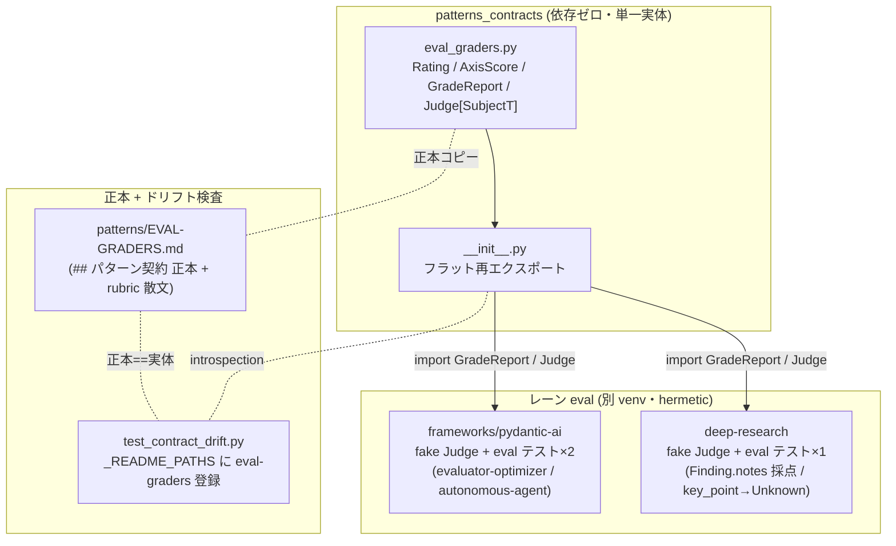
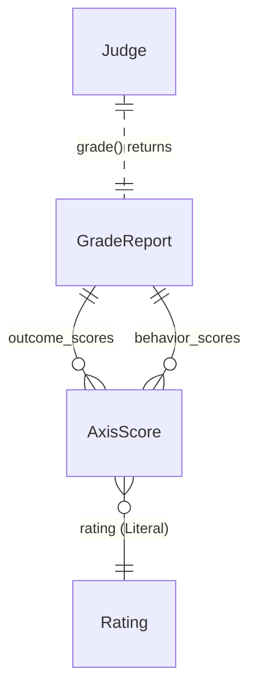

# 011-eval-graders — Technical Plan

承認済み要件（WHAT）を構造（HOW）へ翻訳する。実装コードは書かない。
`rules/plan-principles.md` に従う。出力言語 `ja`、コード識別子は英語。

## Summary

outcome+behavior の多軸グレーダ契約 `GradeReport`（+ `AxisScore` / `Rating` / `Judge` Protocol）を
依存ゼロの `patterns_contracts` に **新規契約モジュール**として純加算し（既存契約は無改変）、初の横断 README
`patterns/EVAL-GRADERS.md` を単一点ドリフトテストへ登録して単一ソース化する。rating はドリフト parser と
非対称衝突しない **文字列 Literal 名前付きエイリアス**で表現し（research.md AD-1）、独立 judge は契約パッケージの
最小ジェネリック `Judge[SubjectT]` Protocol を **注入シーム**として配置（AD-4）、3 パターンの参照検証と決定論
フェイク judge は別 venv 制約に従いレーン側 hermetic テストへ置く（AD-5）。ランタイム本線
（`OptimizationResult`/`ResearchReport`/`AgentRunResult`）は無改変で後方互換を保つ（ADR-4）。

## Architecture Overview



主要部品と流れ: 契約データ（`GradeReport`）と注入シーム（`Judge`）の **実体は `eval_graders.py` のみ**。正本コピーは
`EVAL-GRADERS.md` の `## パターン契約` python fence に二重化し、単一点ドリフトテストが「正本 == パッケージ実体」を
機械検証する。各レーンは `tool.uv.sources` パス依存で `patterns_contracts` を import し、決定論フェイク `Judge` で
採点対象（pattern の runtime result）から `GradeReport` を hermetic に構築・検証する。独立性（self-eval 回避）は
**実装規律**（別モデル注入・Generator/Evaluator 物理分離）で担保し、契約は純データ + `judge_id` 最小メタに留める。

## Components

### EvalGradersContract（`patterns_contracts/eval_graders.py`）

- **Responsibility**: outcome+behavior の多軸スコア契約（`GradeReport`/`AxisScore`/`Rating`）と独立 judge 注入
  シーム（`Judge[SubjectT]` Protocol）を単一実体として定義する。
- **Public interface**:
  - `Rating = Literal["1", "2", "3", "4", "5", "unknown"]`（named alias、`"unknown"` が証拠不足 = R1.2）
  - `class AxisScore(BaseModel)`: `criterion: str`, `rating: Rating`, `rationale: str`
    （`rationale` は空/空白を拒否する `field_validator` 付き = R1.5）
  - `class GradeReport(BaseModel)`: `outcome_scores: list[AxisScore]`, `behavior_scores: list[AxisScore]`,
    `aggregate: float`, `judge_id: str | None = None`
  - `class Judge[SubjectT](Protocol)`: `async def grade(self, subject: SubjectT, /) -> GradeReport: ...`
- **Owns**: グレーダ採点結果のデータ形状、`Rating` 語彙、judge 注入シームの型シグネチャ。
- **Does NOT own**: judge の具体実装／フェイク（レーン `tests/support/`）、rubric の段階定義文（EVAL-GRADERS.md 散文）、
  集約スコアの算出ロジック・スケール（採点ハーネス）、self-eval 禁止等の運用規律（実装規律であり型制約にしない = R3.3）、
  ランタイム収束ゲート（`OptimizationResult` 等は無改変）。
- **Requirements**: 1.1, 1.2, 1.3, 1.5, 3.1, 3.3

### EvalGradersExport（`patterns_contracts/__init__.py`）

- **Responsibility**: `Rating` / `AxisScore` / `GradeReport` / `Judge` をパッケージ root からフラット再エクスポートする。
- **Public interface**: `from patterns_contracts import GradeReport, AxisScore, Rating, Judge`（`__all__` へ追加）。
- **Owns**: 公開 import 面（submodule 非依存の安定パス）。
- **Does NOT own**: モデル定義そのもの（`eval_graders.py` 所有）。
- **Requirements**: 1.1, 2.1

### EvalGradersCanon（`patterns/EVAL-GRADERS.md`）

- **Responsibility**: 共有グレーダ契約の **正本**（`## パターン契約` 正本ブロック）と rubric 1–5 段階定義文、
  outcome/behavior criterion 例、独立 judge 規律の解説を所有する初の横断 README。
- **Public interface**: `## パターン契約` 直後の最初の `python` fence に `Rating = Literal[...]`（col-0 代入）+
  `class AxisScore` / `class GradeReport` / `class Judge(Protocol)` を正本として記載。rubric は別節に散文で定義。
- **Owns**: `GradeReport`/`AxisScore`/`Rating`/`Judge` の正本コピー（one-README 不変条件: 他 README は再宣言しない）、
  rating 1–5 の rubric 文言（R1.4）。
- **Does NOT own**: パッケージ実体（`eval_graders.py`）、各パターン固有の評価節（各 README が参照を追記）。
- **Requirements**: 1.4, 1.6, 5.1

### DriftGuardRegistration（`patterns/contracts/tests/unit/test_contract_drift.py`）

- **Responsibility**: `_README_PATHS` に `"eval-graders": _PATTERNS_DIR / "EVAL-GRADERS.md"` を追加し、正本 ==
  パッケージ実体の一致検査対象に含める（parser 本体は無改修）。
- **Public interface**: モジュール定数 `_README_PATHS` への 1 エントリ追加のみ。
- **Owns**: 横断 README の登録。
- **Does NOT own**: parser ロジック（凍結・無改修。`Rating` 文字列 Literal 設計で parser 変更不要 = AD-1）。
- **Requirements**: 1.6, 4.3

### ContractGraderTests（`patterns/contracts/tests/unit/test_eval_graders.py`）

- **Responsibility**: 契約パッケージ単体で `AxisScore`/`GradeReport`/`Rating`/validator/`Judge` シーム形状を
  hermetic 検証する（inline 決定論フェイク judge 使用）。
- **Public interface**: pytest テスト関数群（rationale 空→loud-fail、`unknown` rating 受理、outcome/behavior 分離保持、
  集約 float、`judge_id` 任意、Protocol 準拠フェイクで `grade()→GradeReport`）。**partial credit 検証**: outcome に一部
  `rating="unknown"` を含み behavior に数値 rating を混在させた `GradeReport` が構築でき、`aggregate: float` を受理する
  ケースを 1 本含める（R1.3「partial credit を許す」の回帰固定）。
- **Owns**: 契約レイヤのカバレッジ（ratchet 維持）。
- **Does NOT own**: レーン横断の参照検証（レーン側 = R4.2）。
- **Requirements**: 1.2, 1.3, 1.5, 3.2, 4.1

### LaneEvalReferences（pydantic-ai レーン ×2 + deep-research レーン ×1）

- **Responsibility**: 3 パターンが同一 `GradeReport`/`Judge` を import・構築できることを各レーンの hermetic eval
  テストで検証し、決定論フェイク `Judge` を各レーン `tests/support/` に置く。
- **Public interface**:
  - pydantic-ai: `tests/support/` のフェイク `Judge` + `test_eval_graders_evaluator_optimizer.py`
    （`OptimizationResult` を採点）+ `test_eval_graders_autonomous_agent.py`（`AgentRunResult` を採点、behavior 軸:
    tool_use_discipline / guardrail_adherence）。
  - deep-research: `tests/support/` のフェイク `Judge[ResearchReport]` + `test_eval_graders_deep_research.py`
    （`Finding.notes` を採点対象に含める = R2.3、空/低信号 `key_point` → faithfulness 軸 `Unknown` = R2.4）。
  - **R2.4 規律は純粋ヘルパへ抽出**: 「空/低信号 `key_point` → `Rating="unknown"`」の判定を `tests/support/` の数行の
    純関数（例 `faithfulness_rating_for(notes) -> Rating`）に切り出し、フェイク `Judge` はそれを呼ぶ。テストは
    ヘルパへ空 `key_point` / 非空 `key_point` の両入力を直接与えて分岐を検証する（マッピング規律自体を tested 化し、
    フェイク台本への焼き込みによる同義反復を回避）。
- **Owns**: レーン側の参照検証・フェイク judge・採点規律（`Unknown` マッピング = 純粋ヘルパ + その分岐テスト）。
- **Does NOT own**: 契約データ形状（`eval_graders.py` 所有）、ランタイム本線ロジック（無改変）。
- **Requirements**: 2.1, 2.3, 2.4, 3.1, 3.2, 4.1, 4.2

### BackwardCompatLayer（既存ランタイム契約・無改変）

- **Responsibility**: `OptimizationResult`/`ResearchReport`/`AgentRunResult` をそのまま維持し、`GradeReport` を
  オフライン/CI 採点の **別レイヤ**として併存させる（ADR-4）。
- **Public interface**: 変更なし（純加算）。
- **Owns**: ランタイム収束ゲート（in-the-loop）。
- **Does NOT own**: オフライン多軸採点（`GradeReport` レイヤ）。
- **Requirements**: 2.2

### DocsSync（`patterns/README.md`, 3 パターン README, `specs/best-practices-review/verification.md`）

- **Responsibility**: EVAL-GRADERS.md を索引へ追加し、各パターン README の評価節へ参照を追記、verification.md 観点6
  へ単一ソース化を反映する。
- **Public interface**: ドキュメント追記（契約再宣言はしない）。
- **Owns**: 索引・参照・ベストプラクティス検証の記述。
- **Does NOT own**: 契約正本（EVAL-GRADERS.md 所有）。
- **Requirements**: 5.1, 5.2

## Data Model



| Entity | Field | Type | Notes |
|--------|-------|------|-------|
| `Rating`（alias） | — | `Literal["1","2","3","4","5","unknown"]` | named alias。`"unknown"`=証拠不足（R1.2）。文字列で drift 両側対称（AD-1） |
| `AxisScore` | `criterion` | `str` | 軸名（例 correctness / tool_use_discipline）。自由 str（AD-2） |
| `AxisScore` | `rating` | `Rating` | 離散 1–5 または unknown（R1.2） |
| `AxisScore` | `rationale` | `str` | 非空必須（`field_validator`、空→loud-fail = R1.5） |
| `GradeReport` | `outcome_scores` | `list[AxisScore]` | 最終成果物の軸（物理分離 = R1.2） |
| `GradeReport` | `behavior_scores` | `list[AxisScore]` | 過程・振る舞いの軸（物理分離 = R1.2） |
| `GradeReport` | `aggregate` | `float` | partial credit 集約（R1.3）。スケールはハーネス定義・契約は plain |
| `GradeReport` | `judge_id` | `str \| None` | judge 出自の最小メタ（任意、R3.3） |
| `Judge[SubjectT]`（Protocol） | `grade` | `async def grade(self, subject: SubjectT, /) -> GradeReport` | 注入シーム。drift parser スキップ（`Tool` 同扱い、AD-4） |

## Interfaces / Contracts

正本ブロック（`patterns/EVAL-GRADERS.md` の `## パターン契約` python fence、設計形状。フィールド名・`Rating` 語彙が
パッケージ実体と一致することをドリフトテストが検証）:

```python
Rating = Literal["1", "2", "3", "4", "5", "unknown"]

class AxisScore(BaseModel):
    criterion: str          # 採点軸名（例 correctness / tool_use_discipline）
    rating: Rating          # 離散 1–5、証拠不足は "unknown"
    rationale: str          # 根拠（空は構築拒否・loud-fail / R1.5）

class GradeReport(BaseModel):
    outcome_scores: list[AxisScore]    # 最終成果物の軸（R1.2 分離保持）
    behavior_scores: list[AxisScore]   # 過程・振る舞いの軸
    aggregate: float                   # partial credit 集約（R1.3）
    judge_id: str | None = None        # judge 出自の最小メタ（R3.3）

class Judge[SubjectT](Protocol):       # 注入シーム（parser スキップ、Tool 前例）
    async def grade(self, subject: SubjectT, /) -> GradeReport: ...
```

不変条件: `AxisScore.rationale` が空/空白のみのとき `GradeReport` 構築は loud-fail する（R1.5）。`rating` は
`Rating` 語彙以外を取らない。独立性（self-eval 回避）は契約型ではなく実装規律（別モデル注入・物理分離）で担保（R3.3）。

レーン参照面（各レーン eval、別 venv で個別検証）:

```python
from patterns_contracts import GradeReport, AxisScore, Rating, Judge
# fake Judge[OptimizationResult|AgentRunResult|ResearchReport] → GradeReport を hermetic 構築
```

## File Structure Plan

| File | Create/Modify | Responsibility |
|------|---------------|----------------|
| `patterns/contracts/src/patterns_contracts/eval_graders.py` | Create | `Rating`/`AxisScore`/`GradeReport`/`Judge` の単一実体を定義し `rationale` 非空 validator を持つ。 |
| `patterns/contracts/src/patterns_contracts/__init__.py` | Modify | `Rating`/`AxisScore`/`GradeReport`/`Judge` を `__all__` とフラット再エクスポートへ追加する。 |
| `patterns/contracts/tests/unit/test_contract_drift.py` | Modify | `_README_PATHS` に `eval-graders → patterns/EVAL-GRADERS.md` を 1 行追加する（parser 本体は無改修）。 |
| `patterns/contracts/tests/unit/test_eval_graders.py` | Create | 契約形状・`Rating`・rationale loud-fail・`Judge` シーム準拠を inline フェイクで hermetic 検証する。 |
| `patterns/EVAL-GRADERS.md` | Create | 共有グレーダ契約の正本ブロック + rating 1–5 rubric 散文 + criterion 例 + 独立 judge 規律を所有する横断 README。 |
| `patterns/README.md` | Modify | 横断 README として EVAL-GRADERS.md を索引へ追加する。 |
| `patterns/evaluator-optimizer/README.md` | Modify | 評価節へ EVAL-GRADERS.md 参照を追記する（契約は再宣言しない）。 |
| `patterns/autonomous-agent/README.md` | Modify | 評価節へ EVAL-GRADERS.md 参照を追記する（契約は再宣言しない）。 |
| `patterns/deep-research/README.md` | Modify | 評価節へ EVAL-GRADERS.md 参照を追記する（契約は再宣言しない）。 |
| `patterns/contracts/README.md` | Modify | import 面・設計方針へ eval-graders 契約を追記する。 |
| `patterns/frameworks/pydantic-ai/tests/support/model_fakes.py` | Modify | 決定論フェイク `Judge`（台本化 `GradeReport`）を追加する。 |
| `patterns/frameworks/pydantic-ai/tests/unit/test_eval_graders_evaluator_optimizer.py` | Create | `OptimizationResult` をフェイク judge で採点し import・形状を検証する（R2.1/4.2）。 |
| `patterns/frameworks/pydantic-ai/tests/unit/test_eval_graders_autonomous_agent.py` | Create | `AgentRunResult` を behavior 軸で採点し import・形状を検証する（R2.1/4.2）。 |
| `patterns/deep-research/tests/support/model_fakes.py` | Modify | 決定論フェイク `Judge[ResearchReport]` を追加し、空 `key_point`→`Unknown` 判定を純粋ヘルパ `faithfulness_rating_for(notes) -> Rating` に切り出してフェイクから呼ぶ。 |
| `patterns/deep-research/tests/unit/test_eval_graders_deep_research.py` | Create | `ResearchReport`（`Finding.notes` 含む）を採点し、ヘルパ `faithfulness_rating_for` へ空/非空 `key_point` を直接与えて `Unknown` 分岐を検証する（R2.3/2.4/4.2）。 |
| `specs/best-practices-review/verification.md` | Modify | 観点6（評価）へグレーダ単一ソース化を反映する（R5.2）。 |

## Error Handling & Edge Cases

- `AxisScore.rationale` が空/空白のみ → `field_validator` が `ValidationError` を送出し `GradeReport` 構築を拒否（R1.5）。
- 証拠不足の軸 → `rating="unknown"` を割り当て（silent に数値採点しない、R1.2/R2.4）。
- deep-research の `ResearchNote.key_point` が空/低信号 → behavior/faithfulness 軸を `Unknown` へマップ（R2.4）。
  マッピングは純粋ヘルパ（`faithfulness_rating_for`）に閉じ、空/非空の両分岐を直接テストする（フェイク台本への
  焼き込みを避け規律を tested 化）。
- `Literal[1..5]`（整数）を使うと drift parser 非対称で R4.3 赤化 → **文字列 `Rating` で回避**（AD-1、design 時点で排除）。
- `GradeReport`/`AxisScore` を複数 README に再宣言 → one-README 不変条件で赤化 → 3 パターン README は **参照のみ**。
- レーン間 import / contracts→レーン import は別 venv で不可 → 参照検証は各レーン側テストに限定（AD-5）。

## Constitution Compliance

| Principle | Status | Notes |
|-----------|--------|-------|
| I. Test-First（NON-NEGOTIABLE） | ✅ | tasks.md で各テストを赤→緑→refactor で起こす。validator・レーン eval は失敗テスト先行。 |
| II. Strict Type Safety | ✅ | PEP 695 ジェネリック `Judge[SubjectT]`、`Literal`、pydantic モデルのみ。`Any` 不使用。pyright strict 緑。 |
| III. Library-First | ✅ | pydantic のみ。新規外部依存ゼロ（NFR 依存ゼロ維持）。 |
| IV. Specification-Driven | ✅ | SDD パイプライン上。全 task が要件 ID へトレース（下表）。 |
| V. Quality Gates Before Merge | ✅ | `mise run patterns:*` で contracts を先行緑化。drift（R4.3）を最初の緑化対象に。coverage ratchet は `test_eval_graders.py` で被覆。 |
| 横断的: 不変条件は契約外原則 | ⚠️ | R1.5 のみ in-contract `field_validator`（AD-3 で正当化: 単一フィールド・依存ゼロ維持・「構築拒否」文言に忠実・drift 非干渉）。HIGH 説明として記録済。 |

CRITICAL 違反なし。⚠️ は AD-3 に根拠を明記済（plain-shape 原則からの限定的・正当化済みの逸脱）。

## Requirements Traceability

| Requirement ID | Component(s) |
|----------------|--------------|
| 1.1 | EvalGradersContract, EvalGradersExport |
| 1.2 | EvalGradersContract（`Rating`/`AxisScore`/outcome・behavior 分離）, ContractGraderTests |
| 1.3 | EvalGradersContract（`aggregate: float`）, ContractGraderTests |
| 1.4 | EvalGradersCanon（rubric 散文） |
| 1.5 | EvalGradersContract（rationale validator）, ContractGraderTests |
| 1.6 | EvalGradersCanon, DriftGuardRegistration |
| 2.1 | EvalGradersExport, LaneEvalReferences |
| 2.2 | BackwardCompatLayer |
| 2.3 | LaneEvalReferences（deep-research、`Finding.notes` 採点） |
| 2.4 | LaneEvalReferences（deep-research、`key_point`→`Unknown`） |
| 3.1 | EvalGradersContract（`Judge` Protocol）, LaneEvalReferences |
| 3.2 | ContractGraderTests, LaneEvalReferences（決定論フェイク judge） |
| 3.3 | EvalGradersContract（純データ + `judge_id` 最小メタ） |
| 4.1 | ContractGraderTests, LaneEvalReferences（I/O ゼロ） |
| 4.2 | LaneEvalReferences（3 パターン参照） |
| 4.3 | DriftGuardRegistration（`Rating` 文字列設計で緑維持） |
| 5.1 | EvalGradersCanon, DocsSync |
| 5.2 | DocsSync（verification.md 観点6） |
