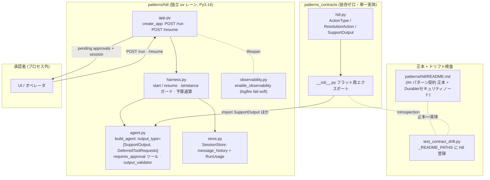

# 012-agentic-ai-design — Technical Plan

承認済み要件(WHAT)を構造(HOW)へ翻訳する。実装コードは書かない。出力言語 `ja`、
コード識別子は英語。API 事実は research.md I-1(実行検証済み)に立脚する。

## Summary

pydantic-ai v2 公式の deferred-tools 機構による**停止・承認・再開 HITL ハーネス**を、
depth-1 の新規独立レーン `patterns/hitl/`(sse レーンをミラー、research.md AD-1)として
純加算する。I/O 契約(`SupportOutput` / `ResolutionAction` / `ActionType` Literal)は
`patterns_contracts.hitl` に所有させ README 正本 + 単一点ドリフト検知(AD-2)。
ハーネスは「1 承認ステップ = 1 HTTP 往復」で `/run` → `DeferredToolRequests` +
session → `/resume` → 終端 `SupportOutput` か再 defer を型安全に返し(AD-3)、
`UsageLimits` は SessionStore が保持する `RunUsage` の再注入で停止・再開を跨いで
通算する(AD-4)。計装は logfire fail-soft ブートストラップ(AD-5)、モデル ID は
env ルーティングで既定はテストダブル(AD-6)、live 統合は dispatch-only Ollama
ワークフローに `EXPECT_LIVE_TESTS` 付きで隔離する(AD-7)。

## Architecture Overview



主要フロー: `/run` が prompt で agent を実行し、`requires_approval` ツールが呼ばれると
run は `DeferredToolRequests` で停止 → SessionStore に `message_history` + `usage` を
保存し pending 一覧 + session id を返す。`/resume` は承認判断を
`DeferredToolResults(approvals=...)` へ写像し、保存済み履歴 + 累積 usage で再開。
終端 `SupportOutput` か再 defer(新しい pending 一覧)を返す。

## Components

### HitlContract(`patterns/contracts/src/patterns_contracts/hitl.py`)

- **Responsibility**: HITL レーンの I/O 契約を単一実体として所有する。
- **Public interface**:
  - `ActionType = Literal["DISCOUNT", "UPGRADE", "ESCALATE"]`(col-0 名前付きエイリアス)
  - `class ResolutionAction(BaseModel)`: `action_type: ActionType`, `target_id: str`,
    `amount_usd: float`(`ge=0`)
  - `class SupportOutput(BaseModel)`: `summary_of_issue: str`, `reasoning: str`,
    `requires_human_approval: bool`, `action_plan: list[ResolutionAction]`
- **Owns**: 構造化出力の形状と `action_type` の閉語彙。
- **Does NOT own**: 承認判断の表現(pydantic-ai の `ToolApproved`/`ToolDenied` をそのまま使う)、
  HTTP リクエスト/レスポンス形状(レーン `app.py` 所有)、ポリシー閾値(レーン設定)。
- **Requirements**: 2.1, 2.2, 2.3

### HitlContractExport(`patterns_contracts/__init__.py`)

- **Responsibility**: `ActionType` / `ResolutionAction` / `SupportOutput` をフラット再エクスポート。
- **Requirements**: 2.1

### HitlCanon(`patterns/hitl/README.md`)

- **Responsibility**: 契約正本(`## パターン契約` python fence)と設計ノートの所有。
- **Public interface**: 正本ブロック(HitlContract と同一)、Durable Execution ノート
  (公式統合 = Temporal / DBOS / Prefect、Restate は Restate 側 SDK)、セキュリティノート
  (v1 併用時 `>=1.99.0` フロア、信頼できない `message_history`/URL の SSRF リスク、
  `safe_download` 経路)、検証基準版(pydantic-ai-slim 2.9.0 / 2026-07-11)。
- **Requirements**: 2.1, 13.1, 13.2, 13.3

### DriftGuardRegistration(`patterns/contracts/tests/unit/test_contract_drift.py`)

- **Responsibility**: `_README_PATHS` へ `"hitl": patterns/hitl/README.md` を登録し、
  正本 == 実体の単一点検証を有効化する。
- **Requirements**: 2.4

### HitlAgent(`patterns/hitl/src/patterns_hitl/agent.py`)

- **Responsibility**: pydantic-ai `Agent` の構築(`build_agent(model, ...)`)。
- **Public interface**: `build_agent(model: Model | str) -> Agent[HitlDeps, SupportOutput | DeferredToolRequests]`
  - `output_type=[SupportOutput, DeferredToolRequests]`(R3.1)
  - `instructions=...`(`system_prompt` 不使用、R3.4)
  - ツール 3 種: `search_customer_context`(読み取り・承認不要)、
    `apply_discount`(条件付き — 閾値超過かつ `not ctx.tool_call_approved` で
    `raise ApprovalRequired`、R5.4)、`escalate_to_legal`(`requires_approval=True`、R3.3)
  - `@output_validator`: `action_plan` 内に閾値超過額 + `requires_human_approval=False`
    があれば `ModelRetry`(R3.5)
  - `instrument=True` は渡さない(R3.2 — v2 で `TypeError`、research.md I-1)
- **Owns**: エージェント定義・ツール実装・ポリシー検査。
- **Does NOT own**: 停止・再開の制御(harness)、モデル選択(env / override、AD-6)。
- **Requirements**: 3.1, 3.2, 3.3, 3.4, 3.5, 4.1, 5.4

### HitlHarness(`patterns/hitl/src/patterns_hitl/harness.py`)

- **Responsibility**: 停止・承認・再開のオーケストレーション。
- **Public interface**:
  - `async start(prompt) -> TerminalResult | PendingResult`
  - `async resume(session_id, decisions: dict[str, ToolApproved | ToolDenied]) -> TerminalResult | PendingResult`
  - 内部: `run()` へ `usage_limits=LIMITS` と(resume 時)`message_history` +
    `deferred_tool_results` + `usage=stored.usage` を渡す(R5.1, 7.1, 7.2)
  - 戻り値は `isinstance(result.output, DeferredToolRequests)` の明示分岐で
    `PendingResult`(pending 一覧)/ `TerminalResult`(`SupportOutput`)に型分割(R6.1)
  - `UsageLimitExceeded` は捕捉して専用例外へ変換(R7.3。HTTP 写像は 013)
- **Owns**: run/resume の呼び出し規約、予算通算、再 defer の型ガード。
- **Does NOT own**: session の永続(store)、HTTP(app)。
- **Requirements**: 4.1, 4.2, 5.1, 5.2, 5.3, 6.1, 7.1, 7.2, 7.3

### SessionStore(`patterns/hitl/src/patterns_hitl/store.py`)

- **Responsibility**: session id → `(message_history, usage)` のインメモリ保持。
- **Public interface**(gap-analysis「state store 案 A」採用): 細い `SessionStore`
  **Protocol**(`create(history, usage) -> str` / `get(session_id)` /
  `update(session_id, history, usage)`)+ in-memory 具象 `InMemorySessionStore`
  (uuid4 生成、MVP 実体はこれ 1 つのみ — over-engineering 回避)。
  Protocol が 013 の状態機械拡張と将来の Durable / 永続 DB の差し替え点になる。
  `pop/invalidate` は 013 が拡張。
- **Owns**: プロセス内状態の正本(R8.4)。
- **Does NOT own**: 永続化・TTL(out of scope)、消費セマンティクス(013 R2)。
- **Requirements**: 8.4

### HitlApp(`patterns/hitl/src/patterns_hitl/app.py`)

- **Responsibility**: FastAPI app-factory と 2 エンドポイント。
- **Public interface**(DI シーム — sse の `create_app(*, event_source, tracer_provider=None)` を鏡映、research.md AD-8 / gap-analysis HIGH):
  - `create_app(*, agent: Agent[HitlDeps, SupportOutput | DeferredToolRequests], store: SessionStore | None = None, instrument: bool = True) -> FastAPI`
    — harness は app 内部で `(agent, store)` から組み立てる。テストは FunctionModel/TestModel
    製の agent と素の `SessionStore()` を注入し、実 I/O ゼロで /run→/resume 全経路を駆動する
    (R8.6, R10.4)。`instrument=False` で計装ブートストラップを外せる(観測性テスト以外の
    ユニットは False を注入)。013 は同シームへ `audit_emitter=` を追加する。
  - `POST /run` `{prompt}` → `200 {status: "completed", output: SupportOutput}` か
    `200 {status: "pending_approval", session_id, approvals: [{tool_call_id, tool_name, args}]}`(R8.1, 8.2)
  - `POST /resume` `{session_id, decisions: {tool_call_id: {approved: bool, override_args?, message?}}}`
    → 終端か再 defer(R8.3)。未知 session は `404`(R8.5)
  - lifespan で `enable_observability()` を fail-soft 起動(`instrument=True` のとき、R9.1)
- **Owns**: HTTP 形状、pydantic-ai 型 ↔ API スキーマの写像
  (`ToolApproved(override_args=...)` / `ToolDenied(message=...)` への変換、R5.2, 5.3)、
  app→harness→agent/store の配線。
- **Does NOT own**: 認証・レート制限(013 で設計ノート化)、消費セマンティクス(013)。
- **Requirements**: 5.2, 5.3, 8.1, 8.2, 8.3, 8.5, 8.6

### Observability(`patterns/hitl/src/patterns_hitl/observability.py`)

- **Responsibility**: logfire ベースの fail-soft 計装ブートストラップ(AD-5)。
- **Public interface**: `enable_observability(app: FastAPI | None = None) -> bool` —
  `logfire.configure()` + `logfire.instrument_pydantic_ai()` + `instrument_fastapi(app)`
  を try/except で包み、失敗時は False を返して続行。
- **Requirements**: 3.2, 9.1

### LaneScaffold(`patterns/hitl/pyproject.toml` ほか列挙面 4 箇所)

- **Responsibility**: レーン足場とリポジトリ列挙面への登録。
- **Public interface**:
  - `pyproject.toml`: sse 雛形を踏襲 — `requires-python = ">=3.14"`、
    `pydantic-ai-slim[openai]>=2.9.0` + `fastapi>=0.136` + `logfire`、
    `[tool.uv.sources] patterns-contracts = { path = "../contracts", editable = true }`、
    ruff 同一セット / pyright strict(3.14)/ `asyncio_mode = "auto"` /
    `fail_under = 98`(R1.1, 1.2, 1.3, 1.5, 10.1)
  - `mise.toml`: `patterns:{setup,lint,format,typecheck,test,audit}` に
    `patterns/hitl` 明示行(R1.4)、`patterns:test:integration:hitl`
    (`RUN_INTEGRATION_PATTERNS=1 EXPECT_LIVE_TESTS=2`、R11.1, 11.2 —
    2 = 承認経路 e2e 1 本 + 拒否経路 1 本、tasks T8.1 と一致)
  - `.github/workflows/patterns-ci.yml`: `patterns/hitl/**` paths + 専用ジョブ(R1.6)
  - `.github/workflows/security.yml`: `patterns-pip-audit` matrix に
    `{ lane: hitl, dir: patterns/hitl }`(R1.6)
  - `.github/dependabot.yml`: pip `directories` へ `/patterns/hitl`(R1.6)。
    **判定規則(gap-analysis G-1 / AD-9)**: dependabot は pydantic-ai 依存レーンを個別監視する
    (現行 frameworks 3 レーン + hitl)。応用兄弟レーン(rag/sse/deep-research)の未監視は
    本 spec のスコープ外の既知ギャップ(daily security cron が補完)。R1.6 の合否は
    「`directories` に `/patterns/hitl` が存在すること」で決定的に判定する
  - `patterns-integration-ollama.yml`: hitl 統合ジョブ(dispatch-only、R11.3)
- **Requirements**: 1.1–1.6, 10.1, 11.1, 11.2, 11.3

### ModelIdGuardSecondLayer(`tests/unit/test_no_hardcoded_model_ids.py` — root、編集)

- **Responsibility**: モデル ID 二層ガードの第2層(backing test)を新レーンへ到達させる。
- **Public interface**: `_iter_scanned_py_files()` の走査対象を `REPO_ROOT / "src"` に加えて
  `patterns/*/src` へ拡張する(gap-analysis H-1: 現行は root `src/` のみ rglob し、
  patterns/ は「未スキャンゆえ自動 pass」— 第1層 pre-commit は `types: [python]` で
  patterns を走査済みなので、第2層のみが欠けている)。
- **Owns**: 第2層の走査範囲。禁止リテラル集合(`FORBIDDEN_MODEL_ID_LITERALS`)は無改変。
- **Does NOT own**: pre-commit フック側(既に patterns を走査、無改変)。
- **Requirements**: 12.2

### HermeticTests(`patterns/hitl/tests/unit/` + `tests/support/`)

- **Responsibility**: 実プロバイダ I/O ゼロの検証(conftest で
  `models.ALLOW_MODEL_REQUESTS = False`)。
- **Public interface**(代表ケース):
  - `test_stop_approve_resume.py`: FunctionModel 台本(終端は
    `ToolCallPart("final_result", ...)`、R10.2)で 停止→承認→再開→`SupportOutput`(R10.4)
  - deny path: `ToolDenied(message=...)` 後にモデルが代替終端(R5.3, 10.4)
  - `override_args` path(R5.2)/ 再 defer path(R6.1)/ 予算通算・超過(R7.2, 7.3)
  - `test_output_validator.py`: 閾値超過 + `requires_human_approval=False` →
    `ModelRetry` 経由の自己修正(R3.5)
  - `test_testmodel_flow.py`: `TestModel(call_tools=[...])` で承認不要経路(R10.3)
  - `test_api.py`: `with TestClient(app):` で `/run`→`/resume` 往復・404(R8.x)
  - `test_observability.py`: exporter 未設定で起動が失敗しない(R9.1)
- **Requirements**: 10.1–10.4, および全機能要件の検証面

### LiveIntegration(`patterns/hitl/tests/integration/`)

- **Responsibility**: Ollama live モデルでの停止・再開 e2e(ゲート付き)。
- **Requirements**: 11.1, 11.2, 11.3, 12.1

## Data Model

- 契約(HitlContract)は上記の通り。閾値は `HitlSettings`(pydantic-settings、
  `HITL_RISK_THRESHOLD_USD` 既定 50.0、`HITL_MODEL_NAME` は live 統合のみ)。
- `PendingApproval`(API スキーマ): `tool_call_id: str`, `tool_name: str`,
  `args: dict[str, Any] | str | None`(pydantic-ai `ToolCallPart` からの写像)。
- `SessionRecord`(store 内部): `history: list[ModelMessage]`, `usage: RunUsage`。
- `LIMITS = UsageLimits(request_limit=8, tool_calls_limit=10, total_tokens_limit=20_000)`
  をレーン定数とし env で上書き可。

## Interfaces / Contracts

```python
# POST /run
class RunRequest(BaseModel):
    prompt: str

# 応答(判別可能ユニオン)
class CompletedResponse(BaseModel):
    status: Literal["completed"] = "completed"
    output: SupportOutput

class PendingResponse(BaseModel):
    status: Literal["pending_approval"] = "pending_approval"
    session_id: str
    approvals: list[PendingApproval]

# POST /resume
class Decision(BaseModel):
    approved: bool
    override_args: dict[str, Any] | None = None  # approved=True のみ
    message: str | None = None                   # approved=False のみ

class ResumeRequest(BaseModel):
    session_id: str
    decisions: dict[str, Decision]  # key = tool_call_id
```

`Decision` → `ToolApproved(override_args=...)` / `ToolDenied(message)` の写像は
`app.py` が所有。013 が `ResumeRequest` に `extra="forbid"` 等の強化を加える。

## File Structure Plan

```
patterns/hitl/
  pyproject.toml            # sse 雛形 + pydantic-ai-slim[openai]>=2.9.0 + logfire
  uv.lock  .python-version  # 3.14
  README.md                 # 契約正本 + Durable/セキュリティ/基準版ノート (R13)
  src/patterns_hitl/
    __init__.py  py.typed
    agent.py     harness.py  store.py  app.py  observability.py  settings.py
  tests/
    unit/    (test_stop_approve_resume / test_output_validator / test_api /
              test_testmodel_flow / test_observability / test_contract_shapes)
    support/ (function_model_scripts.py — FunctionModel 台本)
    integration/ (test_ollama_hitl_e2e.py — ゲート付き)
patterns/contracts/src/patterns_contracts/hitl.py   # 契約実体(純加算)
patterns/contracts/tests/unit/test_hitl_contract.py # 契約形状テスト
patterns/contracts/tests/unit/test_contract_drift.py# _README_PATHS へ登録(編集)
mise.toml / patterns-ci.yml / security.yml / dependabot.yml / patterns-integration-ollama.yml
                                                    # 列挙面(編集)
```

## Error Handling & Edge Cases

- 未知 session → `404`(R8.5。存在秘匿の強化は 013 R1.2)。
- `UsageLimitExceeded` → harness 専用例外(`HitlBudgetExceededError`)。MVP は未捕捉時の
  汎用 5xx で loud に露出させ(予算超過を沈黙させない)、意味的に正しい 429 への写像は
  013 R2.4 が担う。順序: MVP=汎用 5xx → 013=429 精緻化。
- 再開後の再 defer → 正常応答として `PendingResponse`(R6.1 の「ループ継続」相当は
  クライアント責務。型は `isinstance` 分岐で保証)。
- テキスト終端(モデルの逸脱)→ pydantic-ai が出力リトライ → 枯渇時
  `UnexpectedModelBehavior` → API は 502 系 loud(research.md I-1 で挙動確認済み)。
- `Decision.approved=True` + `message` / `approved=False` + `override_args` →
  422(model_validator で相互排他)。
- 観測性初期化失敗 → 起動継続(R9.1、戻り値 False をログ)。

## Constitution Compliance

- **TDD / hermetic**: 全ユニットは TestModel/FunctionModel 駆動・ネットワーク 0(NFR)。
  `ALLOW_MODEL_REQUESTS = False` を conftest で強制。
- **型安全**: pyright strict(3.14)。`args: dict | str | None` の `Any` 面は
  API 境界のみで、内側へは Pydantic モデルで絞る(NFR)。
- **ゲート**: ruff 同一セット・`fail_under = 98`・pip-audit(レーン lockfile)。
- **モデル ID 衛生**: ソース直書きなし、pre-commit `forbid-hardcoded-model-ids` 通過(R12)。
- **凍結面の不侵**: 既存契約・既存レーン・ドリフト README は無改変(純加算)。

## Requirements Traceability

| Req | 実現コンポーネント |
|---|---|
| 1.1–1.6 | LaneScaffold |
| 2.1–2.4 | HitlContract / HitlContractExport / HitlCanon / DriftGuardRegistration |
| 3.1–3.5 | HitlAgent(3.2 は Observability と共有) |
| 4.1–4.2 | HitlAgent + HitlHarness |
| 5.1–5.4 | HitlHarness + HitlApp(写像)+ HitlAgent(5.4) |
| 6.1 | HitlHarness(isinstance 分岐)+ HitlApp(PendingResponse) |
| 7.1–7.3 | HitlHarness + SessionStore(usage 保持) |
| 8.1–8.6 | HitlApp + SessionStore |
| 9.1 | Observability |
| 10.1–10.4 | HermeticTests + LaneScaffold(10.1) |
| 11.1–11.3 | LiveIntegration + LaneScaffold |
| 12.1 | HitlAgent(env 経由)+ LaneScaffold(hook 対象) |
| 12.2 | ModelIdGuardSecondLayer(第2層走査拡張)+ pre-commit 第1層(既存・無改変) |
| 13.1–13.3 | HitlCanon |
