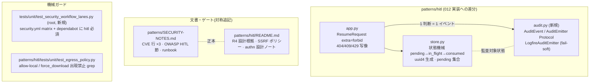

# 013-agentic-ai-security — Technical Plan

承認済み要件(WHAT)を構造(HOW)へ翻訳する。実装コードは書かない。出力言語 `ja`、
コード識別子は英語。012 の HITL レーン(`patterns/hitl/`)への**純加算**であり、
012 plan.md のコンポーネント名を前提とする。

## Summary

**真に新規の実装は 2 つ** — R2 の消費セマンティクス状態機械(012 `SessionStore` への
拡張 + CSPRNG id 生成、research.md AD-1/AD-2)と、R3 の `audit.py` 監査証跡(注入可能な
`AuditEmitter` シーム、既定 logfire fail-soft、AD-3)。残りは縮小済み: `/resume` の
`extra="forbid"` はスキーマ 1 行 + テスト(AD-4)、CVE スキャン到達性は初回緑の回帰防止
ガードテスト(AD-5 訂正版 — hitl は 012 で登録済み、赤は一時削除手順)、SSRF/egress・
OWASP マッピング・runbook は SECURITY-NOTES / README への文書追記 + grep ガード(AD-6)、
依存フロア(R6.2/6.3)は**既充足の確認のみ**(gap-analysis 論点 B)。あわせて既存違反
1 件を是正する: `/resume` 404 本文の session id 漏洩(`app.py:202`、R1.2 違反)と、
`/run`・`/resume` 両経路で未捕捉の予算超過(現状 500 → 429、R2.4)。
新規依存ゼロ・新規基盤ゼロ。

## Architecture Overview



## Components

### SessionLifecycle(`patterns/hitl/src/patterns_hitl/store.py` — 012 SessionStore の拡張)

- **Responsibility**: session の生成・消費・失効の状態機械。
- **Public interface**:
  - `new_session_id() -> str` — `uuid.uuid4()` 一元化(R1.1)
  - `SessionRecord`: `history`, `usage`, `state: Literal["pending", "in_flight", "consumed"]`,
    `pending_call_ids: frozenset[str]`
  - `claim(session_id) -> SessionRecord`(`pending` のときのみ成功し、**同期的に**
    `pending → in_flight` へ遷移して返す。未知 / `in_flight` / `consumed` はいずれも同一の
    `UnknownSessionError`(区別情報を持たない、呼び出し側で 404、R1.2, R2.1)。この
    同期遷移が並行 `/resume` の先勝ちを保証する — 2 本目の `claim()` は `in_flight` を見て 404)
  - `settle_pending(session_id, history, usage, pending_call_ids)` — 再 defer 時に
    `in_flight → pending` へ戻し履歴・usage・pending 集合を更新(R2.2)
  - `consume(session_id)` — 終端/エラー時に `→ consumed` で失効(R2.1, R2.4)
  - `release(session_id)` — 409(pending 集合外の判断)時に `in_flight → pending` を復元。
    ツール未実行で session は再開可能のまま(R2.3)
- **Owns**: 状態遷移の整合性(`pending`/`in_flight`/`consumed`)、pending `tool_call_id` 集合の正本、並行 `/resume` のロック。
- **Does NOT own**: HTTP ステータス写像(app)、監査(audit)。
- **Requirements**: 1.1, 1.2, 1.3, 2.1, 2.2, 2.3

### ConsumptionGuard(`patterns/hitl/src/patterns_hitl/app.py` — 012 HitlApp の拡張)

- **Responsibility**: 消費セマンティクスの HTTP 写像(research.md AD-2 の表)—
  **`/run` と `/resume` の両ハンドラ**に適用する(R2.4 は "a run or resume" を明記)。
- **現状の実装事実(2026-07-12 実測)**:
  - `HitlBudgetExceededError` は `harness.start()`(`harness.py:120`)と
    `resume()`(`harness.py:157`)の両方から送出されるが、`app.py` は `/resume` の
    `KeyError` しか捕捉しない(`app.py:200`)→ 予算超過は**両経路とも現状 500**。
  - `/resume` の 404 本文は `detail=f"unknown session_id: {exc.args[0]}"`(`app.py:202`)で
    **session id と「unknown」という理由を漏洩** — R1.2 の既存違反。本コンポーネントで是正必須。
- **Public interface**:
  - 未知 / `in_flight` / consumed session → `404`(本文は **id も理由も含まない固定メッセージ** —
    `app.py:202` の漏洩を是正、R1.2)
  - `decisions` のキーが `pending_call_ids` 外 → `409`。検証は **`claim()` 後・
    `await harness.resume()` 呼出前**に app 層で全キー ⊆ `pending_call_ids` を確認する
    (`await` を挟まないため asyncio でも原子的)。不整合なら `release()` で `pending` へ
    戻して 409 — **どのツールも実行せず**、1 件でも外れれば全体拒絶(R2.3)
  - `HitlBudgetExceededError` → `429`。**`/run` では session を作らず**、`/resume` では
    `consume()` して以後 404(R2.4 — 両ハンドラに except を配置)
- **Requirements**: 1.2, 2.1, 2.3, 2.4

### AuditTrail(`patterns/hitl/src/patterns_hitl/audit.py` — 新規)

- **Responsibility**: 承認判断の構造化監査イベント。
- **Public interface**:
  - `class AuditEvent(BaseModel)`: `session_id`, `tool_call_id`, `tool_name`,
    `decision: Literal["approved", "approved_with_override", "denied"]`,
    `denial_message: str | None`, `overridden_keys: tuple[str, ...]`,
    `timestamp: datetime`(**引数の生値フィールドは持たない** — キー集合のみ、R3.2, 3.3)
  - `class AuditEmitter(Protocol)`: `def emit(self, event: AuditEvent) -> None: ...`
  - `LogfireAuditEmitter` — 012 Observability の fail-soft 方針を踏襲(送出失敗は
    握って続行、R3.4)/ `InMemoryAuditEmitter`(`tests/support/`)
  - `create_app(audit_emitter=...)` に注入シームを追加(既定 = logfire 実装)
- **Owns**: イベント形状とマスキング規約。
- **Does NOT own**: 判断の適用(harness)、エクスポータ設定(observability)。
- **Requirements**: 3.1, 3.2, 3.3, 3.4, 3.5

### ResumeSchemaGuard(`patterns/hitl/src/patterns_hitl/app.py`)

- **Responsibility**: 「履歴はサーバー正本」のスキーマ強制。
- **Public interface**: `ResumeRequest` / `RunRequest` に
  `model_config = ConfigDict(extra="forbid")`。`message_history` / `usage` / `model`
  フィールドは**定義しない**(未知フィールドは 422、R4.1–4.3)。再開素材は
  `SessionStore` からのみ取得(012 R8.4 と合流)。
- **Requirements**: 4.1, 4.2, 4.3

### EgressPolicyGuard(`patterns/hitl/tests/unit/test_egress_policy.py` — 新規)

- **Responsibility**: SSRF ポリシーの将来ゲート(research.md AD-6)。
- **Public interface**: レーン `src/` を走査し `allow-local` / `force_download` の
  出現を禁止する grep テスト + README に `safe_download` ポリシー節が存在することの
  存在検査(R5.1, 5.2 の WHERE 条件が発火するまでの番人)。
- **Requirements**: 5.1, 5.2, 5.3(README 節の存在検査)

### FloorConstraint(`patterns/hitl/pyproject.toml` — **既充足の回帰確認に格下げ**、gap-analysis 論点 B: B1 採用)

- **Responsibility**: 依存フロアの回帰確認(新規実装ではない)。
- **既充足の事実(2026-07-12 実測)**: `pydantic-ai-slim[openai]>=2.9.0` は 012 実装で
  `pyproject.toml:29` に設定済み・uv.lock 反映済み(R6.2 充足)。検証基準版の README 記録も
  `README.md:148-152` に存在(R6.3 充足)。
- **残作業**: tasks 8.1 の lockfile 確認のみ(意図しないフロア緩和が入っていないことの
  目視確認)。フロア検証の専用ユニットテストは追加しない(B2 却下 — downgrade は
  uv 解決が既に loud に失敗する)。R6 の実装実体は **R6.1(SECURITY-NOTES への CVE 追記)
  と R6.3 の文面更新(013 完了の反映)に縮小**。
- **Requirements**: 6.2, 6.3(確認)/ 実装は SecurityNotesSync(6.1)へ

### SecurityNotesSync(`patterns/SECURITY-NOTES.md`)

- **Responsibility**: 正本文書への対称追記(research.md I-5 の形式)。
- **Public interface**:
  - 「CVE 根拠と依存フロア」表: CVE-2026-25580 / CVE-2026-46678 の既存行に HITL レーンの
    対応(v2 フロア + R4 スキーマ遮断)を追記、CVE-2026-61437 行を新規追加(R6.1)
  - 「HITL 応用レイヤ → OWASP マッピング」節(既存 4 レーンと同一表形式):
    承認ゲート → Excessive Agency / Insecure Tool Use、`UsageLimits` 通算 →
    Unbounded Consumption、セッション衛生 + サーバー正本履歴 → 信頼できない入力面、
    監査証跡 → アカウンタビリティ(R7.1, 7.2)
  - 「fix 未提供アドバイザリの運用」節: 確認 → 影響評価 → レーン限定
    `--ignore-vuln <ID>` + 期限コメント + 追跡 issue → 修正着地で撤去。
    期限・追跡なしの抑止エントリ禁止(R8.1, 8.2)
- **Requirements**: 6.1, 7.1, 7.2, 8.1, 8.2

### ScanReachabilityGuard(`tests/unit/test_security_workflow_lanes.py` — root、新規)

- **Responsibility**: レーン列挙面の登録漏れを red 化する**回帰防止ゲート**
  (nltk 事案の再発防止)。
- **Public interface**: `test_ollama_ci_workflows.py` と同じ YAML パース手法で
  (a) `security.yml` の `patterns-pip-audit` matrix include に
  `{lane: hitl, dir: patterns/hitl}` があること、(b) `dependabot.yml` の pip
  `directories` に `/patterns/hitl` があることを assert(R9.1–9.3)。
  列挙は `patterns/` 全 uv レーンと matrix の**集合一致**で書く(research.md AD-5 A2)。
- **前提の訂正(gap-analysis 論点 A)**: hitl は 012 実装で既に両列挙面へ登録済み
  (`security.yml:162` / `dependabot.yml:91`、実測確認)のため、実 YAML に対する assert は
  **初回作成時点で緑**になる。TDD の赤は**集合一致判定を純関数へ切り出し、`hitl` を欠いた
  合成入力を渡すと fail する負のユニットケース**で成立させる(スイート内に恒久固定、H-2)。
  実 YAML 側は「hitl 行の一時削除(非コミット)→ red 確認 → 復元」を補助として PDCA ログに残す(A1)。
- **Owns**: 到達性の機械検証。012 の LaneScaffold(登録の実施)とは責務分離。
- **Requirements**: 9.1, 9.2, 9.3

### ReadmeSecurityNotes(`patterns/hitl/README.md` — 012 HitlCanon の拡張)

- **Responsibility**: レーン README のセキュリティ節。
- **Public interface**: R4 の設計根拠(CVE ID 付き)、SSRF/egress ポリシー
  (CVE-2026-46678 根拠)、検証基準版、authn/authz の設計ノート
  (「session id は認可トークンではない。本番は認証境界の内側に置く」)。
- **Requirements**: 4.4, 5.3, 6.3(+ Out of Scope の設計ノート)

### HardeningTests(`patterns/hitl/tests/unit/`)

- **Responsibility**: 本 spec 追加分の hermetic 検証。
- **Public interface**(代表ケース):
  - `test_session_hygiene.py`: 同一 prompt ×2 → 異なる非連続 id(R1.3)、
    未知/consumed → 404 で本文が理由を区別しない(R1.2, R2.1)
  - `test_consumption.py`: 終端後の再 resume → 404(R2.1)、pending 外
    `tool_call_id` → 409 + ツール未実行(R2.3)、limit 超過 → 429 + 失効(R2.4)、
    再 defer 後は旧判断が再適用不能(R2.2)
  - `test_audit_trail.py`: approve / deny / override の各 path で
    `InMemoryAuditEmitter` にイベント 1 件ずつ、`overridden_keys` はキーのみ・
    生値なし(R3.1–3.3, 3.5)、emitter 例外でも resume 成功(R3.4)
  - `test_resume_schema.py`: `message_history` 入り body → 422(R4.1, 4.3)
- **Requirements**: 1.2, 1.3, 2.1–2.4, 3.1–3.5, 4.1, 4.3

## Data Model

- `SessionRecord`(拡張): `history: list[ModelMessage]`, `usage: RunUsage`,
  `state: Literal["pending", "in_flight", "consumed"]`, `pending_call_ids: frozenset[str]`。
  `in_flight` は `claim()` が取得する実行中ロック — `await harness.resume()` を跨いで
  保持され、並行 `/resume` の二重実行を防ぐ(H-1 対応)。
- `AuditEvent`: 上記 Components の通り(判断メタデータのみ。NFR「監査イベントの
  機微情報」に対応)。
- HTTP 写像表は research.md AD-2 を正とする。

## Interfaces / Contracts

```python
class ResumeRequest(BaseModel):
    model_config = ConfigDict(extra="forbid")   # R4.3
    session_id: str
    decisions: dict[str, Decision]              # 履歴/usage/model は定義しない (R4.1)

class AuditEvent(BaseModel):
    session_id: str
    tool_call_id: str
    tool_name: str
    decision: Literal["approved", "approved_with_override", "denied"]
    denial_message: str | None = None
    overridden_keys: tuple[str, ...] = ()       # キー集合のみ (R3.2/3.3)
    timestamp: datetime
```

契約パッケージ(`patterns_contracts`)には追加しない — `AuditEvent` はレーン内部の
運用イベントであり、レーン間共有契約ではない(所有則: 共有時に初めて昇格)。

## File Structure Plan

```
patterns/hitl/src/patterns_hitl/
  audit.py                    # 新規 (AuditEvent / AuditEmitter / LogfireAuditEmitter)
  store.py  app.py            # 012 実装の拡張(状態機械 / HTTP 写像 / extra=forbid)
patterns/hitl/tests/
  unit/ (test_session_hygiene / test_consumption / test_audit_trail /
         test_resume_schema / test_egress_policy)
  support/ (in_memory_audit.py)
patterns/hitl/README.md       # セキュリティ節追記
patterns/SECURITY-NOTES.md    # CVE 行 / OWASP HITL 節 / runbook 節
tests/unit/test_security_workflow_lanes.py   # root、新規 (到達性ガード)
```

## Error Handling & Edge Cases

- 404 は「未知」「consumed」「失効」を**区別しない**固定本文(存在秘匿、R1.2)。
- 409(pending 外判断)は**部分適用しない** — 1 件でも不整合なら全体拒絶(R2.3)。
- 監査エミッタの失敗は fail-soft(R3.4)、消費セマンティクスの失敗は loud(NFR の
  フェイルソフト境界)。両者を混同しない。
- 並行 resume(同一 session への同時 POST)は `claim()` の **同期的** `pending → in_flight`
  遷移で先勝ちにする — 2 本目の `claim()` は `in_flight` を見て 404。ロックは
  `await harness.resume()` を跨いで保持され、終端で `consume()`、再 defer で
  `settle_pending()`、409 で `release()` により解除される(インメモリ・単一イベント
  ループ MVP の範囲。分散対応は out of scope)。
- ScanReachabilityGuard は初回緑(hitl 登録済み)の回帰防止ゲート — 赤の証跡は
  一時削除手順で残す(research.md AD-5 訂正版)。
- `/run` の予算超過 429 では **session を保存しない**(部分状態を残さない)。
  `/resume` の 429 は `consume()` で失効させる — 両者の差をテストで固定する。

## Constitution Compliance

- **hermetic**: 追加テストはすべてネットワーク 0(logfire 実送出なし、
  `InMemoryAuditEmitter` 注入)。
- **型安全 / lint / coverage**: 012 のゲート(pyright strict、ruff 同一セット、
  `fail_under = 98`)を弱めない。監査 Protocol は pyright strict で型検証。
- **新規依存ゼロ**: 追加ライブラリなし(NFR / research.md External dependencies)。
- **凍結面の不侵**: `patterns_contracts` 無改変。SECURITY-NOTES は追記のみ。

## Requirements Traceability

| Req | 実現コンポーネント |
|---|---|
| 1.1–1.3 | SessionLifecycle(+ HardeningTests) |
| 2.1–2.4 | SessionLifecycle + ConsumptionGuard |
| 3.1–3.5 | AuditTrail(+ HardeningTests) |
| 4.1–4.4 | ResumeSchemaGuard + ReadmeSecurityNotes |
| 5.1–5.3 | EgressPolicyGuard + ReadmeSecurityNotes |
| 6.1–6.3 | FloorConstraint + SecurityNotesSync + ReadmeSecurityNotes |
| 7.1–7.2 | SecurityNotesSync |
| 8.1–8.2 | SecurityNotesSync |
| 9.1–9.3 | ScanReachabilityGuard |
