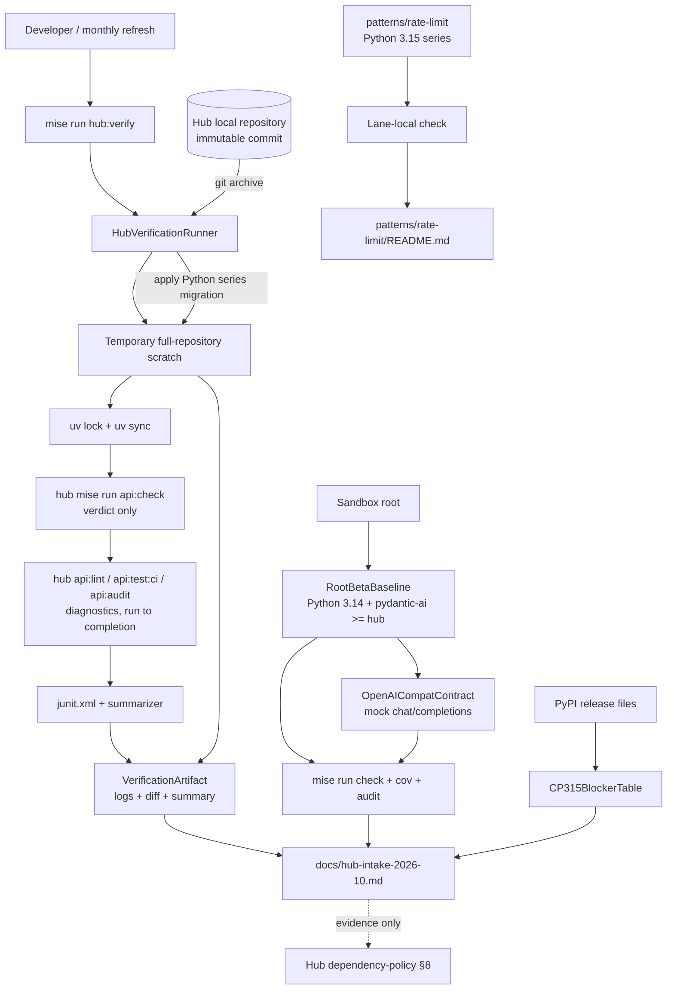
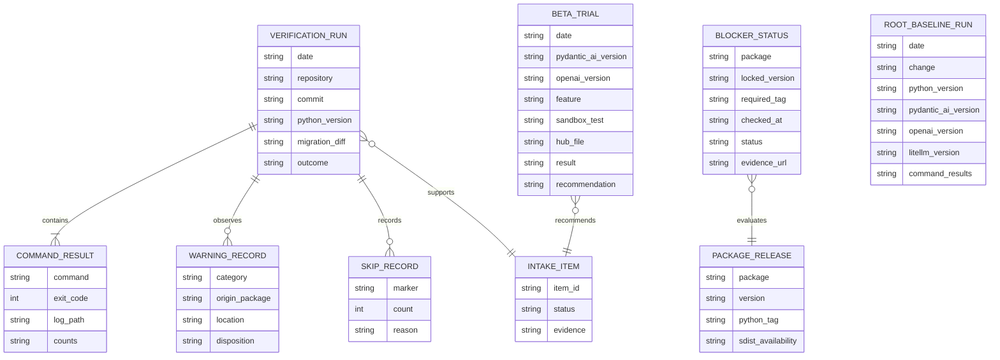

# 014-hub-python-beta-lane — Technical Plan

## Summary

本計画は、(1) ハブの特定 commit を local scratch へ展開し、Python 3.14 migration 差分を当てて
ハブ自身の `api:check`（内部で `api:audit` へ委譲）を実行する再利用可能な検証 runner、(2) ルートを Python 3.14 と
ハブ以上の `pydantic-ai-slim` へ更新する dependency baseline、(3) 結果・cp315 blocker・取り込み候補を
一つの intake evidence ledger へ記録する運用、の 3 層で Requirement 1–5 を実現する。

依存衝突は option (c) を採る。ただし `pydantic-ai-slim 2.54.0` が公式には OpenAI SDK 3.x を要求する中で
OpenAI SDK 2.x を使うため、lock された SDK 版による OpenAI-compatible request-path test を必須の
実行可能契約とする。この契約が失敗した場合は本計画を止め、option (a) の独立 uv lane へ設計変更する。
BeeAI/LlamaIndex および既存 pydantic-ai pattern lane は変更しない。

## Architecture Overview



制御境界は明確に分ける。`HubVerificationRunner` は scratch の生成とコマンド実行だけを所有し、
ハブまたは sandbox の source tree を変更しない。`RootBetaBaseline` は sandbox 自身の runtime baseline を
所有し、ハブの production code を所有しない。`EvidenceLedger` は観測結果と recommendation を保持するが、
検証を成功扱いにする判断を捏造せず、各 gate の exit status と原ログを参照する。

## Components

### DES-1.1 HubVerificationRunner

- **Responsibility**: ハブの immutable commit を完全な scratch copy に展開し、指定 Python series の
  migration 差分とハブ自身の gate を順序付きで実行して evidence artifact を生成する。
- **Public interface**:
  - `mise run hub:verify -- --hub-repo <path> --commit <sha> --python <3.14|3.15> --output <dir>`
  - required phases は standalone `uv lock`、standalone `uv sync`、verdict gate (`api:check`) の 3 段階。
    すべて green の場合だけ exit `0` とし、最初に失敗した required phase の非ゼロを伝播する。
    diagnostics 段階は non-gating evidence として verdict の成否に関係なく最後まで実行し、段階ごとの exit とログを残す。
  - `<output>/summary.md`, `<output>/migration.diff`, `<output>/logs/*.log`, `<output>/junit/*.xml` を生成する。
- **Owns**: commit archive、temporary directory lifecycle、Python series patch、command ordering、
  stdout/stderr capture、exit-status propagation、scratch 限定の mise trust 環境
  （`MISE_TRUSTED_CONFIG_PATHS`）、report-only の `PYTEST_ADDOPTS` 注入。
- **Does NOT own**: hub source/worktree の変更、hub gate の中身、intake 文書の recommendation、
  Redis/chroma/Ollama の live service provisioning。
- **Requirements**: 1.1, 1.2, 1.3, 1.5, 3.3

### DES-1.2 HubVerificationContractTests

- **Responsibility**: runner が source tree 非書き込み、full archive、migration 差分、失敗伝播を守ることを
  fake hub repository と fake `mise` executable で hermetic に固定する。
- **Public interface**:
  - pytest contract tests; network、real hub、real package install は使わない。
  - fake repository には `services/api/` 以外の sentinel (`evals/`, workflow, generated schema) を置き、
    scratch に存在することを assert する。
  - fake `mise` は受け取った argv と環境変数を記録する。`MISE_TRUSTED_CONFIG_PATHS` が scratch パスだけを含み、
    ツール自動インストール抑止の設定が渡り、ユーザーの mise state ディレクトリ（`HOME` を tmp に差し替えて観測）へ
    書き込みが無いことを assert する。
  - standalone `uv lock` / `uv sync` / `api:check` の各 required phase の失敗が runner の non-zero になることを assert する。
    `api:check` が失敗しても `api:lint` / `api:test:ci` / `api:audit` が全て呼ばれ、diagnostics の成否は exit を変更せず、
    required verdict と食い違う場合は `diagnostic divergence` が記録されることを assert する。
  - サンプル junit XML から summarizer が passed/failed/skipped、marker 別 skip reason、warning を
    正しく集計することを assert する。
- **Owns**: runner の CLI contract と非破壊性の回帰テスト。
- **Does NOT own**: 実ハブ dependency compatibility、Python 3.14 の実 gate 結果。
- **Requirements**: 1.1, 1.2, 1.3, 1.5, 3.3

### DES-2.1 RootBetaBaseline

- **Responsibility**: sandbox root を Python 3.14 に同期し、`pydantic-ai-slim` をハブ以上へ上げながら
  safe `litellm` line と Ollama runtime dependency を共存させる。
- **Public interface**:
  - `pyproject.toml`: `requires-python >=3.14`, `pydantic-ai-slim[logfire]>=2.54.0`（target hub commit が更新された場合はその lock 版以上）,
    runtime `openai>=2.20.0,<3.0.0`, optional/dev `litellm`。
  - `.python-version`, `mise.toml`, Ruff, Pyright, pre-commit, CI, README の baseline を 3.14 に同期。
  - `uv.lock` が resolved versions の正本。
  - baseline 変更（Python 3.14 化と pydantic-ai/OpenAI dependency 変更）ごとに、憲法 Principle 6 に従い
    lock・sync・static checks・tests・coverage・audit の結果を EvidenceLedger の Root baseline run 節へ
    記録してから merge 可能とする（記録が無い baseline 変更は未完了）。
  - Python 3.14 化と同じ変更で、3.13 を root baseline と明記している統治文書を同期する:
    `.sdd/memory/constitution.md`（Principle 3 と Additional Constraints の "Current root baseline"、
    MINOR bump 2.0.0 → 2.1.0）、`CLAUDE.md` の root Python 記述。どちらも git 管理外の local artifact のため、
    checked-in の正本は `test_python_baseline.py` とし、文書同期は PR 説明に記録する。
- **Owns**: root interpreter/dependency/tooling baseline と ADR-1/ADR-2 の説明。
- **Does NOT own**: pattern lane の dependency floor、hub の Python pin、litellm upstream release policy。
- **Requirements**: 2.1, 2.2, 2.3, 2.4, 2.5, 5.1

### DES-2.2 OpenAICompatContract

- **Responsibility**: upstream 公式サポート外の `pydantic-ai-slim` + OpenAI SDK 2.x 組合せについて、
  Ollama provider から `/v1/chat/completions` までの実 request path を hermetic に検証する。
- **Public interface**:
  - respx mock の OpenAI-compatible endpoint。
  - `OllamaProvider → OpenAIChatModel → Agent.run()` の通常応答、timeout forwarding、request body の
    model/messages を検証する。テストは実際に lock された OpenAI SDK 版を report する。
  - 同じファイルに「installed `pydantic-ai-slim` ≥ 検証対象 hub の lock 版」かつ「installed `openai` < 3」を
    assert するテストを置く。現行 2.31.1 ではこれが red になり、依存変更前の失敗状態を TDD 証拠として示す
    （request-path テスト自体は 2.31.1 でも green のため、それ単独では red を示せない）。
  - floor の値はハブの lock を読まず、テストモジュールの定数 `HUB_VERIFIED_PYDANTIC_AI_FLOOR`
    （値と、その値を確認したハブ commit SHA・確認日をコメントで併記）で固定する。hermetic test から
    ハブ repository を参照しないため。更新契機は (1) 月次 dependency refresh（R3.2 と同時）、
    (2) `hub:verify` を新しいハブ commit で実行した時。ハブの lock 版がこの定数より新しいと判明したら、
    定数を上げて red を確認してから root の floor を上げる（R2.1 の継続的な担保）。
- **Owns**: 非ストリーミング Chat Completions compatibility の executable evidence と、R2.1 の版の下限 assert。
- **Does NOT own**: OpenAI SDK 全 API の互換性、live Ollama、streaming/tool-call/structured-output の
  未検証面。これらを暗黙に「対応済み」と扱わない。
- **Requirements**: 2.1, 2.2, 2.4

### DES-2.3 PythonBaselineContracts

- **Responsibility**: Python 3.14 pin の分散設定と Watsonx import compatibility を rules-as-tests で固定する。
- **Public interface**:
  - `test_running_interpreter_matches_the_pin()`。
  - config consistency test: `.python-version`, `pyproject.toml` の `requires-python`, `mise.toml`, Ruff target, Pyright version,
    pre-commit label/command, CI provisioning が 3.14 と一致する。
  - `test_watsonx_model_inference_imports_on_python314()`。
  - 期待する series はテスト内の定数 `EXPECTED_SERIES = "3.14"` で持つ。interpreter 一致テストと Watsonx import
    テストは 3.13 上でも green になるため、TDD の red は「各 pin が `EXPECTED_SERIES` と一致する」assert から得る
    （3.13 の現行 pin で全 path が失敗する）。
- **Owns**: machine-checkable root baseline invariants。
- **Does NOT own**: third-party package implementation、Python 3.15 lane。
- **Requirements**: 2.4, 2.5

### DES-3.1 EvidenceLedger

- **Responsibility**: hub verification、root baseline、cp315 blocker、H/L intake status、beta feature trial を
  dated section と正規化表で記録し、hub dependency-policy §8 へ渡す recommendation を形成する。
- **Public interface**:
  - `docs/hub-intake-2026-10.md` の 5 つの節/表: hub verification run、root baseline run、cp315 blocker、
    intake item status、beta-feature trial。
  - 各 verification run は hub commit、Python、lock versions、commands、pass/fail/skip counts、
    warnings、migration diff reference、recommendation を必須とする。
  - 各 root baseline run は日付、変更内容（Python series / dependency floor）、Python、resolved versions
    （`pydantic-ai-slim`・`openai`・`litellm`）、`uv lock`・`uv sync`・`mise run check`・`mise run cov`・
    `uv run pip-audit`・`mise run patterns:check` の exit と件数を必須とする（憲法 Principle 6）。
- **Owns**: evidence と状態の履歴。完了/不採用項目を削除せず status で区別する。
- **Does NOT own**: hub repository の変更、gate success の再解釈、実ログの改変。
- **Requirements**: 1.3, 1.4, 1.5, 2.3, 2.4, 2.5, 3.1, 3.2, 3.3, 4.1, 4.2, 4.3, 4.4, 5.2

### DES-3.2 RateLimit315Sentinel

- **Responsibility**: `patterns/rate-limit` を Python 3.15 series 上で green に保ち、公開済み rc/final ごとの
  実測環境と結果を lane README に更新する。
- **Public interface**:
  - existing `.python-version = 3.15`。
  - lane-local `uv sync`, lint, format, typecheck, pytest/cov, pip-audit の結果。
  - README evidence は実装日に公開済みの exact interpreter release（rc か final か）を記録する。
    PEP 790 の予定では 3.15.0 final が 2026-10-01 のため、final が出ていれば final で検証する。
- **Owns**: rate-limit lane の 3.15 smoke evidence。
- **Does NOT own**: hub の ML dependency closure、root Python baseline、3.15 final の公開時期。
- **Requirements**: 3.4

### DES-3.3 BetaExperimentProtocol

- **Responsibility**: hub 採用前の pydantic-ai feature を、hub 以上の版を持つ root で試し、影響先と
  recommendation を同じ intake ledger へ記録する。
- **Public interface**:
  - trial record: date、`pydantic-ai-slim` version、lock 済み `openai` SDK version（root は upstream 公式範囲外の
    2.x 組合せのため必須）、feature/API、sandbox test location、hub affected file、
    result、recommendation (`adopt` / `reject` / `wait`)。
  - 本 spec が納めるのは R5.1 の前提（ハブ以上の版を持つ root）と記録契約、および最初の trial record である。
    最初の record は task 2 の dependency 変更そのものを対象とする: feature/API = 「pydantic-ai-slim 2.54 系 +
    OpenAI SDK 2.x の非ストリーミング Chat Completions」、sandbox test = `tests/unit/test_ollama_openai_compat.py`、
    hub affected file = `services/api/pyproject.toml`（ハブが `openai` extra を外している構成の妥当性）。
  - 個別の新機能（`UsageLimits` の新項目、streaming API、tool approval API 等）の trial は、ハブより新しい
    pydantic-ai release がその機能を含んだ時に起動する継続的な義務とし、1 件ごとに sandbox test と record を
    同じ変更で追加する。014 の完了条件には含めない（R5.1 は「ハブが採る前に」試す順序の要件で、対象機能の
    列挙は例示であるため）。
- **Owns**: 実験の最小記録契約。
- **Does NOT own**: BeeAI/LlamaIndex lane の拡張、pattern 4 lane の一括 dependency update、hub への実装。
- **Requirements**: 5.1, 5.2, 5.3


## Data Model



| Entity | Field | Type | Notes |
|---|---|---|---|
| `VerificationRun` | `outcome` | `Literal["green", "blocked", "failed"]` | `green` は required phases 全て exit 0 の場合だけ |
| `RootBaselineRun` | `change` | `Literal["python-series", "dependency-floor"]` | resolved versions と root gate 各段の exit を必須とし、merge 前に記録する（Principle 6） |
| `CommandResult` | `counts` | structured text | pytest passed/failed/skipped（junit XML 由来）、audit findings 等。原ログへの path を必須化。`role` = `required`（standalone lock/sync と `api:check`）/ `diagnostic`（個別タスク）を区別 |
| `WarningRecord` | `category` | warning class | `DeprecationWarning` と `StarletteDeprecationWarning` を区別 |
| `SkipRecord` | `reason` | text | Redis/chroma/Ollama 等、marker/service 理由を集約せず分ける |
| `BlockerStatus` | `status` | `hard-blocker / source-build / wheel-ready` | 最新版でなく hub locked version に対する判定 |
| `IntakeItem` | `status` | `proposed / verified / landed / already-present / rejected / waiting` | 行を削除せず遷移で履歴を保つ |
| `BetaTrial` | `recommendation` | `adopt / reject / wait` | hub file と検証版が無い記録は不完全 |

これらは runtime Pydantic model として実装しない。`summary.md` と intake Markdown の schema として扱い、
新規 dependency や永続化層を増やさない。runner の内部値は shell の明示変数と exit status で表現する。

## Interfaces / Contracts

### `hub:verify` CLI contract

```text
mise run hub:verify -- \
  --hub-repo /absolute/path/to/vaz-agentic-ai-next \
  --commit <full-or-unambiguous-sha> \
  --python 3.14 \
  --output /absolute/path/to/evidence-directory
```

| Phase | Contract |
|---|---|
| Validate | hub path は Git repository、commit は解決可能、Python は `3.14` または trigger 後の `3.15`、output は source/hub tree 外 |
| Archive | `git -C <hub> archive <commit>` のみを入力にし、dirty worktree を読まない |
| Assert scope | `services/api`, `evals`, `.github/workflows/api.yml`, `packages/schemas/src/generated` の存在を検査 |
| Migrate | scratch 内だけで `.python-version`、interpreter expectation、Ruff target を指定 series へ変更し、`migration.diff` を保存。期待文字列不一致なら fail closed |
| Resolve | `services/api` で指定 Python を使い `uv lock` → `uv sync` を個別に実行し、それぞれの exit・ログ、lock diff、resolved versions を保存する。`api:check` 内の sync が失敗しても R1.2 の `uv lock`・`uv sync` 結果が独立に残るようにする。`uv lock` 失敗時は `blocked` |
| Environment | gate 呼び出しにだけ `MISE_TRUSTED_CONFIG_PATHS=<scratch>` とツール自動インストール抑止の 4 変数 `MISE_AUTO_INSTALL=0`・`MISE_EXEC_AUTO_INSTALL=0`・`MISE_NOT_FOUND_AUTO_INSTALL=0`・`MISE_TASK_RUN_AUTO_INSTALL=0` を渡す（mise 2026.9.16 で、4 つの設定 `auto_install`・`exec_auto_install`・`not_found_auto_install`・`task.run_auto_install` がこの環境変数で `false` になることを `mise settings get` で確認、2026-10-03）。`mise trust` は実行せず、ユーザーの mise state へ書き込まない。必要ツール（uv 等）が未導入なら `blocked` として停止する |
| Gate (verdict) | hub root から `mise run api:check` を 1 回実行。これは `uv sync`, Ruff, `ty check`, pytest unit+integration+e2e, `api:audit` の正本。standalone `uv lock`・`uv sync` とこの gate を required phases とし、3 段階がすべて exit 0 の場合だけ runner exit 0 / §8.1 satisfied とする |
| Diagnose | verdict の成否に関係なく、ハブ自身の個別タスク `api:lint` → `api:test:ci` → `api:audit` を各段の失敗で止めずに最後まで実行し、段階ごとの exit とログを保存する。diagnostics は non-gating evidence で runner exit と §8.1 判定を変更しないが、required verdict と結果が食い違う場合は `diagnostic divergence` として summary と recommendation に明記する。いずれも `api:check` と同じコマンドのハブ定義で、runner は ruff/ty/pytest の定義を複製しない。実装時に対象 commit のハブ `mise.toml` を読み、`ty check` を含むタスク（`api:lint` か独立の `api:typecheck` 等）を特定して diagnostics 列に加える。`summary.md` には R1.2 の各コマンド（ruff・`ty check`・pytest・pip-audit）がどの diagnostic タスクで実行されたかの対応表を出す |
| Report injection | pytest を含む呼び出しに `PYTEST_ADDOPTS="-rsx --junitxml=<output>/junit/<stage>.xml"` を渡す。出力を増やすだけで合否・warning filter を変えない report-only 注入であることを `summary.md` に明記する |
| Summarize | 標準ライブラリだけの `scripts/summarize_hub_verification.py` が junit XML とログから command exit、pytest counts、marker 別 skip reason、warning class と origin package、audit result を `summary.md` へ出す。green でない結果も保存 |
| Cleanup | scratch は常に削除。`--keep-scratch` は設けず、再現は commit + migration.diff + command で行う |

script は network credential、hub URL、GitHub token を扱わない。repository の取得は呼び出し側の責務とする。

### Root dependency contract

- runtime dependencies:
  - `pydantic-ai-slim[logfire]>=<verified hub floor>`
  - `openai>=2.20.0,<3.0.0`（Ollama runtime が直接 import/use するため dev/transitive 扱いにしない）
- optional dependency: `litellm`。root runtime の OpenAI cap を共有し、脆弱な `litellm 1.83.0` へ
  rollback した lock は不合格。
- `uv.lock` の acceptance:
  - `pydantic-ai-slim >= hub services/api locked version`
  - `openai < 3`
  - `litellm != 1.83.0` かつ audit green
- removal trigger: litellm の release metadata が OpenAI SDK 3.x support を宣言したら、direct cap の撤去と
  upstream extra の復元を試行する。compatibility test と root gates が 3.x で green の場合だけ変更を確定し、
  失敗時は cap を維持して blocker・検証版・再試行条件を intake ledger に記録する。release metadata は月次
  dependency refresh で確認する。

### Root verification contract

実装完了判定は次の既存 entry points を使う。

1. `mise run check` — lint / format / typecheck / unit+integration tests。
2. `mise run cov` — `fail_under = 98`。
3. `mise run pre-commit:manual` の丸ごと再実行は pytest を重複させるため、既存 pre-commit/security lane と
   同じ root audit command (`uv run pip-audit`) を個別反復として実行する。新しい ignore は追加しない。
4. optional evidence: local Ollama が利用可能な場合だけ `mise run test:integration`。
5. root `mise.toml` の `python` 変更が lane を巻き込まないことの確認として `mise run patterns:check` を 1 回実行する
   （各レーンは自身の `.python-version` で解決する前提を実測で確かめる）。

### Intake ledger contract

- **Verification section**: date、hub commit、Python、migration diff、resolved versions、commands、
  passed/failed/skipped counts、warning table、audit result、§8.1 判定。warning table には
  `hub-intake-2026-10.md` §2.3 の罠 2（`TestClient` → `StarletteDeprecationWarning`）と罠 3（redis-py の
  `asyncio.iscoroutinefunction`）の 3.14 での観測結果を、発火した／発火しない（経路未通過を含む）として必ず 1 行ずつ載せる（R1.3）。
- **Root baseline run section**: DES-3.1 の root baseline run 必須項目。Python 3.14 化（task 1）と
  dependency 変更（task 2）をそれぞれ 1 行として、各 baseline 変更の merge 前に記録する（憲法 Principle 6）。
- **Monthly dependency refresh procedure**: CP315 release filesと LiteLLM の OpenAI SDK 3.x support 宣言を同じ refresh で確認する。LiteLLM が対応を宣言した場合は R2.3 の cap 撤去試行を起動し、成功または blocker を dated evidence として残す。
- **CP315 table**: package、hub locked version、required wheel tag、sdist availability、checked date、status、PyPI evidence。
- **Status table**: H1/H2=`landed`、H3=`proposed` → hub verification が §8.1 satisfied なら `verified`、L1=`already-present`、L2–L4=`waiting` または hub report 後の結果、
  L5/L6=`rejected`。行は削除しない。L4 は現行文書で「取り込まない（確認だけする）」だが、ハブ spec `009` R6 の確認までは `waiting` とし、確認後に `rejected` へ移す。
- **Beta trial table**: date、pydantic-ai version、lock 済み OpenAI SDK version、feature、sandbox test、hub affected file、result、recommendation。
- verification の artifact はリポジトリ外の一時的な置き場なので、ledger には `summary.md` 冒頭の要点節と `migration.diff` を転記し、artifact path は参考情報に留める。
- `green` / `§8.1 satisfied` は required phases（standalone `uv lock`、standalone `uv sync`、`api:check`）が全て exit 0 の時だけ記載する。diagnostics は non-gating とし、required verdict との divergence は隠さず記載する。skip は failure と混同せず理由別に記載する。

## File Structure Plan

| File | Create/Modify | Responsibility |
|---|---|---|
| `scripts/verify-hub-python.sh` | Create | 特定 hub commit の full archive、scratch migration、`uv lock`、upstream `api:check`、artifact 出力を実行する |
| `scripts/summarize_hub_verification.py` | Create | junit XML とログを stdlib だけで集計し `summary.md` を生成する（新規 dependency なし） |
| `tests/unit/test_hub_verification_runner.py` | Create | fake hub/fake mise で runner の CLI、full archive、非書き込み、mise trust 環境、diagnostics の継続実行、失敗伝播、summary 集計を検証する |
| `tests/unit/test_python_baseline.py` | Create | running interpreter と全 Python 3.14 pin の一致、および Watsonx `ModelInference` import を固定する |
| `tests/unit/test_ollama_openai_compat.py` | Create | lock 済み OpenAI SDK 2.x で Ollama provider の Chat Completions HTTP path を hermetic に検証し、版 floor の assert で依存変更前の red を示す |
| `src/pydantic_ai_sandbox/**` | Modify (conditional) | Ruff `target-version = "py314"` で新たに出る lint/format 指摘だけを機械的に修正する。挙動変更は含めない |
| `.python-version` | Modify | root interpreter series を 3.14 に固定する |
| `mise.toml` | Modify | root Python tool/説明を 3.14 に同期し、`hub:verify` entry point を追加する |
| `pyproject.toml` | Modify | Python/Ruff/Pyright baseline、ADR-1/ADR-2、pydantic-ai/OpenAI/LiteLLM dependency contract を更新する |
| `uv.lock` | Modify | Python 3.14 と新 dependency contract の resolved versions を固定する |
| `.pre-commit-config.yaml` | Modify | Pyright hook の Python baseline 表示・設定を 3.14 に同期する |
| `.github/workflows/ci.yml` | Modify | root CI の Python baseline 説明と provisioning contract を 3.14 に同期する |
| `README.md` | Modify | onboarding、command table、beta-lane current baseline を Python 3.14 と新 ADR に同期する |
| `docs/hub-intake-2026-10.md` | Modify | R1 evidence、root baseline run、cp315 blocker table、H/L status、beta-trial record を単一 ledger に追記する |
| `patterns/rate-limit/README.md` | Modify | 実装日に公開済みの最新 3.15 release（final があれば final）の exact environment と lane gate 結果へ更新する |
| `.sdd/memory/constitution.md` | Modify (local, git-ignored) | Principle 3 と "Current root baseline" を 3.14 に改訂し、MINOR bump（2.0.0 → 2.1.0）と Sync Impact を記す |
| `CLAUDE.md` | Modify (local, git-ignored) | root app の Python 記述（3.13）を 3.14 に同期する |

条件付き option (a) の lane files はこの file plan に含めない。OpenAI compatibility contract が失敗した場合、
この plan を承認・実装継続せず、file plan を改訂してから task generation をやり直す。

## Error Handling & Edge Cases

- hub path が repository でない / commit が解決できない → archive 前に exit non-zero、output に入力エラーのみを記録する（1.1）。
- output が sandbox または hub source tree 内 → source 汚染を避けるため拒否する（1.1）。
- archive に `evals/`、workflow、generated schema のいずれかが無い → partial-copy と判定して gate を実行しない（1.1）。
- migration target の期待文字列が hub commit で変わっている → silent replacement をせず fail closed。最新 hub spec 009 と runner を同期する（1.5）。
- `uv lock` が解決不能 → `blocked`。後続 gate を走らせず、resolver output と package chain を evidence に残す（1.2, 3.3）。
- warning-as-error で pytest が失敗 → warning class、origin package、file/line を `WarningRecord` にし、warning filter を弱めない（1.3）。
- Redis/chroma/Ollama 等が marker で skip → `SkipRecord` として count/reason を分離し、pass count に吸収しない（1.2）。
- required phase の一つでも non-zero → `§8.1 satisfied` を書かない。成功済み段階と失敗段階を同時に記録する（1.5）。
- `pydantic-ai-slim` が hub lock より古く解決 → lock を不合格にし、floor/constraint を見直す（2.1）。
- resolver が `litellm 1.83.0` へ rollback → security failure として停止する。pydantic-ai を古く戻して回避しない（2.2, 2.4）。
- OpenAI-compatible request-path test が失敗 → option (c) を採用しない。option (a) の設計改訂まで dependency change を進めない（2.2）。
- compatibility test が non-streaming だけ green → streaming/tool-call/structured-output を「検証済み」と記録しない（2.2, 5.2）。
- Python pin の一部が 3.13 のまま → `test_python_baseline.py` が対象 path を明示して失敗する（2.5）。
- Watsonx import が 3.14 で失敗 → `ibm-watsonx-ai` floor または root 3.14 migration を blocker 扱いにし、import test を skip しない（2.5）。
- `onnxruntime` / `torch` に cp315 wheel なし → hard blocker。3.15 hub verification を開始しない（3.1, 3.3）。
- `pydantic-core` が sdist build のみ → hard blocker と混同せず `source-build` と記録し、時間と toolchain risk を残す（3.1）。
- 3.15 final が未公開 → rc evidence と final evidence を分け、future release を検証済みと書かない（3.4）。
- hub spec 009 R6 の L2–L4 report が未完了 → status=`waiting` を維持し、推測で埋めない（4.3）。
- landed/rejected item → 行を削除せず status と evidence commit/PR を更新する（4.1, 4.4）。
- beta trial が hub 未満の pydantic-ai version で実施された → intake candidate に昇格させない（5.1, 5.2）。
- scratch の `mise.toml` が未 trust / ハブの `[tools]` が未導入 → trust はプロセス環境変数でだけ与え、
  自動インストールはしない。必要ツールが無ければ `blocked` として停止し、ユーザー環境を変更しない（1.1）。
- `api:check` が途中の段で失敗 → verdict は failed のまま、diagnostics の個別タスクで後続段の結果
  （pytest の warning・skip を含む）を取得し、どの段の証拠が verdict 由来か diagnostic 由来かを区別する（1.2, 1.3）。
- Ruff `target-version` 更新で root `src/` に新しい指摘 → 機械的修正だけを行い、lint rule を弱めない（2.5）。
- runner trap/interrupt → scratch を cleanup しつつ、既に output directory へ確定書き込みしたログは保持する。
- runner contract test は `subprocess` で shell script と fake `mise` を起動する → Ruff `S603`/`S607` は
  per-line の `# noqa` に「固定 argv・test-owned executable」の理由を付けて抑止し、ルール自体は弱めない。
  `scripts/` は coverage の `source`（`src/pydantic_ai_sandbox`）外なので、summarizer の網羅は contract test の
  ケース列挙で担保し、ratchet 対象外であることを PR に明記する。
- ハブの lock 版が `HUB_VERIFIED_PYDANTIC_AI_FLOOR` より新しくなった → 定数を上げて red を確認し、root floor を
  上げてから green にする。定数を上げずに放置しない（2.1）。

## Constitution Compliance

| Principle | Status | Notes |
|---|---|---|
| 1. 実行可能な契約を正本とする | ✅ | Python pin、Watsonx import、OpenAI request path、pydantic-ai floor、runner 非破壊性を tests で固定。検知不能として manual evidence にするのは次の 2 つで、理由を記録する: cp315 月次確認（外部 release 状態）と R2.3 の cap 撤去条件（litellm の将来 release metadata。ADR-2 の文章と月次 refresh 時の確認で担保） |
| 2. 単一エントリポイントの品質ゲート | ✅ | sandbox は `mise run check`、pattern は lane-local gate、hub は upstream `mise run api:check` を正本とする。runner は ruff/ty/pytest 定義を複製しない |
| 3. 厳格な型安全性と境界検証 | ✅（改訂を伴う） | production Python code の挙動は変更しない（Ruff `py314` の機械的修正のみ、条件付き）。本原則の「Python 3.13 設定」と Additional Constraints の root baseline は 3.14 化と同じ変更で MINOR 改訂する。追加 pytest は型注釈を持ち、CLI は列挙された引数、許可 Python series、source 外 output を検証する |
| 4. 独立レーンと非ベンダリング | ✅ | hub code は temporary `git archive` のみで repository へ commit しない。pattern lane 間共有や symlink を追加せず、BeeAI/LlamaIndex を凍結維持する |
| 5. 仕様・テスト・実装の追跡可能性 | ✅ | 全 requirement ID を component と file plan へ割り当てる。option (c) が失敗した場合は plan amendment を要求し、未設計の option (a) を暗黙実装しない |
| 6. Python ベータ検証レーンとしての境界 | ✅ | hub production source を所有せず、commit・commands・versions・results・recommendation の evidence だけを dependency-policy §8 へ渡す。root の baseline 変更（Python 3.14、pydantic-ai/OpenAI）は lock・sync・static・tests・audit の結果を Root baseline run 節へ記録してから merge する |
| Coverage `fail_under = 98` | ✅ | ratchet を変更しない。追加 tests は root suite に入り、`mise run cov` で検証する |
| Security / dependency audit | ✅ | hardcoded secret、dynamic eval、credential handling を追加しない。`litellm 1.83.0` rollback を拒否し、既存 pip-audit を通す |
| Model configuration | ✅ | production model ID を追加しない。compatibility test の model 値は test-only sentinel とする |

**Critical violation**: なし。設計承認を妨げる憲法違反は検出されなかった。upstream 公式範囲外の
OpenAI SDK 2.x 組合せはリスクだが、明示 ADR、回帰テスト、fallback decision を持つため統治可能である。

## Requirements Traceability

| Requirement ID | Component(s) | Primary file(s) |
|---|---|---|
| 1.1 | HubVerificationRunner, HubVerificationContractTests | `scripts/verify-hub-python.sh`, `tests/unit/test_hub_verification_runner.py` |
| 1.2 | HubVerificationRunner, EvidenceLedger | runner, `docs/hub-intake-2026-10.md` |
| 1.3 | HubVerificationRunner, EvidenceLedger | runner summary/logs, intake warning table |
| 1.4 | EvidenceLedger | `docs/hub-intake-2026-10.md` |
| 1.5 | HubVerificationRunner, HubVerificationContractTests, EvidenceLedger | runner migration diff + intake §8.1 decision |
| 2.1 | RootBetaBaseline, OpenAICompatContract | `pyproject.toml`, `uv.lock`, `tests/unit/test_ollama_openai_compat.py` |
| 2.2 | RootBetaBaseline, OpenAICompatContract | `pyproject.toml`, `uv.lock`, `tests/unit/test_ollama_openai_compat.py` |
| 2.3 | RootBetaBaseline, EvidenceLedger | ADR-2 comments in `pyproject.toml` + monthly refresh procedure and dated result |
| 2.4 | RootBetaBaseline, OpenAICompatContract, PythonBaselineContracts, EvidenceLedger | root gates, three root files/tests, root baseline run |
| 2.5 | RootBetaBaseline, PythonBaselineContracts, EvidenceLedger | version/config files, `tests/unit/test_python_baseline.py`, README, constitution/CLAUDE.md sync, root baseline run |
| 3.1 | EvidenceLedger | intake CP315 blocker table |
| 3.2 | EvidenceLedger | dated checks in intake CP315 table |
| 3.3 | HubVerificationRunner, EvidenceLedger | same runner with `--python 3.15`, future intake run |
| 3.4 | RateLimit315Sentinel | `patterns/rate-limit/README.md` + existing lane config/gates |
| 4.1 | EvidenceLedger | intake status table H1/H2 |
| 4.2 | EvidenceLedger | intake status table L1 with hub file citations |
| 4.3 | EvidenceLedger | intake status table L2–L4 waiting/result transition |
| 4.4 | EvidenceLedger | non-deleting intake status table including L5/L6 |
| 5.1 | RootBetaBaseline, BetaExperimentProtocol | updated root dependency baseline + trial process |
| 5.2 | EvidenceLedger, BetaExperimentProtocol | intake beta-trial table |
| 5.3 | BetaExperimentProtocol | file plan excludes BeeAI/LlamaIndex and pattern lane expansions |
