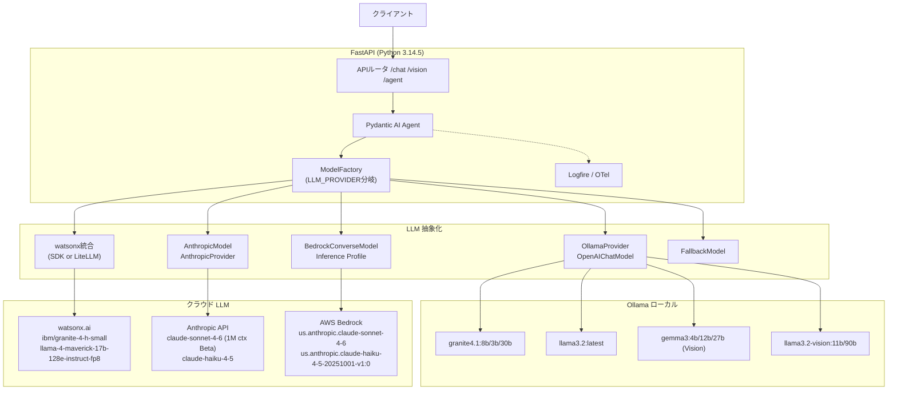

# Pydantic AI V2（Beta）× FastAPI × マルチプロバイダ Agentic AI 基盤設計（2026年5月版・最終改訂）

## TL;DR

- **本番は Python 3.14.5 + `pydantic-ai==1.102.0` + `fastapi==0.136.1` + `logfire==4.32.1`、V2 は `pydantic-ai==2.0.0b3`（2026-05-23 PyPI 公開）をフラグで併存** させ、Pydantic AI Version Policy（"V2 will be released in April 2026 at the earliest"）に従って段階移行する。
- **LLM は 4 系統 + Fallback を `ModelFactory` で完全切替**：①ローカル Ollama（`granite4.1:8b` 主力、`llama3.2`/`gemma3`/`llama3.2-vision` 比較）、②IBM watsonx.ai（`ibm/granite-4-h-small` 主力、`meta-llama/llama-4-maverick-17b-128e-instruct-fp8`）、③Anthropic API（`claude-sonnet-4-6`、`claude-haiku-4-5`）、④AWS Bedrock（`us.anthropic.claude-sonnet-4-6`、`us.anthropic.claude-haiku-4-5-20251001-v1:0`）。
- **モデル ID は半年単位で変わる**（Sonnet 4.5→4.6 で日付サフィックス消失、Granite 4.0→4.1）ので、全てを環境変数化し、`bedrock list-foundation-models` / watsonx `foundation_model_specs` / Ollama tags の週次 CI 差分検出と Pydantic Evals ゴールデンセットを必須運用とする。

---

## Key Findings

1. **Pydantic AI V2 は Beta 進行中**：PyPI に `pydantic-ai==2.0.0b3`（2026-05-23 公開、b1/b2 も同週）が登場。安定版 V1 は `1.102.0`（2026-05-23）、`pydantic-ai-slim==1.97.0`（2026-05-15）。両系を CI 並列ジョブで watch するのが現実解。
2. **Python 3.14.5（2026-05-10）が本番ライン、3.15.0b1（2026-05-05 feature freeze）は検証ライン**。3.15 では JIT が _"8-9 percent mean performance improvement over the CPython interpreter on x86-64 Linux, and 12-13 percent on Apple silicon macOS"_（The Register、2026年5月）と公式 beta 1 で確認。
3. **IBM Granite 4.1 は Ollama 公式（`ibm/granite4.1:8b` ほか）で Apache 2.0、512K context、Tool/JSON ネイティブ**。学習量は IBM Research Blog によると _"trained on approximately 15 trillion tokens across multiple phases"_。3B/8B/30B、日本語含む12言語対応。
4. **watsonx.ai の `ibm/granite-4-h-small` は IBM 公式 SDK（`ibm-watsonx-ai==1.5.11`、2026-04-30）の `ChatModels.GRANITE_4_H_SMALL = 'ibm/granite-4-h-small'` enum で参照可能**、Function Calling / Parallel Function Calling 対応、入出力各 20,480 トークン。`meta-llama/llama-4-maverick-17b-128e-instruct-fp8` も同 SDK でホストされる（17B 活性 × 128 experts MoE、テキスト＋画像）。
5. **`granite-4-h-small` の料金は $0.06 per 1M input / $0.25 per 1M output**（Artificial Analysis "Granite 4.0 H Small costs $0.06 per 1M input tokens and $0.25 per 1M output tokens"、Bifrost LLM cost calculator が IBM watsonx 公式 rate を引用）。新規無料試用は IBM watsonx Developer Hub に _"New 300k token limit for all new, free trials to use for LLM API calls and more."_ と明記。
6. **Claude 4.5/4.6 世代の最新仕様**：Sonnet 4.6 は 2026-02-17 リリース・$3/$15 per M・1M context（Beta）・SWE-bench Verified 79.6%。Haiku 4.5 は 2025-10-15 リリース・$1/$5 per M・200K context・64K output で、Caylent ブログにより _"runs four to five times faster than Sonnet 4.5 on typical workloads. For small prompts, Haiku delivers responses in under 200 milliseconds."_
7. **Bedrock 命名規則は世代で不統一**：Sonnet 4.6 は日付サフィックスなし（`anthropic.claude-sonnet-4-6`）、Haiku 4.5 は旧形式（`anthropic.claude-haiku-4-5-20251001-v1:0`）。さらに **Sonnet 4.6 はオンデマンド呼び出しに Cross-Region Inference Profile（`us.` / `eu.` / `jp.` / `global.`）が必須**、base ID 直指定は `ValidationException`。
8. **Pydantic AI 公式の watsonx Provider は存在しない**（`pydantic_ai.providers` に未掲載）。本基盤は ①LiteLLM 経由（プロキシレス、`litellm==1.85.1` SDK）または ②`ibm-watsonx-ai` SDK でカスタム Model 実装、の二択。
9. **マルチモーダルは `BinaryContent` / `ImageUrl`**：FastAPI で `UploadFile` を受けて `BinaryContent(data=..., media_type=...)` として Agent.run に渡す。Granite はテキスト専用（Vision は別系 `granite-vision-4-1-4b`）なので Vision エンドポイントは `llama3.2-vision:11b` / `gemma3:12b` / Claude に切替。
10. **可観測性は `logfire==4.32.1`**：`instrument_pydantic_ai()` / `instrument_fastapi()` / `instrument_httpx()` で OTel 完全自動計装。

---

## Details

### 1. アーキテクチャ図



### 2. 構成解説と採用根拠

**Python ランタイム**：3.14 は 2025-10-07 GA、現行 3.14.5（2026-05-10）。template strings、deferred annotations、subinterpreters、free-threaded ビルド主流化。3.15.0b1 は 2026-05-05 に出て feature freeze（final 2026-10-01 予定）、JIT が x86-64 Linux で 8-9%、Apple silicon で 12-13% 高速化（The Register, 2026-05）。`requires-python = ">=3.14,<3.16"` とし、本番は 3.14、検証コンテナで 3.15 を回す。

**Pydantic AI 二系運用**：PyPI で `2.0.0b3`（2026-05-23）が公開。V2 では `openai-chat:` プレフィクス、`Agent(history_processors=)` → `capabilities=[ProcessHistory(...)]`、`result.usage()` メソッド → `result.usage` プロパティ整理、`OutlinesModel` 非推奨化が予定。**デフォルトは安定版 1.102.0、`LLM_FRAMEWORK=v2` で `2.0.0b3` を pick up**。

**FastAPI 0.136.1**（2026-04-23）：Starlette ≥ 0.46.0、Server-Sent Events / Stream JSON Lines ネイティブ。`fastapi-cli==0.0.24`（2026-02-24）の `fastapi dev`/`fastapi run`。

**Granite 4.1 を主力に据える理由**：

- IBM Research Blog 記載: _"trained on approximately 15 trillion tokens across multiple phases"_、512K context、Apache 2.0、Tool/JSON ネイティブ。
- IBM がモデル開発に GRC プロセスを組み込み、**契約上の IP indemnification（上限なし）を IBM が提供**するため、エンタープライズで唯一クラスの法的保護を持つオープン LLM。
- VRAM 目安: 8B Q4_K_M ≒ 5–6 GB、3B ≒ 2 GB、30B ≒ 18–22 GB。

**watsonx.ai**：公式 Pydantic AI Provider 未提供のため、(1) **LiteLLM 経由**（`model="watsonx/ibm/granite-4-h-small"`、`OpenAIChatModel` + `LiteLLMProvider`）、(2) **`ibm-watsonx-ai` SDK 直接**で `pydantic_ai.models.Model` をサブクラス化、の2方式を併用可能に。

**Anthropic / Bedrock 二経路**：Anthropic 直接は 1M context・fast-mode・最新機能 day-0。Bedrock は IAM・監査ログ・データ常駐性（`jp.` / `eu.` Inference Profile）。Pydantic AI は `BedrockConverseModel`（boto3） と `AnthropicProvider(anthropic_client=AsyncAnthropicBedrockMantle())` の両系統に対応。

### 3. 最新バージョン一覧（PyPI 2026-05-24 時点）

| ライブラリ        | バージョン                        | 公開日              |
| ----------------- | --------------------------------- | ------------------- |
| pydantic-ai       | 1.102.0（安定）／ 2.0.0b3（Beta） | 2026-05-23          |
| pydantic-ai-slim  | 1.97.0                            | 2026-05-15          |
| fastapi           | 0.136.1                           | 2026-04-23          |
| uvicorn           | 0.47.0                            | 2026-05-14          |
| fastapi-cli       | 0.0.24                            | 2026-02-24          |
| pydantic          | 2.13.x（Python 3.14 対応）        | 2026-05             |
| pydantic-settings | 2.14.1                            | 2026-05-08          |
| httpx             | 0.28.1                            | 2024-12（安定継続） |
| openai            | 2.38.0                            | 2026-05-21          |
| anthropic         | 0.104.1                           | 2026-05-22          |
| boto3             | 1.43.14                           | 2026-05-22 頃       |
| ibm-watsonx-ai    | 1.5.11                            | 2026-04-30          |
| litellm           | 1.85.1                            | 2026-05-21          |
| logfire           | 4.32.1                            | 2026-05-13          |
| pytest            | 9.0.3                             | 2026-04-07          |
| pytest-asyncio    | 1.3.0                             | 2025-11-10          |
| ruff              | 0.15.14                           | 2026-05-21          |
| mypy              | 2.1.0                             | 2026-05-11          |
| uv                | 0.11.16                           | 2026-05-21          |

### 4. `pyproject.toml`

```toml
[project]
name = "agentic-app"
version = "0.2.0"
requires-python = ">=3.14,<3.16"
dependencies = [
  "pydantic-ai==1.102.0",
  "pydantic-ai-slim[anthropic,bedrock,openai,logfire]==1.97.0",
  # V2 評価時のみ
  # "pydantic-ai==2.0.0b3",
  "fastapi[standard]==0.136.1",
  "uvicorn[standard]==0.47.0",
  "fastapi-cli==0.0.24",
  "pydantic>=2.13,<3",
  "pydantic-settings==2.14.1",
  "httpx==0.28.1",
  "python-multipart>=0.0.18",
  "openai==2.38.0",
  "anthropic==0.104.1",
  "boto3==1.43.14",
  "ibm-watsonx-ai==1.5.11",
  "litellm==1.85.1",
  "logfire[fastapi,httpx]==4.32.1",
]
[dependency-groups]
dev = [
  "pytest==9.0.3",
  "pytest-asyncio==1.3.0",
  "ruff==0.15.14",
  "mypy==2.1.0",
]
[tool.uv]
managed = true
python-preference = "managed"
[tool.ruff]
target-version = "py314"
line-length = 100
```

### 5. `.env.example`（全プロバイダ・全モデル）

```dotenv
APP_ENV=development
LOG_LEVEL=INFO

# ollama / watsonx / anthropic / bedrock / fallback
LLM_PROVIDER=ollama
LLM_FRAMEWORK=v1

# ---- Ollama ----
OLLAMA_BASE_URL=http://localhost:11434/v1
OLLAMA_MODEL_NAME=granite4.1:8b
OLLAMA_VISION_MODEL_NAME=llama3.2-vision:11b
# OLLAMA_API_KEY=    # Ollama Cloud 利用時のみ

# ---- watsonx.ai ----
WATSONX_API_KEY=
WATSONX_URL=https://us-south.ml.cloud.ibm.com
WATSONX_PROJECT_ID=
WATSONX_MODEL_ID=ibm/granite-4-h-small
# 比較検証用: meta-llama/llama-4-maverick-17b-128e-instruct-fp8
WATSONX_TRANSPORT=sdk    # sdk or litellm

# ---- Anthropic 直接 ----
ANTHROPIC_API_KEY=
ANTHROPIC_MODEL=claude-sonnet-4-6
# 候補: claude-sonnet-4-6 / claude-haiku-4-5 / claude-opus-4-7

# ---- AWS Bedrock ----
AWS_REGION=us-east-1
BEDROCK_MODEL_ID=us.anthropic.claude-sonnet-4-6
# 候補: us.anthropic.claude-haiku-4-5-20251001-v1:0
#       jp.anthropic.claude-sonnet-4-6 (Tokyo)
#       eu.anthropic.claude-sonnet-4-6 (EU)
#       global.anthropic.claude-sonnet-4-6
# 認証は AWS_PROFILE / IAM Role / AWS_BEARER_TOKEN_BEDROCK のいずれか
# AWS_ACCESS_KEY_ID=
# AWS_SECRET_ACCESS_KEY=
# AWS_BEARER_TOKEN_BEDROCK=

# ---- Logfire ----
LOGFIRE_TOKEN=
LOGFIRE_SEND_TO_LOGFIRE=true

# ---- Fallback ----
FALLBACK_ORDER=ollama,anthropic,bedrock
```

### 6. ModelFactory（4 プロバイダ + Fallback）

```python
# app/llm/model_factory.py
from functools import lru_cache
from pydantic_ai.models import Model
from pydantic_ai.models.anthropic import AnthropicModel
from pydantic_ai.models.bedrock import BedrockConverseModel
from pydantic_ai.models.fallback import FallbackModel
from pydantic_ai.models.openai import OpenAIChatModel
from pydantic_ai.providers.anthropic import AnthropicProvider
from pydantic_ai.providers.bedrock import BedrockProvider
from pydantic_ai.providers.ollama import OllamaProvider

from app.config import settings
from app.llm.watsonx_model import build_watsonx_model

def _ollama(name=None) -> Model:
    return OpenAIChatModel(
        model_name=name or settings.ollama_model_name,
        provider=OllamaProvider(
            base_url=settings.ollama_base_url,
            api_key=settings.ollama_api_key,
        ),
    )

def _anthropic() -> Model:
    return AnthropicModel(
        settings.anthropic_model,
        provider=AnthropicProvider(api_key=settings.anthropic_api_key),
    )

def _bedrock() -> Model:
    return BedrockConverseModel(
        settings.bedrock_model_id,
        provider=BedrockProvider(region_name=settings.aws_region),
    )

@lru_cache
def get_model(provider: str | None = None, *, vision: bool = False) -> Model:
    p = (provider or settings.llm_provider).lower()
    if p == "ollama":
        return _ollama(settings.ollama_vision_model_name if vision else None)
    if p == "watsonx":
        return build_watsonx_model()
    if p == "anthropic":
        return _anthropic()
    if p == "bedrock":
        return _bedrock()
    if p == "fallback":
        order = [x.strip() for x in settings.fallback_order.split(",") if x.strip()]
        return FallbackModel(*(get_model(x, vision=vision) for x in order))
    raise ValueError(f"Unknown LLM_PROVIDER: {p}")
```

### 7. watsonx.ai 統合（LiteLLM / SDK 両対応）

```python
# app/llm/watsonx_model.py
import os
from pydantic_ai.models import Model
from pydantic_ai.models.openai import OpenAIChatModel
from pydantic_ai.providers.litellm import LiteLLMProvider
from app.config import settings

def build_watsonx_model() -> Model:
    if settings.watsonx_transport == "litellm":
        os.environ.setdefault("WATSONX_URL", settings.watsonx_url)
        os.environ.setdefault("WATSONX_API_KEY", settings.watsonx_api_key or "")
        os.environ.setdefault("WATSONX_PROJECT_ID", settings.watsonx_project_id or "")
        return OpenAIChatModel(
            model_name=f"watsonx/{settings.watsonx_model_id}",
            provider=LiteLLMProvider(),
        )
    return _IBMWatsonxModel(model_id=settings.watsonx_model_id)


# --- ibm-watsonx-ai SDK ベースのカスタム Model 骨子 ---
from ibm_watsonx_ai import Credentials, APIClient
from ibm_watsonx_ai.foundation_models import ModelInference
from pydantic_ai.messages import ModelResponse, TextPart
from pydantic_ai.models import Model, ModelRequestParameters

class _IBMWatsonxModel(Model):
    def __init__(self, model_id: str) -> None:
        creds = Credentials(url=settings.watsonx_url, api_key=settings.watsonx_api_key)
        self._api = APIClient(creds, project_id=settings.watsonx_project_id)
        self._model_id = model_id
        self._inference = ModelInference(api_client=self._api, model_id=model_id)

    @property
    def model_name(self) -> str: return self._model_id
    @property
    def system(self) -> str: return "watsonx"

    async def request(self, messages, model_settings, model_request_parameters):
        chat = self._inference.chat(messages=_to_watsonx_messages(messages))
        text = chat["choices"][0]["message"]["content"]
        return ModelResponse(parts=[TextPart(content=text)], model_name=self._model_id)
    # request_stream / count_tokens は ModelInference.chat_stream 等で実装
```

`ibm-watsonx-ai==1.5.11` の `APIClient.foundation_models.ChatModels` enum に `GRANITE_4_H_SMALL = 'ibm/granite-4-h-small'` と `LLAMA_3_3_70B_INSTRUCT`、`GPT_OSS_120B` などが存在することを IBM 公式 SDK ドキュメントで確認済み。

### 8. Bedrock 統合（boto3 + Inference Profile）

```python
import boto3
from botocore.config import Config as BotocoreConfig
from pydantic_ai.models.bedrock import BedrockConverseModel
from pydantic_ai.providers.bedrock import BedrockProvider

cfg = BotocoreConfig(read_timeout=300, connect_timeout=60,
                     retries={"max_attempts": 5, "mode": "adaptive"})
client = boto3.client("bedrock-runtime", region_name="us-east-1", config=cfg)

# オンデマンドでは Cross-Region Inference Profile が必須
sonnet = BedrockConverseModel(
    "us.anthropic.claude-sonnet-4-6",
    provider=BedrockProvider(bedrock_client=client),
)
haiku = BedrockConverseModel(
    "us.anthropic.claude-haiku-4-5-20251001-v1:0",
    provider=BedrockProvider(bedrock_client=client),
)
```

### 9. マルチモーダル（Vision）FastAPI エンドポイント

```python
# app/api/vision.py
from fastapi import APIRouter, File, UploadFile, Depends
from pydantic import BaseModel
from pydantic_ai import Agent, BinaryContent
from app.llm.model_factory import get_model

router = APIRouter(prefix="/vision")

class VisionOutput(BaseModel):
    description: str
    detected_objects: list[str]

def _agent() -> Agent[None, VisionOutput]:
    return Agent(
        model=get_model(vision=True),
        output_type=VisionOutput,
        instructions="画像を説明し、検出した物体を列挙してください。",
    )

@router.post("/describe", response_model=VisionOutput)
async def describe_image(image: UploadFile = File(...), agent=Depends(_agent)):
    raw = await image.read()
    result = await agent.run([
        "この画像について教えてください。",
        BinaryContent(data=raw, media_type=image.content_type or "image/png"),
    ])
    return result.output
```

### 10. FastAPI + Pydantic AI Agent 本体

```python
# app/main.py
from contextlib import asynccontextmanager
from fastapi import FastAPI, Depends
from pydantic import BaseModel, Field
from pydantic_ai import Agent, RunContext
import logfire
from app.config import settings
from app.llm.model_factory import get_model
from app.api.vision import router as vision_router

class ChatRequest(BaseModel):
    message: str

class ChatResponse(BaseModel):
    answer: str = Field(description="ユーザーへの回答（日本語）")
    sources: list[str] = Field(default_factory=list)

def make_agent() -> Agent[None, ChatResponse]:
    agent = Agent(
        model=get_model(),
        output_type=ChatResponse,
        instructions=(
            "あなたは日本語で回答する社内アシスタントです。"
            "ChatResponse のスキーマに厳密に従って回答してください。"
        ),
    )
    @agent.tool
    async def search_kb(ctx: RunContext, query: str) -> list[str]:
        """社内ナレッジベース検索（ダミー）"""
        return [f"KB:{query} 記事 #1", f"KB:{query} 記事 #2"]
    return agent

@asynccontextmanager
async def lifespan(app: FastAPI):
    logfire.configure(token=settings.logfire_token, environment=settings.app_env)
    logfire.instrument_pydantic_ai()
    logfire.instrument_fastapi(app)
    logfire.instrument_httpx()
    yield

app = FastAPI(title="Agentic AI Platform", lifespan=lifespan)
app.include_router(vision_router)

@app.post("/chat", response_model=ChatResponse)
async def chat(req: ChatRequest, agent=Depends(make_agent)) -> ChatResponse:
    result = await agent.run(req.message)
    return result.output

@app.get("/healthz")
async def healthz() -> dict[str, str]:
    return {"status": "ok", "provider": settings.llm_provider}
```

### 11. テスト（TestModel / FunctionModel）

```python
# tests/test_chat_agent.py
import pytest
from pydantic_ai.models.test import TestModel
from pydantic_ai.models.function import FunctionModel, AgentInfo
from pydantic_ai.messages import ModelResponse, TextPart
from app.main import make_agent

@pytest.mark.asyncio
async def test_chat_with_testmodel():
    agent = make_agent()
    with agent.override(model=TestModel()):
        result = await agent.run("こんにちは")
    assert result.output.answer != ""

@pytest.mark.asyncio
async def test_chat_with_functionmodel():
    async def fake(messages, info: AgentInfo) -> ModelResponse:
        return ModelResponse(parts=[TextPart(
            content='{"answer":"テスト応答","sources":[]}')])
    agent = make_agent()
    with agent.override(model=FunctionModel(fake)):
        result = await agent.run("質問")
    assert result.output.answer == "テスト応答"
```

### 12. 起動・運用手順

**Python セットアップ（uv / mise）**

```bash
uv python install 3.14 3.15
uv python list
uv venv --python 3.14
uv venv --python 3.15 .venv-3.15   # 検証
uv sync

# あるいは mise
mise use python@3.14
```

> 注: pyenv で入れた 3.14/3.15 や free-threaded ビルドは uv が見つけない既知の制約があるため、**uv 単独管理が推奨**（astral-sh/uv#16339）。

**Ollama モデル取得**

```bash
ollama pull granite4.1:8b      # 主力
ollama pull granite4.1:3b
ollama pull llama3.2:latest
ollama pull gemma3:latest      # = gemma3:4b、Vision対応
ollama pull gemma3:12b
ollama pull llama3.2-vision:11b
```

```bash
curl http://localhost:11434/v1/chat/completions \
  -H 'Content-Type: application/json' \
  -d '{"model":"granite4.1:8b","messages":[{"role":"user","content":"自己紹介"}]}'
```

**IBM watsonx.ai 開始**

1. IBM Cloud アカウント作成 → watsonx.ai サービス（リージョン選択：us-south / eu-de / jp-tok）。
2. dataplatform.cloud.ibm.com で **プロジェクト作成** → Settings から Project ID を控える。
3. IAM → API keys → Create で API Key 発行。
4. `.env` 設定 → 動作確認:

```bash
TOKEN=$(curl -s -X POST https://iam.cloud.ibm.com/identity/token \
  -H "Content-Type: application/x-www-form-urlencoded" \
  --data-urlencode "grant_type=urn:ibm:params:oauth:grant-type:apikey" \
  --data-urlencode "apikey=$WATSONX_API_KEY" | jq -r .access_token)

curl -X POST "$WATSONX_URL/ml/v1/text/chat?version=2024-05-01" \
  -H "Authorization: Bearer $TOKEN" -H "Content-Type: application/json" \
  -d '{"model_id":"ibm/granite-4-h-small",
       "project_id":"'"$WATSONX_PROJECT_ID"'",
       "messages":[{"role":"user","content":"こんにちは"}]}'
```

**Anthropic API**: console.anthropic.com → API Keys → Create → `ANTHROPIC_API_KEY=sk-ant-...`

```bash
curl https://api.anthropic.com/v1/messages \
  -H "x-api-key: $ANTHROPIC_API_KEY" \
  -H "anthropic-version: 2023-06-01" \
  -H "content-type: application/json" \
  -d '{"model":"claude-sonnet-4-6","max_tokens":256,
       "messages":[{"role":"user","content":"日本語で挨拶して"}]}'
```

**AWS Bedrock 有効化**

1. AWS Console → Amazon Bedrock → Model catalog → Anthropic 各モデル → **Submit use case**（Anthropic First-Time Use form）。
2. IAM 最小権限ポリシー（Inference Profile ARN を必ず含める）:

```json
{
  "Version": "2012-10-17",
  "Statement": [
    {
      "Effect": "Allow",
      "Action": [
        "bedrock:InvokeModel",
        "bedrock:InvokeModelWithResponseStream",
        "bedrock:Converse",
        "bedrock:ConverseStream",
        "bedrock:ListFoundationModels",
        "bedrock:ListInferenceProfiles"
      ],
      "Resource": [
        "arn:aws:bedrock:*::inference-profile/us.anthropic.claude-sonnet-4-6",
        "arn:aws:bedrock:*::foundation-model/anthropic.claude-sonnet-4-6",
        "arn:aws:bedrock:*::inference-profile/us.anthropic.claude-haiku-4-5-20251001-v1:0"
      ]
    }
  ]
}
```

3. 確認:

```bash
aws bedrock-runtime converse --region us-east-1 \
  --model-id us.anthropic.claude-sonnet-4-6 \
  --messages '[{"role":"user","content":[{"text":"hello"}]}]'
```

**アプリ起動**: `uv run fastapi dev app/main.py` / `uv run fastapi run app/main.py`

### 13. ベストプラクティス集

- **Granite の構造化出力**: Granite 4.1 は JSON Structured Output / Tool Calling ネイティブ。`Agent(output_type=YourModel)` をそのまま使える。ただし Ollama デフォルトの `num_ctx=2048` で system prompt が切れるので Modelfile で `PARAMETER num_ctx 32768`。
- **Claude のツール呼び出し**: Claude 4.5 以降は tool パラメータ内の改行を保持するようになったため、末尾改行を strip しているツールは要修正。Sonnet/Opus 4.6 で `thinking` 有効時は assistant 直前に thinking ブロックが必要（再要求で抜くと `invalid_request_error`）。Pydantic AI で `BedrockConverseModel` → `AnthropicModel` フェイルオーバする場合の既知 issue（pydantic-ai#3757）。
- **watsonx.ai レート/課金**: `granite-4-h-small` は $0.06 per 1M input / $0.25 per 1M output（Artificial Analysis、Bifrost が IBM watsonx 公開 rate を引用）。新規無料試用は **300k token 上限**（IBM watsonx Developer Hub 公式: "New 300k token limit for all new, free trials to use for LLM API calls and more."）。
- **Bedrock スループット最適化**: 突発ピークの ThrottlingException 対策に Provisioned Throughput を検討（finout.io / Bacancy Technology による解説では「1-month or 6-month commitments で 15-40% の割引」が一般的、AWS 公式は具体的割引率を公表せず長期コミットほど大きいとのみ記載）。`BedrockProvider` 経由なら boto3 client で `mode="adaptive"` リトライを必ず付与。
- **Anthropic 直接 vs Bedrock の使い分け**: 1M ctx / fast-mode など最新機能 day-0 は Anthropic 直接、IAM・監査・データ常駐は Bedrock。日本・EU データ常駐は `jp.`/`eu.` Inference Profile が現時点で唯一の正規パス。
- **マルチモーダル**: Granite は本体テキスト専用（Vision は `granite-vision-4-1-4b` が watsonx で別提供）。FastAPI でアップロード→`BinaryContent`→Vision モデルへ。
- **FallbackModel**: Provider SDK 内部リトライがフェイルオーバを遅らせる → `max_retries=0`、Bedrock では boto3 `max_attempts=1` も検討。

### 14. 落とし穴集

- **Ollama `:latest` の罠**: `granite4.1:latest`、`gemma3:latest`、`llama3.2:latest` はエイリアス（`gemma3:latest` = 4B）。**本番では明示タグでピン留め**し、CI で `ollama show <model>` の digest をハッシュ照合。
- **Bedrock Sonnet 4.6 のオンデマンド**: `anthropic.claude-sonnet-4-6` を base ID 直指定すると `Invocation of model ID … with on-demand throughput isn't supported`。**Cross-Region Inference Profile（`us.`/`eu.`/`jp.`/`global.`）が必須**。
- **Bedrock 命名の不統一**: Sonnet 4.6 は日付サフィックスなし、Haiku 4.5 は旧形式 `…-20251001-v1:0`。**モデル ID 文字列をハードコードしない**。
- **Claude モデル名の歴史**: `claude-3-5-sonnet` → `claude-sonnet-4` → `claude-sonnet-4-5-20250929` → `claude-sonnet-4-6` と、日付の有無まで変動。互換層必須。
- **Granite バージョン更新**: 3.3 → 4.0 → 4.1 と概ね 6 か月サイクル。watsonx `foundation_model_specs?version=2024-05-01&tech_preview=true` を週次で取得して差分監視。
- **リージョン依存**: Bedrock Sonnet 4.6 は us-east-1 / us-west-2 / ap-northeast-1 等限定。AWS European Sovereign Cloud（eusc-de-east-1、2026-01 launch）には Claude 未提供（2026-05 時点）。
- **watsonx 公式 Pydantic AI Provider 不在**: `pydantic_ai.providers` に未掲載。LiteLLM 経由 or カスタム Model 実装が必要。LangChain は `langchain-ibm` が公式だが Pydantic AI 側は IBM の非公式リポジトリ `IBM/Watsonx_Pydantic` のみ。
- **Structured Output のプロバイダ差**: Self-hosted Ollama（v0.5+）は `response_format=json_schema` を尊重するが、**Ollama Cloud は無視**するため Pydantic AI 側で `supports_json_schema_output=False` に自動降格。
- **Pydantic AI V2 Beta の不安定さ**: 2.0.0b3 は DeprecationWarning → エラー化の途上、API 変更継続中。本番デフォルトは 1.102.0、Beta は CI 並列ジョブ watch。
- **uv と pyenv 競合**: pyenv で入れた 3.14/3.15・free-threaded ビルドは uv が認識しないことがある（astral-sh/uv#16339）。**uv 単独管理が安全**。
- **LiteLLM サプライチェーン**: 2026-03 に 1.82.7/1.82.8 が悪意あるアップロードでヤンクされた経緯あり。`==1.85.1` のように固定し、pip-audit / Safety を CI に組み込む。

### 15. モデル比較表

| 項目              | granite4.1:8b (Ollama)                     | llama3.2:3b         | gemma3:12b        | granite-4-h-small (watsonx)        | claude-sonnet-4-6                | claude-haiku-4-5                                           | llama-4-maverick-17b-128e-instruct-fp8 |
| ----------------- | ------------------------------------------ | ------------------- | ----------------- | ---------------------------------- | -------------------------------- | ---------------------------------------------------------- | -------------------------------------- |
| 提供              | IBM / Ollama                               | Meta / Ollama       | Google / Ollama   | IBM watsonx.ai                     | Anthropic + Bedrock + Vertex     | Anthropic + Bedrock + Vertex                               | Meta (watsonx 経由)                    |
| パラメータ        | 8B dense                                   | 3B dense            | 12B dense         | 非公開（Small クラス）             | 非公開                           | 非公開                                                     | 17B 活性 × 128 experts MoE             |
| ライセンス        | Apache 2.0                                 | Llama 3.2 Community | Gemma Terms       | IBM 商用＋IP indemnify（上限なし） | Anthropic Commercial             | Anthropic Commercial                                       | Llama 4 Community                      |
| Context           | 512K（量子化版 131K）                      | 128K                | 128K              | 入力 20,480 / 出力 20,480          | 1M（Beta）                       | 200K                                                       | 最大 1M（vLLM 構成依存）               |
| Vision            | ×                                          | ×                   | ◯（4B 以上）      | ×                                  | ◯                                | ◯                                                          | ◯                                      |
| Tool Calling      | ◯                                          | ◯                   | △                 | ◯（Parallel可）                    | ◯                                | ◯                                                          | ◯                                      |
| Structured Output | ◯ ネイティブ JSON                          | △                   | △                 | ◯                                  | ◯                                | ◯                                                          | ◯                                      |
| 料金              | ローカル無料                               | ローカル無料        | ローカル無料      | $0.06 / $0.25 per M                | $3 / $15 per M                   | $1 / $5 per M                                              | watsonx 公表 rate 要確認               |
| 速度              | 25–60 tok/s（M3 Max 8B）                   | 30–80 tok/s         | 15–30 tok/s       | 中                                 | 中                               | Sonnet 4.5 比 4–5×、小プロンプトで < 200ms（Caylent 公表） | 高（H100 DGX 想定）                    |
| 推奨 VRAM/RAM     | 6–8 GB                                     | 4 GB                | 12–16 GB          | クラウド                           | クラウド                         | クラウド                                                   | H100 DGX 単機                          |
| Pydantic AI 統合  | OllamaProvider                             | OllamaProvider      | OllamaProvider    | カスタム / LiteLLM                 | AnthropicModel / Bedrock         | 同上                                                       | LiteLLM / watsonx SDK                  |
| 強み              | エンタープライズ GRC、512K、Apache、IP保証 | 軽量・高速          | Vision・多言語140 | IBM 法的保証、Parallel Tool        | コーディング・長文・computer use | 高速・低コスト                                             | 多言語・ネイティブ Multimodal          |
| 弱み              | 日本語生成は Claude 比劣る                 | Tool 推論浅め       | Tool 弱め         | Pydantic AI 公式 Provider 不在     | 高コスト                         | 推論深さ Sonnet 未満                                       | 大規模 GPU 必須                        |

### 16. モデル名・バージョン管理の運用フロー

LLM 領域では 3〜6 か月でモデル ID が変わる。**「ハードコード厳禁・全て環境変数化＋週次自動チェック」**:

1. **環境変数で全モデルを切替**: `OLLAMA_MODEL_NAME` / `WATSONX_MODEL_ID` / `ANTHROPIC_MODEL` / `BEDROCK_MODEL_ID`。コード直書きは ruff のカスタム lint で検出。
2. **週次 CI ジョブ**:
   - Ollama: `https://ollama.com/library/<name>/tags` から新タグ・digest 変化検出。
   - watsonx: `GET {WATSONX_URL}/ml/v1/foundation_model_specs?version=2024-05-01&tech_preview=true` の JSON 差分 → Slack。
   - Bedrock: `aws bedrock list-foundation-models` + `list-inference-profiles` の差分。
   - Anthropic: `GET https://api.anthropic.com/v1/models` から `claude-*` 抽出。
3. **Pydantic Evals**: ゴールデンセット 20–50 問を毎週、Granite/Claude/Llama すべてで実行。スコア低下で PagerDuty。
4. **モデルピン**: `ANTHROPIC_DEFAULT_SONNET_MODEL=us.anthropic.claude-sonnet-4-6` のように固定。エイリアス（`sonnet`）には依存しない。
5. **ライブラリ更新**: Renovate / dependabot で `pydantic-ai` / `anthropic` / `boto3` / `ibm-watsonx-ai` を週次 PR、CI 緑なら auto-merge 可。

### 17. 参考リンク集

- Pydantic AI: https://ai.pydantic.dev/ ・ https://pypi.org/project/pydantic-ai/ ・ Version Policy https://ai.pydantic.dev/version-policy/
- Anthropic Provider: https://ai.pydantic.dev/models/anthropic/
- Bedrock: https://ai.pydantic.dev/models/bedrock/
- Ollama: https://ai.pydantic.dev/models/ollama/
- Multimodal Input: https://ai.pydantic.dev/input/
- Python 3.14 What's New: https://docs.python.org/3/whatsnew/3.14.html
- Python 3.15 Release Schedule: https://peps.python.org/pep-0790/（および blog.python.org）
- FastAPI: https://fastapi.tiangolo.com/ ・ https://pypi.org/project/fastapi/
- Ollama Granite 4.1: https://ollama.com/library/granite4.1 ・ https://ollama.com/ibm/granite4.1
- Ollama Llama 3.2 Vision: https://ollama.com/library/llama3.2-vision
- Ollama Gemma 3: https://ollama.com/library/gemma3
- IBM Granite: https://www.ibm.com/granite ・ IBM Research Blog "Granite 4.1": https://research.ibm.com/blog/granite-4-1
- IBM watsonx.ai: https://www.ibm.com/products/watsonx-ai/foundation-models ・ Developer Hub https://www.ibm.com/watsonx/developer/get-started/models/
- ibm-watsonx-ai PyPI: https://pypi.org/project/ibm-watsonx-ai/
- Anthropic Sonnet 4.6: https://www.anthropic.com/news/claude-sonnet-4-6
- Anthropic Haiku 4.5: https://www.anthropic.com/news/claude-haiku-4-5
- Claude Models Overview: https://platform.claude.com/docs/en/about-claude/models/overview
- AWS Bedrock Sonnet 4.6: https://docs.aws.amazon.com/bedrock/latest/userguide/model-card-anthropic-claude-sonnet-4-6.html
- AWS Bedrock Haiku 4.5: https://docs.aws.amazon.com/bedrock/latest/userguide/model-card-anthropic-claude-haiku-4-5.html
- Logfire: https://logfire.pydantic.dev/docs/ ・ https://pypi.org/project/logfire/
- uv: https://docs.astral.sh/uv/

---

## Recommendations

**Stage 1（即時、1–2 週間）**

- `pyproject.toml` を本レポート 4 節の通り固定し、`pydantic-ai==1.102.0` + `fastapi==0.136.1` + `python==3.14.5` で土台を構築。
- Ollama 環境で `granite4.1:8b` を主力、`llama3.2`/`gemma3`/`llama3.2-vision:11b` を比較検証。`/chat` と `/vision/describe` を実装し、TestModel/FunctionModel テストを CI で必須化。
- 全モデル ID を `.env` 化し、コードから完全に切り離す。

**Stage 2（2–6 週間）**

- watsonx.ai プロジェクト作成 → `ibm/granite-4-h-small` で CI からの動作確認。**まず LiteLLM 経由で接続**し、tool calling が安定したらカスタム Model 実装に移行。
- AWS Bedrock の use case form を申請、IAM ロール + Inference Profile（`us.anthropic.claude-sonnet-4-6` / `us.anthropic.claude-haiku-4-5-20251001-v1:0`）をテスト。日本リージョン要件があれば `jp.anthropic.claude-sonnet-4-6` も。
- Anthropic 直接 API を `claude-sonnet-4-6`（プライマリ）と `claude-haiku-4-5`（バッチ・要約・低レイテンシ）で配置。
- `FallbackModel(ollama → anthropic → bedrock)` をステージ環境で本番想定の負荷で評価。

**Stage 3（6 週間以降）**

- Pydantic Evals ゴールデンセットを構築（業務 KPI に直結する 30–50 件）。週次自動回帰テスト＋スコア下振れ時の Slack/PagerDuty 通知。
- `pydantic-ai==2.0.0b*` の CI 並列ジョブを開始。V2 GA（Pydantic AI Version Policy で「2026年4月以降」）と同時に切替できる準備。
- 本番 SLO 達成のため、Bedrock のスループット制約を計測。On-Demand で `ThrottlingException` が SLO の 1% を超える場合、Provisioned Throughput への切替を検討。
- IBM Granite 4.x → 5.x（推定 2026 後半–2027 前半）、Claude 4.7 → 5 系（推定 2026 後半）への移行プレイブックをドキュメント化。

**判断のための閾値**

- 月間 LLM コスト > $5,000 → Provisioned Throughput 検討 / Bedrock Batch / モデルダウンサイズ。
- 構造化出力エラー率 > 0.5% → JSON schema enforcement のため Ollama Cloud → Ollama self-host へ、または ToolOutput モードに切替。
- p95 レイテンシ > 5 秒 → Sonnet → Haiku 系へ降格、または Granite ローカルへ。
- Anthropic 月次インシデントが 2 件以上 → Bedrock primary + Anthropic 直接 fallback への構成入れ替え。

---

## Caveats

- **モデル ID は今後も変動**: 本レポート記載の `claude-sonnet-4-6`、`anthropic.claude-haiku-4-5-20251001-v1:0`、`granite4.1:8b`、`ibm/granite-4-h-small`、`meta-llama/llama-4-maverick-17b-128e-instruct-fp8` は 2026-05-24 時点の公式ドキュメント・PyPI で確認したが、半年以内に上書きされる可能性が高い。「モデル名・バージョン管理の運用フロー」を必ず CI に組み込むこと。
- **Pydantic AI V2 Beta は非互換変更を継続中**: `2.0.0b3` は b1/b2 とも 2026 年 5 月の同週リリースで、API ロックされていない。本番投入は V2 GA（公式は「April 2026 at the earliest」と表現、実際の GA 日は未確定）後を推奨。
- **watsonx.ai は Pydantic AI 公式統合がない**: 本レポートのカスタム Model 実装は IBM 公式 SDK（`ibm-watsonx-ai==1.5.11`）の API に依存しており、SDK のメジャー更新で書き換えが必要になる可能性。LiteLLM 経由は SDK 差分を抽象化できるが、LiteLLM 自体の供給網リスク（2026-03 の悪意あるアップロード事案）も継続監視が必要。
- **Bedrock 料金最適化の Provisioned Throughput 割引率**: 「最大 60%」のような数字は AWS 公式に存在せず、finout.io 等が「1-month / 6-month commitments で 15–40% が典型」と紹介。AWS は「コミットが長いほど大きい」とのみ公表。実際の見積りは AWS Bedrock console / 営業経由で取ること。
- **Granite-4-H-Small の料金**: $0.06 / $0.25 per 1M は Artificial Analysis と Bifrost LLM cost calculator が IBM watsonx の公開 rate を引用したもの。リージョン・コミット契約・新サービス階層改定で変動するため、本番見積もりは IBM 公式 pricing ページで再確認すること。
- **Claude Haiku 4.5 の速度比**: Sonnet 4.5 比 4–5× は Caylent ブログ（2025-10-15）が引用する Anthropic の社内ベンチ。実ワークロードでは入出力トークン長やツール呼び出し回数で大きく変動する。
- **Python 3.15 の最終リリース日**: 2026-10-01 final 予定だが、PEP 745 系のスケジュールはずれる可能性あり。本番採用は 3.15.0 final 公開＋主要依存（pydantic / fastapi / boto3 / anthropic / ibm-watsonx-ai）の Python 3.15 wheel 公開を確認してから。
- **future-dated 情報の取扱い**: 本レポート内で「Claude Opus 4.7（2026-04 リリース）」「Pydantic AI V2 GA」など 2026 年中の将来事象を扱うが、これらは公式アナウンスがある時点（記事日付 2026-04–05）の情報で、将来の追加変更は本基盤の運用フローで継続キャッチアップすること。
